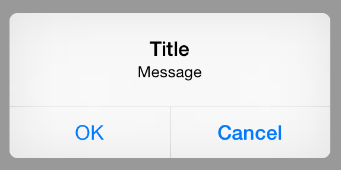
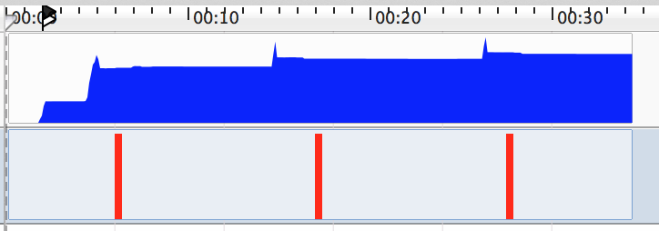

This morning, I was working on the [sample app](https://github.com/AshFurrow/Moya/issues/39) for [Moya](https://github.com/AshFurrow/Moya), a network abstraction framework that I’ve built on top of [Alamofire](https://github.com/Alamofire/Alamofire). I needed a way to grab some user text input, so I turned to `UIAlertView`. Turns out that that’s deprecated in favour of `UIAlertController`. Hmm.

Looking around the internet, there weren’t very many examples of how to use this cool new class, and the [documentation](https://developer.apple.com/library/prerelease/ios/documentation/UIKit/Reference/UIAlertController_class/) was sparse at best. Let’s take a look at the high-level API and then get into some of the nitty-gritty. (I’m going to write this in Swift because I am not a [dinosaur](http://t.co/Q2hvacChLu).)

`UIAlertController` is a `UIViewController` subclass. This contrasts with `UIAlertView`, a `UIView` subclass. View controllers are (or at least, should be) the main unit of composition when writing iOS applications. It makes a lot of sense that Apple would replace alert views with alert view _controllers_. That’s cool.

Creating an alert view controller is pretty simple. Just use the initializer to create one and then present it to the user as you would present any other view controller.

```swift
let alertController = UIAlertController(title: "Title", message: "Message", preferredStyle: .Alert)
presentViewController(alertController, animated: true, completion: nil)
```

Pretty straightforward. I’m using the `.Alert` preferred style, but you can use the `.ActionSheet` instead. I’m using this as a replacement for `UIAlertView`, so I’ll just discuss the alert style.

If you ran this code, you’d be presented with something like the following (on beta 7).


Weird. The title is there, but the message is not present. There are also no buttons, so you can’t dismiss the controller. It’s there until you relaunch your app. Sucky.

Turns out if you want buttons, you’ve got to explicitly add them to the controller before presenting it.

```swift
let ok = UIAlertAction(title: "OK", style: .Default, handler: { (action) -> Void in })
let cancel = UIAlertAction(title: "Cancel", style: .Cancel) { (action) -> Void in }
alertController.addAction(ok) alertController.addAction(cancel)
```

This is _worlds_ better than `UIAlertView`, despite being much more verbose. First of all, you can have multiple cancel or destructive buttons. You also specify individual closures to be executed when a button is pressed instead of some shitty delegate callback telling you which button _index_ was pressed. (If anyone out there makes a `UIAlertController+Blocks` category, I will find you, and I _will_ kill you.)


If we added the above configuration to our code, we’d get the following.



Way better. Weird that the message is now showing up. Maybe it’s a bug, or maybe it’s intended behaviour. Apple, you so cray cray. Anyway, you should also notice that the “OK” and “Cancel” buttons have been styled and positioned according to iOS conventions. Neato.

What _I_ needed, however, was user input. This was possible with `UIAlertView`, so it should be possible with `UIAlertController`, right? Well, kinda. There’s an encouraging instance method named `addTextFieldWithConfigurationHandler()`, but using it is not so straightforward. Let me show you what I mean.

```swift
alertController.addTextFieldWithConfigurationHandler { (textField) -> Void in
    // Here you can configure the text field (eg: make it secure, add a placeholder, etc)
}
```

Straightforward. Run the code, get the following.


The question now is this: how do you, in the closure for the “OK” button, access the contents of the text field?


There is no way for you to directly access the text field from the closure invoked when a button is pressed. [This](http://stackoverflow.com/questions/24172593/access-input-from-uialertcontroller) StackOverflow question has two possible answers. You can access the `textFields` array on the controller (assuming that the order of that array is the same as the order which you added the text fields), but this causes a reference cycle (the alert action has a strong reference to the alert view controller, which has a strong reference to the alert action). This _does_ cause a memory leak for each controller that you present.



The other answer suggests storing the text field that’s passed into the configuration closure in a property on the presenting controller, which can later be accessed. That’s a _very_ Objective-C way of solving this problem.

So what do we do? Well, I’ve been writing Swift lately, and whenever I come across a problem like this, I think “if I had [five years of Swift experience](http://instagram.com/p/rWyQdUDBhH), what would _I_ do?” My answer was the following.

Let’s create a local variable, a `UITextField?` optional. In the configuration closure for the text field, assign the local variable to the text field that we’re passed in. Then we can access that local variable in our alert action closure. Sweet. The full implementation looks like this.

```swift
var inputTextField: UITextField?

let alertController = UIAlertController(title: "Title", message: "Message", preferredStyle: .Alert)
let ok = UIAlertAction(title: "OK", style: .Default, handler: { (action) -> Void in
    // Do whatever you want with inputTextField?.text
    println("\(inputTextField?.text)")
})
let cancel = UIAlertAction(title: "Cancel", style: .Cancel) { (action) -> Void in }

alertController.addAction(ok)
alertController.addAction(cancel)

alertController.addTextFieldWithConfigurationHandler { (textField) -> Void in
    inputTextField = textField
}

presentViewController(alertController, animated: true, completion: nil)

```

I like this a lot. It avoids polluting our object with unnecessary properties, avoids memory leaks, and seems pretty “Swift”. I’ve created a [GitHub repo](https://github.com/AshFurrow/UIAlertController-Example) that I’ll keep up to date with future betas, etc.


So yeah. The new `UIAlertController` has some great benefits:

- It’s explicit
- It conforms to iOS composability conventions
- It’s got a clear API
- It’s reusable in different contexts (iWatch vs iWatch mini)

The drawbacks are:

- It’s unfamiliar

As we march forward into this brave new world of Swift, we need to reevaluate our approaches to familiar problems. Just because a solution that worked well in Objective-C might work OK in Swift doesn’t make it a solution _well_ suited for use in Swift. As developers, we should keep an open mind about new ideas and experiment. The way I look at it is like this: right now, the community is pretty new at Swift. We’re racing in all different directions because [no one](http://robnapier.net/i-dont-know-swift) really knows what the best practices are, yet. We need this expansion in all directions, even if a lot of those directions are going to turn out to be bad ideas. If we don’t throw it all against the wall, we won’t figure out what sticks.

So next time you try and do something and get confused because Swift is unfamiliar, try all kinds of things. Could be you end up creating a brand new convention that’s adopted by the whole iOS community for years to come.
