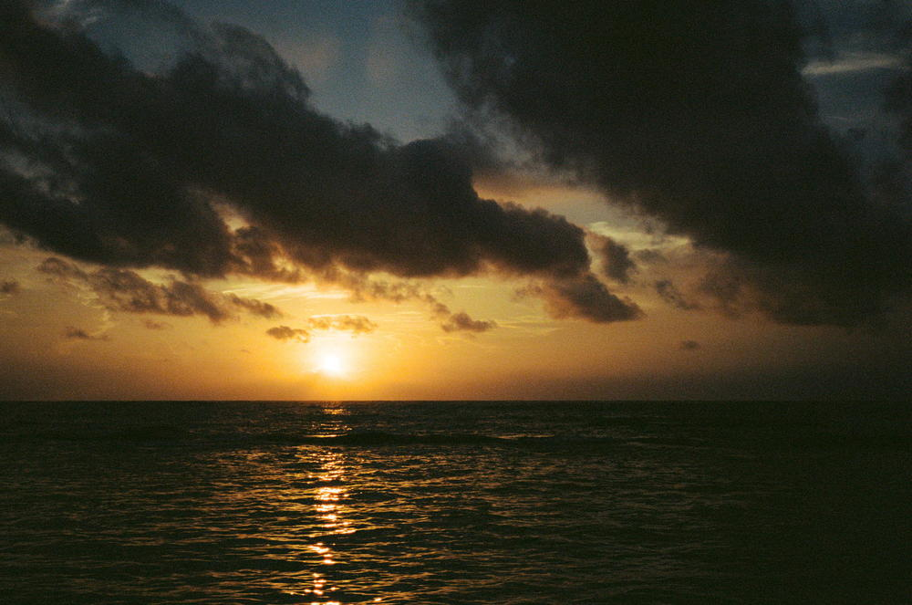

I’ve been blogging recently about photography, and a few readers have asked me questions about the tools that I use to make photos. I think it’s an idea worth exploring, and I’d like to explain (not justify) my reasoning for relying on film photography.

Many film photographers will insist that film has a different “feel” to it – that the images captured with it are inherently different from those captured on digital. I think they’re right, but that’s not the reason I choose to use film.

The premise is that you experience the world differently when you hold a camera in your hand. It’s something I believe most – probably all – photographers would agree on. Taking a walk by yourself is intrinsically different from taking a walk with a camera. You see things in new ways. You see things you wouldn’t have seen. You’re looking for them now. Everything feels different.

So let’s accept that premise for this post – that being able to capture a photo changes the way you experience your surroundings. I think a logical extension of this premise is _how_ you are able to capture a photo changes your experience in the same way _that_ being able to capture a photo does. Let me explain.

[Ansel Adams](https://www.artsy.net/artist/ansel-adams), a famous American landscape photographer, used [large format](<http://en.wikipedia.org/wiki/Large_format_(photography)>) cameras. These were large wooden boxes that held film that was 4x5” or larger and sat upon sturdy tripods. In order to take a photo, he had to carry all that gear with him. Let’s compare the cameras he began using in the twenties with cameras people began using 60 years later, when single lens reflex (SLR) cameras started to gain popularity. A handheld device capable of capturing photos on (typically) 35mm film. Much, much smaller than the equipment Adams was using.

It isn’t a stretch to believe that the different equipment would enable the same photographer to see their environment differently. 4x5” film is very different from 35mm film, as are the cameras using those two formats. Had Ansel Adams used 35mm SLRs, it’s likely he would have captured different images than the ones he did. And it follows that his experience of the world would have been different, too.

To be clear, I am _not_ saying one medium is better than the other. They are simply different, each with their benefits and drawbacks. At the end of the day, they are simply tools. Consider a painter leaving in the morning to capture a beautiful sunrise. Whether they choose oil paints or watercolours will change the outcome of their painting – they’ll be different, but one is not intrinsically better than the other.

So far, we’ve established that the _kind_ of camera you carry with you affects your experience of the world. However, discussion up to this point has varied between film formats. What about changes in formats like film vs. digital? That’s an interesting conversation.

Like different sizes of film, differences in physical media affect the way a photographer experiences the world. Despite having similar uses, the two media are very different, each with their owns set of pros and cons. The same scene captured with film and digital cameras will result in very different images. For example, last year in Mexico, I took the following two photographs within minutes of each other. One with a [Canon 5D Mark III](http://500px.com/photo/50729840/sunrise-in-paradise-by-ash-furrow), and the other with a [Leica M6](http://500px.com/photo/50730002/sunrise-by-ash-furrow) on Portra 400 film.

These photographs aren’t just different because of their media, they’re different because when I held the cameras to my eye to capture those photos, I saw the light differently. The medium affected _how_ I chose to make those photos.

So here we get to the fun part. If the tools photographers use affect the way they see the world, it’s not unreasonable to assume that a photographer familiar with different media might prefer one medium over another. And it’s certainly reasonable to imagine a photographer whose preferences change over time. Maybe they prefer to walk around with digital one day and film the next. Or with T-Max 400 (black and white) film one day and Portra 400 (colour) the next. Don’t even get me started on the differences in the types of cameras in the same medium (digital SLRs, rangefinders, bodies with live-view screens (or EVFs), point-and-shoots, smartphones, the list goes on).

So yeah. People ask me why I like shooting on film, and my answer is that film photography is inherently different from digital photography. The different tools affect how I see things. Sometimes I want to see things with film. Sometimes digital. It depends on my mood.

It’s chic to make fun of people who prefer to write on typewriters, or in Moleskin notebooks, or in “distraction-free writing environments” (this post was itself written in [iA Writer](http://www.iawriter.com/mac/)). But I don’t have a hard time believing people when they say that the types of tools they use affect how they produce their work. I’m going to continue to use film for [as long](https://www.youtube.com/watch?v=sjtphPVchJI) as they keep manufacturing it.
