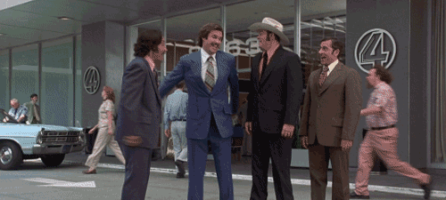

Really happy to share the news that the [documentary](https://www.indiegogo.com/projects/code-debugging-the-gender-gap) on the gender gap in the software scene that I [blogged about](/blog/why-is-this-difficult) recently got funded today. Really awesome news.

I want to thank anyone who donated money and/or shared this project with others. It may not be my place to thank you, but I'm doing it anyway because this came very close to not happening, and I feel like anyone who helped out should feel good about it. We did it – great work, team!

