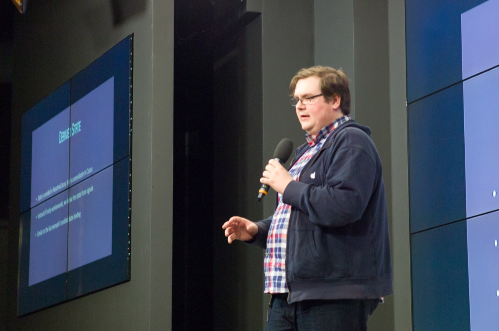
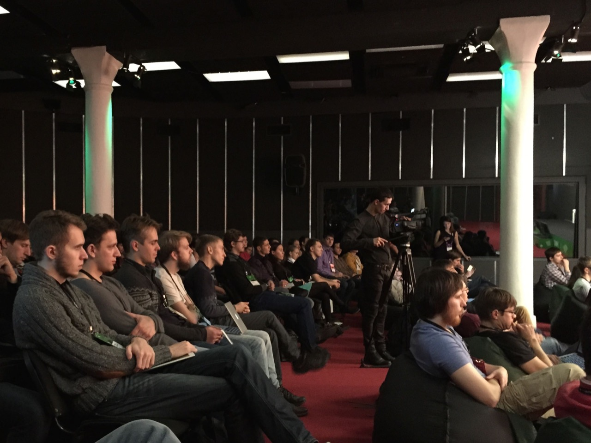
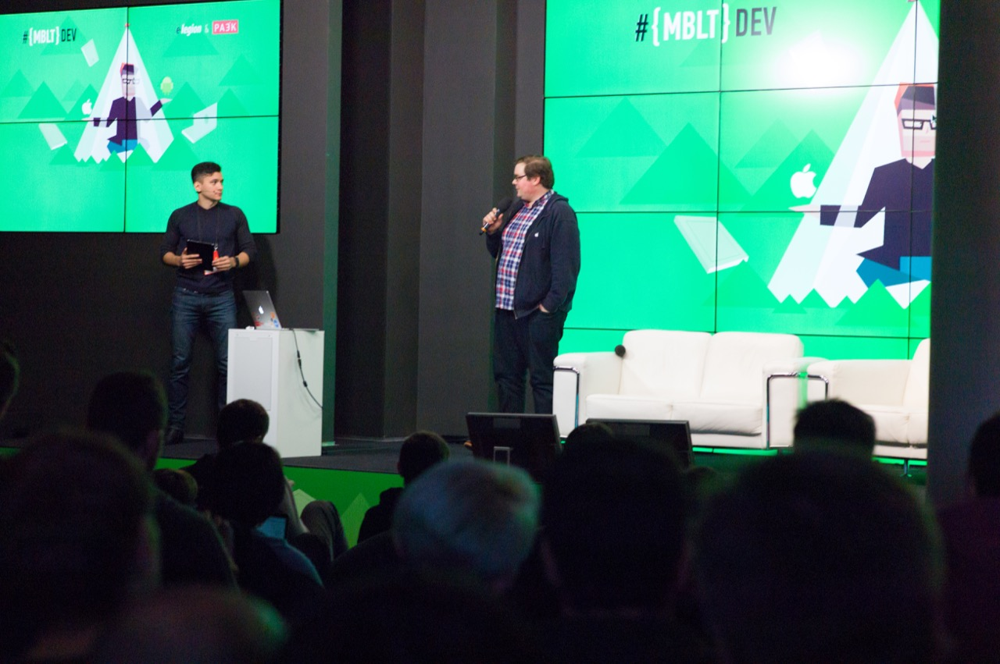

I just finished giving a presentation at [MBLTDev](http://mbltdev.ru), a conference in Moscow about mobile app development. The audience seemed receptive to the message and I got some interesting questions afterward.

Mine is only one of five English talks, and my Russian is pretty rusty. There are interpreters as well (some of the audience heard my talk in Russian, which is pretty cool).

The hosts have been awesome, and the participants are also welcoming. This is my first time in Russia, and Moscow is a very interesting city. I'm looking forward to exploring it tomorrow.

My slides are [available](https://speakerdeck.com/ashfurrow/functional-reactive-programming-in-swift), as well as a [sample project on GitHub](https://github.com/AshFurrow/MBLTDev).



The talk focuses on practical uses of ReactiveCocoa instead of the philosophy, which was a difficult decision to make. I've give the same talk on ReactiveCocoa a bunch of times, and I didn't want to give it again. I went back to the drawing board about how a talk on ReactiveCocoa can be done. For instance, people rarely comment on my 10-minute description of the history of programming, but they always have questions about how to adopt ReactiveCocoa in their team, so I focused more on that.

Let me know if you have any questions!
