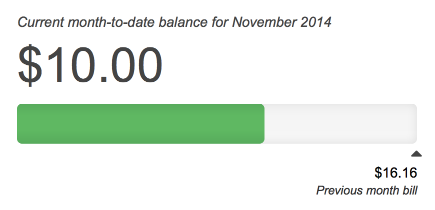
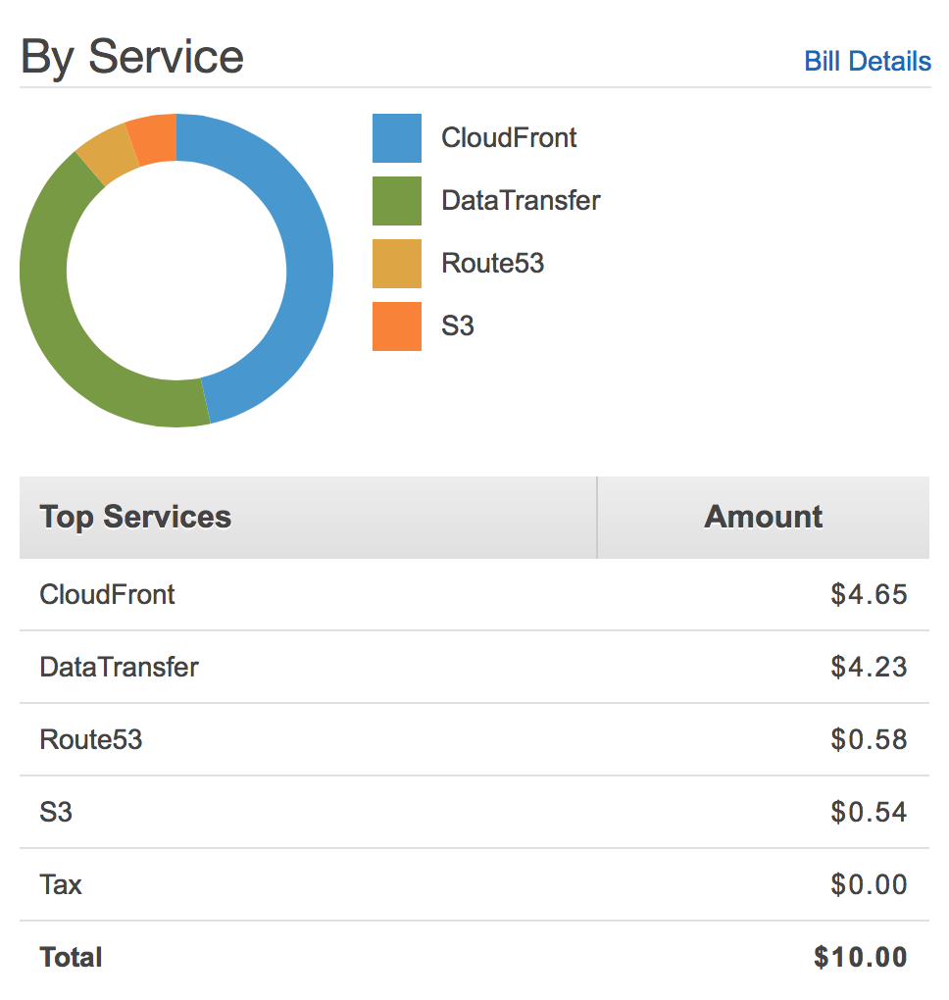
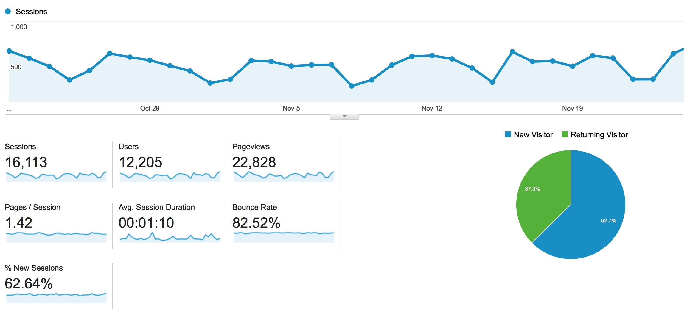
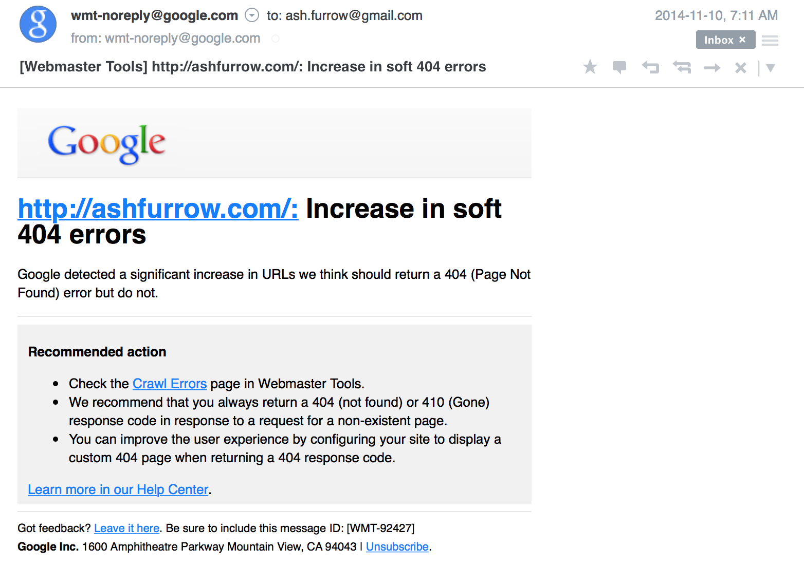

About a month ago, I wrote about [transitioning from Squarespace to my own maintained site](/blog/fresh-coat-of-paint/). A month has passed, and I thought that I would describe the technical aspects of the site: its migration, what went well, and what you should be on the lookout for if you decide to host on S3.

## Idea

To recap, the idea for building my own site was simple. I had been burned using Wordpress and had switched to Squarespace a few years ago because I didn’t want the hassle of maintaining my own site. Squarespace is great and I still recommend it to anyone who asks what to use. However, in the time between when I started to use it and a month ago, two things happened: I learned a lot about front-end web development, and the tools available really matured. _My_ circumstances were such that creating and maintaining a static site hosted on S3 and built using open source tools would be the best choice _for me_.

## Setup

So I started simply: a [Middleman](http://middlemanapp.com) installation using their built-in blogging engine. I picked a [clean bootstrap template](http://startbootstrap.com/template-overviews/clean-blog/) and a [nice highlight colour](http://www.colourlovers.com/color/398CCC/Walton). I put the site on [GitHub](https://github.com/AshFurrow/blog) because there is no reason to keep it private. And then the fun started.

I played with the design of the original template and then added my own touches: the logo in the upper-lefthand corner, custom background images from my own photography collection, some customization of the basic layout, etc. It was actually very easy to do most of the things I wanted to.

I focused on getting a basic site with sample content first – just to see if my idea of hosting my own site without a lot of hassle was feasible. I would worry about migrating existing content and transitioning the DNS later, since I knew they would be a challenge for me. If I could get invested in the new site by doing the easy stuff upfront, then I would be too invested to lose steam when the hard parts came.

As I built a more and more complex site, I had to expand outside my comfort zone a bit. For example, to get the kind of code-highlighting I wanted (that I always wanted on Squarespace), I had to use a [custom markdown formatter](https://github.com/ashfurrow/blog/blob/c18f2dc7cab2fb6085fb2a1a476d425553f5c2c8/config.rb#L8-L9). I wasn’t – and am not currently – experienced in writing production-worthy ruby code, but I tried my best to apply the ruby mantra: Don’t Repeat Yourself. I even got to use some interesting rubyisms like `unless` and `or`.

Something else I insisted on was automation: deploying had to be one-step. The site for [my podcast](http://notificationcenter.tv) is hosted with Middleman, but the deploy process is arduous enough for me to not look forward to creating content. Through [judicious use of `rake`](https://github.com/ashfurrow/blog/blob/c18f2dc7cab2fb6085fb2a1a476d425553f5c2c8/Rakefile), I was able to accomplish a one-step deploy. Once I was happy with he visuals on the site, as well as the extensibility of the template I had modified, I set up a staging environment and started deploying to it.

## Content Migration

Now that the site was on staging and I verified it was being served by Amazon S3 properly, I needed to migrate content from Squarespace to Middleman. Squarespace has an export feature (it’s one of the reasons I chose it in the first place) which outputs a giant XML file that is Wordpress-compatible. That’s cool for Wordpress, but I’m rolling my own shit here.

I used `irb` to experiment with [Nokogiri](http://www.nokogiri.org), an XML/HTML parsing library for ruby. I had to learn some basics of xpath querying, but I managed to write a [half-decent script](https://gist.github.com/ashfurrow/ea1e354fba72bb4cc533) to process the giant XML file of 400+ blog posts into 400+ markdown files that Middleman can understand. I didn’t stop there, though. Since all of the images were still stored on Squarespace’s CDN, I had to download them, gave them a unique filename, and store them locally for Middleman to access through the modified HTML contents of each post.

> Note: I do _not_ intend this to be used as-is by anyone. It’s released under the “IDGAF” license and is _only_ meant to be used as a demonstration of how someone with nearly no ruby experience can still make something useful.

## DNS Transition

The next step is the one I looked forward to the least: DNS transition. At a high-level, I understand the purpose and use of DNS. At a low-level, I find it terrifying to use. Some entries need a `.` after the host name (for whatever reason). You don’t know if you’ve broken something for at least ten or twenty minutes. When you do break something, it takes another ten or twenty minutes again for fixes to propagate throughout the Internet.

I also have my email set up through my own domain name (I host on [FastMail](/blog/switching-from-gmail-to-fastmail/)), so I need specific DNS entries to authenticate my FastMail outgoing mail as legitimately being from the `ashfurrow.com` domain; I _really_ don’t want to mess those up (because I don’t remember how to set them up lolol – make sure to document this kind of thing, people).

The problem was that, using a non-Amazon DNS service like Hover with S3 hosting, my site _must_ have a `www.` prefix, which is unacceptable to me. The problem is a combination of limitations on S3 and the DNS system: a DNS entry pointing to a “naked” domain (non-`www.` prefixed) _must_ use an IP address and not another domain name. My S3 bucket doesn’t have a necessarily fixed IP address. The only solution is to use Amazon’s Route53 service – it keeps DNS entries up-to-date with S3 endpoints’ IP addresses any time they change. Super cool.



Transitioning to Route53 was actually _very easy_. I felt totally confident after the first few records, and really dig AWS’ modern approach to DNS.

## Cost

One of the most common questions I got when I switched from Squarespace to static S3 hosting was about the cost: how much would I be paying to host my site on S3? Well, let’s take a look at things.

Squarespace’s [pricing](http://squarespace.com/pricing/) is pretty good. It’s $8/month for the standard plan and $16/month if you want access to a full e-commerce feature (which I don’t need) and their developer platform (which I was unwilling to pay for on principle). You can get different discounts from any one of the literally millions of podcasts that Squarespace sponsors and if you sign up for a year then you get an additional 10% off. So I was paying about $7/month for something that I felt constrained by. I could pay $14/month for something that I would feel slightly less constrained by, but that wasn’t much better to me (learning how to customize Squarespace’s templates is not a transferrable skill; learning how to use Bootstrap properly is).

Let’s compare with AWS. My bill so far this November is actually exactly $10, which includes hosting several GIFs for various GitHub repos and blog posts on other sites (all served from CloudFront), as well as all podcasts episodes for a few different shows I’ve had over the years. Note that I haven’t published a [Notification Center](http://www.notificationcenter.tv) episode in that time, so the lion’s share of this $10 figure is _just_ my site.

The site itself is hosted on S3 while the common banner images (not the custom ones used on individual posts, but the 5 or so default ones) are hosted through Amazon’s CloundFront CDN so that my friends in Australia will stop whining about slow loading times.

As you can see, even putting just some common images behind CloudFront constituted a significant cost.

To give you an idea of the traffic I get on my blog, here’s the Google Analytics page views since I moved to Middleman.

So I’m pretty happy about the cost. Maybe a little more than I was paying with Squarespace, but I didn’t switch for the cost: I switched to have more control over my site, which has been a great success.

## Issues

The migration was generally smooth but not without a few small issues. Because of a mess up I made with the migration script, a few URLs for generated Middleman posts are incorrect (ones where the title didn’t match the slug – usually due to a typo in the original title). There are also issues with the date format: my original Wordpress installation had blog posts in a format of `/blog/year/month/title`, but I started using the `.htaccess` file to redirect new ones to `/blog/title`. Squarespace allowed me to redirect all old Wordpress links (in either format) to new content, but S3 only allows 50 redirects total, including wildcards like my 404 page and my feed redirect. So I just redirected some high-traffic posts.

It’s not ideal, but I can live with it. Those older articles don’t really concern me too much – Google will re-crawl the blog and I don’t think many people have links to my content going back that far. If they do, the content is probably outdated anyway.

If I were doing this professionally, I would’ve done more thorough testing.

Speaking of my feed, I did have a few issues. Middleman’s blog template produces an Atom feed; I thought that if that feed was at the same location as the old RSS (or had a 301 redirect), then everything would be fine. Turns out that most reader clients don’t expect a previously RSS feed to suddenly become an Atom one. Oops.

So I created a new feed in the RSS format and, thanks to Orta’s suggestion, set up hosting at `feed.ashfurrow.com` – something I can control through DNS that’s separate from whatever blogging engine I might use in the future. A few redirects and meta-tag changes later, and everyone got caught up on my feed. At worst, some readers didn't see my transition post for a few days and saw the final 5 posts on Squarespace duplicated in their feeds, which a few people did contact me about, but wasn’t easily avoidable.

## Future

There are still some issues I want to get done for me to consider the new site at a “1.0” – mostly surrounding the [Speaking](/speaking) and [Portfolio](/portfolio) pages. I moved to Middleman to have control over the design. Now that I do, it’s time to put that to good use and knock it out of the park. That said, I’d take [design feedback](https://github.com/ashfurrow/blog/labels/design%20help%20wanted) on either page.

Hosting on GitHub has a few benefits, too. The repo for this blog doesn’t really get much traffic, but I know of a few people who have used ideas or techniques from my approach to make their owns sites. And if they see something I could improve on, they let me know. Win-win.

If you want to see me write about some topic, answer a question, update an old article, or even fix a typo, feel free to [open an issue](http://github.com/ashfurrow/blog/issues/new) and I’ll take a look.

I was wary of using CloudFront to put a CDN in front of my blog, opting instead to just have some large resources like common background images distributed through a CDN. Being behind CloudFront means that when I update my site, invalidations have to be made to update endpoints’ caches around the world. Not a huge deal, but when I finish a blog post and publish it, I’d like to be able to tweet it right away without having to wait for CDN invalidations to propagate. I’ll probably move it over to CloudFront and try it out – maybe I’m being overly cautious. If you have experience with this, I’d love to hear from you.

I mentioned earlier that I wanted one-step deploys for my site. To deploy to both staging and production, and to update the RSS and Atom feeds on their own bucket, I only have to type `rake publish:all`. That still seems like a lot of work to me. I’d love a sort of zero-step deploy, and when I was talking to Chris Eidhof about how they host [objc.io](http://objc.io), he said that they do something like that. I’m planning on setting up Travis on my blog’s repo and whenever it builds on the `master` branch, Travis can do the `rake publish:production` for me (if the build has no errors). By using Travis’ [encrypted environment variables](http://docs.travis-ci.com/user/environment-variables/), I wouldn’t need to have any AWS credentials in the clear.

Deploying through Travis would have a few cool advantages. Primarily, it would let me only push changes to GitHub from my computer, and not also push all changes to the site (like when I changed my `head` metadata tags – I had to re-upload nearly every page). Travis’ internet connection is probably a lot faster than mine. I can also see me adopting a really snazzy workflow of creating blog posts on branches and creating pull requests to get any feedback I need from friends and colleagues. When I’m satisfied, I can merge the pull request and Travis will take care of publishing.

## Conclusion

From a personal perspective, I feel like the transition from Squarespace to Middleman was a success: I accomplished my goal of having more control over my site without burdening myself with a heavy maintenance cost. From a technical perspective, things are a bit murkier, but still generally awesome. While there are some outstanding 404’s that I’ve decided not to address, and existing RSS subscribers missed out on my feed for a few days, I only got a few complaints.

When people ask me where to host their site, my default answer is still Squarespace. It’s a fantastic resource that offers a lot for a very low price. I was happy with it for over two years and only moved away from it because I wanted more creative control over the design aspects of my site.

So while the transition was necessary and ultimately successful, I feel like I did it at the right time: once the tools were mature and once I was familiar enough with using them.
