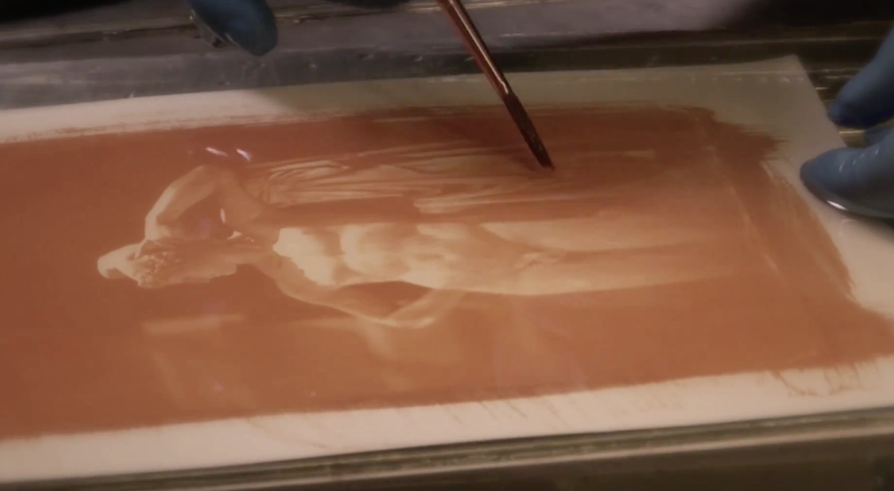

I've done a lot of photography over the Christmas holiday – and I don't mean that I've taken lots of photos. My wife and I have spent a lot of time walking all over Amsterdam, discussing plans for photos we wanted to make, visiting galleries, and developing film. It was just the kind of relaxing time-off that I needed to start off the new year fresh and ready-to-go. It was all kind of kicked off by a [really awesome Youtube series](https://www.youtube.com/playlist?list=PL4F918844C147182A) discussing the history of photography.

The series was produced by the [George Eastman House](http://www.eastmanhouse.org) – as in George "I Founded Kodak" Eastman. It discusses humanity's centuries-old quest to make accurate, reproducible, and long-lasting depictions of events. There are twelve videos covering progress starting before photography's emergence in the 19th century to today's digital cameras.



Photography is a very broad term, and the videos highlight some of the more significant advances in photographic technology, which include:

- Discovery of light-sensitive chemicals
- The ability to "fix" the image (rendering it no longer sensitive to light)
- Single-step "dry plate" photos
- "Negatives" that allow single photographs to be _printed_ many times
- Various different printing processes
- Flexible negatives (which lead to the invention of motion pictures)

The printing processes were the most fascinating to me. From around the 1880's, producing negatives was possible using a variety of different chemical processes. Since that time, many different printing processes have been conceived of to fit different needs. Some were meant to be cost-effective while others were meant to be resistant to fading.

But there was something the videos barely hinted at that really interests me: the transformation of photography from a technological achievement to an art form (if anyone has book recommendations, get in touch). This was a very purposeful transformation performed by a group of people who called themselves "Pictorialists."
[This video](https://www.youtube.com/watch?v=jzzsw1hR9G8) from the series above discusses the Pictorialism movement in more detail. To quote [Wikipedia](https://en.wikipedia.org/wiki/Pictorialism):

> Pictorialism as a movement thrived from about 1885 to 1915, although it was still being promoted by some as late as the 1940s. It began in response to claims that a photograph was nothing more than a simple record of reality, and transformed into an international movement to advance the status of all photography as a true art form. For more than three decades painters, photographers and art critics debated opposing artistic philosophies, ultimately culminating in the acquisition of photographs by several major art museums.

When we arrive in New York, my wife and I intend to set up a basic darkroom and start to make physical prints of our analogue photos. I've been looking forward to this for a while, but in all my day-dreaming, I had never considered the print to be much of an artistic component in photography. Beyond dodging and burning, I've realized, there is an entire world of infinite expressive opportunities. Pictorialists often preferred printing processes that required more direct manipulation of the print. In that way, the print becomes something very similar to a paining: truly unique.

I'm as excited as ever to start making prints and I find my mind racing to consider the different possibilities.
