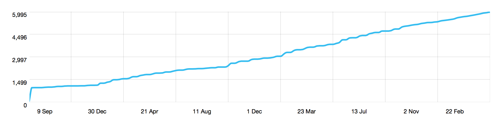
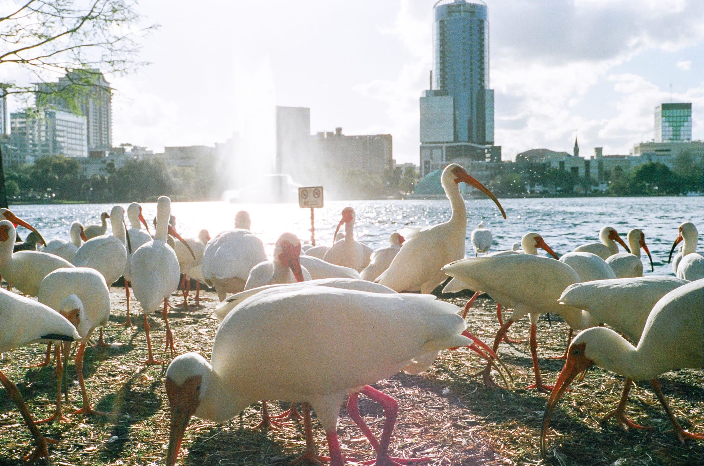
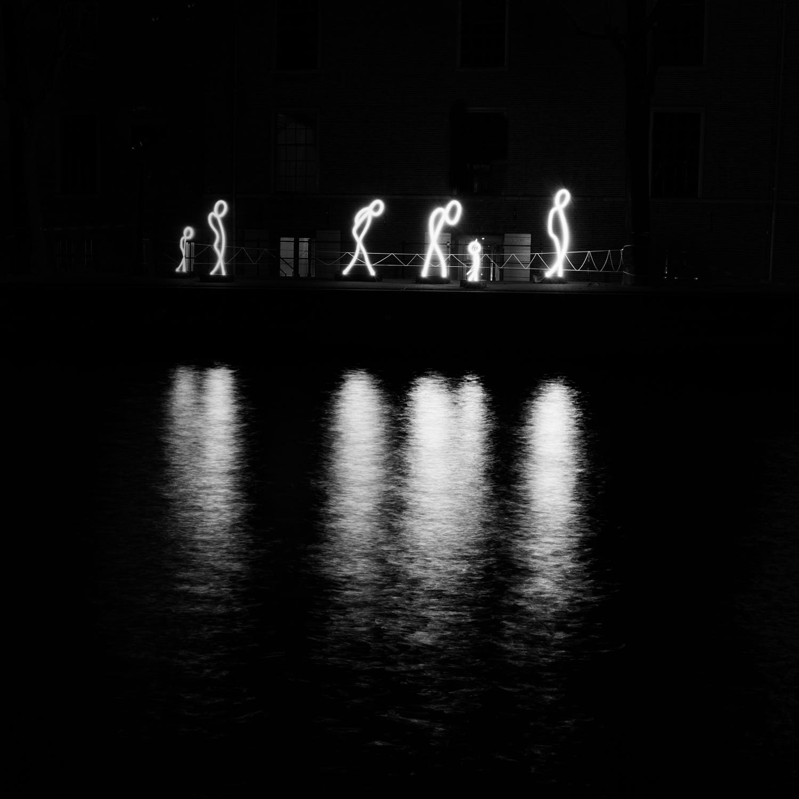
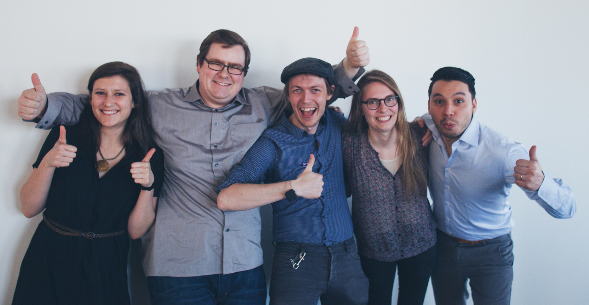
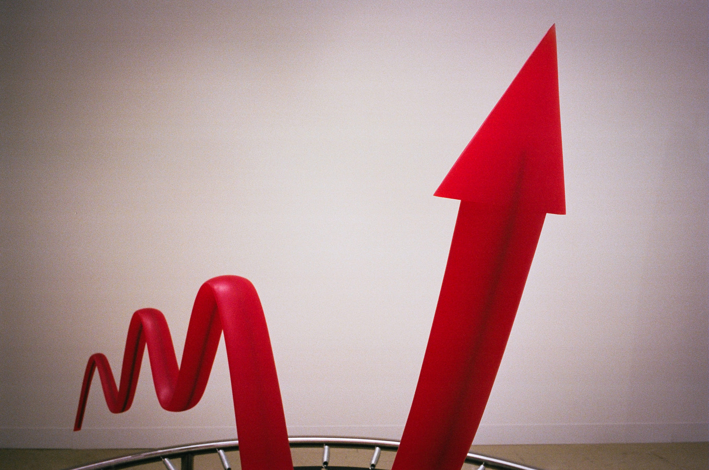
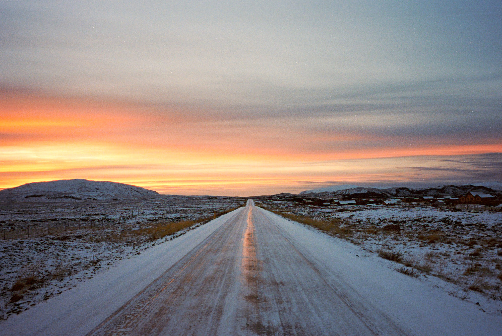

So I turned 27 last week. And I'm doing that thing where you do a write-up of your year. Orta's idea, and I really like it. I [started last year](/blog/on-turning-26/) and found the exercise to be cathartic and helpful.

Instead of writing out a timeline, like [some kind of asshole](/blog/5-years-of-ios/), I've decided to investigate what threads tie my experiences together. The most significant theme of the past year has been growth. Let's dive in.

## Personal Growth

In Toronto, I was used to leaning on my social support network of friends and colleagues when I felt depressed.

Then I left Toronto and moved to Europe.

😕

Things became rough. Luckily, I started working at Artsy, which helped _a lot_; the people I worked with were kind and supportive.

Online friends became really important, especially ones in Europe because they were online in the mornings, which were the hardest times for me. I was also developing friendships in Amsterdam, mostly at [Appsterdam](https://appsterdam.rs) events.

Through the experience of growing new social support networks, I became acutely aware of their importance to me.



<blockquote class="instagram-media" data-instgrm-captioned data-instgrm-permalink="https://www.instagram.com/p/tVnUGaDBsX/?utm_source=ig_embed&amp;utm_campaign=loading" data-instgrm-version="13" style=" background:#FFF; border:0; border-radius:3px; box-shadow:0 0 1px 0 rgba(0,0,0,0.5),0 1px 10px 0 rgba(0,0,0,0.15); margin: 1px; max-width:540px; min-width:326px; padding:0; width:99.375%; width:-webkit-calc(100% - 2px); width:calc(100% - 2px);">
 <a href="https://www.instagram.com/p/tVnUGaDBsX/?utm_source=ig_embed&amp;utm_campaign=loading" style=" background:#FFFFFF; line-height:0; padding:0 0; text-align:center; text-decoration:none; width:100%;" target="_blank"> 
 

 
 

 

 

 
 View this post on Instagram

 

 

 

 

 

 

 

 

 

 
 

 

</a>
<a href="https://www.instagram.com/p/tVnUGaDBsX/?utm_source=ig_embed&amp;utm_campaign=loading" style=" color:#c9c8cd; font-family:Arial,sans-serif; font-size:14px; font-style:normal; font-weight:normal; line-height:17px; text-decoration:none;" target="_blank">A post shared by Ash Furrow 🏳️‍🌈 (@ashfurrow)</a>

</blockquote>



I'm, you know, I guess, sort of well-known (I'll touch on this later). When I arrived in Europe, I started receiving invitations to speak at conferences and meetups all over the place. Most of the travelling I did in Europe was for these events, and I loved every one. I got to see so many awesome places and meet the awesome people who live there.

I was doing a lot of public speaking, which I enjoy. While I had refined the organization of my presentations, I still didn't have a tonne of experience. These meetups gave me lots of practice. They were sometimes recorded, so I got to critique myself afterward and work on my shortcomings. It's been really cool to understand my level of skill and have goals in a soft skill like public speaking. It's made me realize this kind of mindfulness is missing in different areas of my life; that in these ways, I've been drifting. Sometimes that's OK, sometimes it's not, but it's good to be aware.

I've been gaining Twitter followers at a more-or-less constant rate for a while. It's been weird, because I never really treated Twitter like part of my actual life. It was always, like, this "other me" that had his own personality. He could be abrasive, sarcastic, and snarky in ways I would not actually behave. On some advice from some friends, I've tried to reel him in a bit. I've come to understand that he's an aspect of my identity, and that I shouldn't shut him out, but I shouldn't let him run my online life, either.

Another effect of having people follow me is that they often read my tweets. For example, there was a period of time that I'd meet someone at an event who would introduce themselves by asking "hey, have you got you toilet fixed yet?"

<Tweet tweetID="457095589046792192" />

In real life, I [shy away](http://ashfurrow.com/blog/whelp./) from being recognized. When someone does recognize me, I try and downplay my significance. It's actually a bit self-flagellant – I'm afraid that people will I'm a braggart. I've been trying to find a good balance between "I don't matter at all" and "I'm actually the greatest thing since venture capitalism."

I've found myself asking questions like "Who am I? Who would I like to be? How could I become that person?"

Looking back, part of the person I wanted to be was someone who had a broader perspective on the world. It's why I moved to Europe, I think. I don't really remember why we moved, to be honest. But anyway, I realized that I didn't want to ever be someone who thought he had _enough_ perspective. Instead, I wanted to be someone who _always_ sought out new points of view, and that's someone I think I've become.

Fake it 'til you make it?

¯\\_(ツ)_/¯

I dunno.

There was a lot of depression and self-doubt over the past year. Picturing myself, from an outside observer's perspective and objectively measuring my own worth has helped me deal with those negative feelings. But that takes energy – energy that I only had by the grace of my friends.

## Art

So, art. I've always felt that the arts are important, from a sort of "social good" standpoint. Art in public areas is good. Teaching kids art is good. Going to museums is good. But it's always been an abstract belief, as though "art is important, but mostly for the benefit of others." Well, that's kind of rubbish isn't it? Art is good for me, just like it's good for everyone.



Thanks to Artsy, I was able to [attend Art Basel](/blog/reflections-on-art-basel-2014/), one of the most important art fairs in the world. It was incredible – and importantly, they were giving away these awesome books.



<blockquote class="instagram-media" data-instgrm-captioned data-instgrm-permalink="https://www.instagram.com/p/pbvDRRDBmO/?utm_source=ig_embed&amp;utm_campaign=loading" data-instgrm-version="13" style=" background:#FFF; border:0; border-radius:3px; box-shadow:0 0 1px 0 rgba(0,0,0,0.5),0 1px 10px 0 rgba(0,0,0,0.15); margin: 1px; max-width:540px; min-width:326px; padding:0; width:99.375%; width:-webkit-calc(100% - 2px); width:calc(100% - 2px);">
 <a href="https://www.instagram.com/p/pbvDRRDBmO/?utm_source=ig_embed&amp;utm_campaign=loading" style=" background:#FFFFFF; line-height:0; padding:0 0; text-align:center; text-decoration:none; width:100%;" target="_blank"> 
 

 
 

 

 

 
 View this post on Instagram

 

 

 

 

 

 

 

 

 

 
 

 

</a>
<a href="https://www.instagram.com/p/pbvDRRDBmO/?utm_source=ig_embed&amp;utm_campaign=loading" style=" color:#c9c8cd; font-family:Arial,sans-serif; font-size:14px; font-style:normal; font-weight:normal; line-height:17px; text-decoration:none;" target="_blank">A post shared by Ash Furrow 🏳️‍🌈 (@ashfurrow)</a>

</blockquote>



I started reading about art, learning more about art history and piecing together a broader inner-, social-narrative that included art as a central theme. It's been incredible.

After reading some books on art, I was able to attend the [ICI 2014 Auction](https://www.artsy.net/feature/ici-benefit-auction-2014) as an Artsy employee. I got to meet some awesome, interesting colleages who all had different perspectives on the art world. As I've spoken with more people and have read more about the art world, I saw my understanding liquidating. Like, the opposite of becoming solid. Every answer as led me to more questions, and every experience has led me to look forward to more experiences.

I've tried to direct that new enthusiasm and energy toward my photography, an art that I've grown more and more curious about. Since moving to New York, I've started to buy photo books to learn more about photography, more about photographers, and more about the history of the medium.

It's been awesome.

## Photography

Before moving across the pond to Amsterdam, I sold a lot of my equipment. I had a bunch of lenses and accessories that I wasn't using, or not using often, so I sold them.

After I moved to Europe, I had two main cameras. A Fuji X100S, which I could fit in my coat pocket, and a massive Canon 5D MarkIII with a few lenses, usually my heavy 24-70 f/2.8L.

Could you guess which one got used more often? Yeah. So [I sold the DSLR](/blog/doubling-down-on-mirrorless/). I also sold my medium format film camera, which had become damaged on the trip over.

And in the Spring, I was really liking the photos I got. I was shooting some on film, too. I had stripped down my kit but was happier.

Ok, that was a lie. I also bought some new things, but _mostly_ I stripped down my kit. And I was _definitely_ happier.

Around the beginning of Summer, I ran out of my antidepressant medication. You see, they didn't make my medication in small enough doses in Europe, or something. And I wouldn't find a regular psychiatrist until the Fall, so every doctor's visit was rolling the dice. Would they believe I had depression? Would they want to renew my prescriptions? Change them? I never saw the same doctor twice, and they started contradicting each other. It was a nightmare.

And then I got back from Art Basel and wanted to develop some film. I forgot to check the expiry date on the chemicals and lost two rolls of photos.

I, uhh, didn't take it well. It was a catalyst that triggered my incipient descent into a full-blown depressive episode, and I stopped making pictures.

Which really sucked.

I had lost the thing that was getting me out of the house. I was working from home, not leaving the apartment for days, and cancelling plans with friends at the last minute.

So finally I got some actual psychiatric help and things were starting to return to normal. I remember it happened around a conference in Spain, where I enjoyed the company of some great friends.

After that, I started shooting more. I had missed the Summer, and all the opportunities that came with frequently travelling to new places. Honestly, a lot what kept me from picking up a camera was guilt about having not done it for so long. But I got over it, shot a few dozen rolls of film, and [started feeling better again](/blog/get-out-and-shoot/).



<blockquote class="instagram-media" data-instgrm-captioned data-instgrm-permalink="https://www.instagram.com/p/uyj-6ijBrz/?utm_source=ig_embed&amp;utm_campaign=loading" data-instgrm-version="13" style=" background:#FFF; border:0; border-radius:3px; box-shadow:0 0 1px 0 rgba(0,0,0,0.5),0 1px 10px 0 rgba(0,0,0,0.15); margin: 1px; max-width:540px; min-width:326px; padding:0; width:99.375%; width:-webkit-calc(100% - 2px); width:calc(100% - 2px);">
 <a href="https://www.instagram.com/p/uyj-6ijBrz/?utm_source=ig_embed&amp;utm_campaign=loading" style=" background:#FFFFFF; line-height:0; padding:0 0; text-align:center; text-decoration:none; width:100%;" target="_blank"> 
 

 
 

 

 

 
 View this post on Instagram

 

 

 

 

 

 

 

 

 

 
 

 

</a>
<a href="https://www.instagram.com/p/uyj-6ijBrz/?utm_source=ig_embed&amp;utm_campaign=loading" style=" color:#c9c8cd; font-family:Arial,sans-serif; font-size:14px; font-style:normal; font-weight:normal; line-height:17px; text-decoration:none;" target="_blank">A post shared by Ash Furrow 🏳️‍🌈 (@ashfurrow)</a>

</blockquote>



Then I started applying what I was learning about art to photography, lessons I described earlier. I went to art exhibits. I started reading about the history of photography, devouring every scrap of information I could find. Photography became a larger part of [my inner narrative](/blog/technology-meets-art/).

I got a tattoo.



<blockquote class="instagram-media" data-instgrm-captioned data-instgrm-permalink="https://www.instagram.com/p/yFD99hSOa3/?utm_source=ig_embed&amp;utm_campaign=loading" data-instgrm-version="13" style=" background:#FFF; border:0; border-radius:3px; box-shadow:0 0 1px 0 rgba(0,0,0,0.5),0 1px 10px 0 rgba(0,0,0,0.15); margin: 1px; max-width:540px; min-width:326px; padding:0; width:99.375%; width:-webkit-calc(100% - 2px); width:calc(100% - 2px);">
 <a href="https://www.instagram.com/p/yFD99hSOa3/?utm_source=ig_embed&amp;utm_campaign=loading" style=" background:#FFFFFF; line-height:0; padding:0 0; text-align:center; text-decoration:none; width:100%;" target="_blank"> 
 

 
 

 

 

 
 View this post on Instagram

 

 

 

 

 

 

 

 

 

 
 

 

</a>
<a href="https://www.instagram.com/p/yFD99hSOa3/?utm_source=ig_embed&amp;utm_campaign=loading" style=" color:#c9c8cd; font-family:Arial,sans-serif; font-size:14px; font-style:normal; font-weight:normal; line-height:17px; text-decoration:none;" target="_blank">A post shared by Ashley Furrow (@ashleyfurrow)</a>

</blockquote>



It's my favourite lens, depicted through my interpretation of its technical diagram.

Even if photography someday fades from my life, I'll always knows that it meant this much to me at this point in my life.

## Professional Growth

I work at [Artsy](https://www.artsy.net), a startup whose vision it is to make art as popular as music.



<blockquote class="instagram-media" data-instgrm-captioned data-instgrm-permalink="https://www.instagram.com/p/znnMI4DBhI/?utm_source=ig_embed&amp;utm_campaign=loading" data-instgrm-version="13" style=" background:#FFF; border:0; border-radius:3px; box-shadow:0 0 1px 0 rgba(0,0,0,0.5),0 1px 10px 0 rgba(0,0,0,0.15); margin: 1px; max-width:540px; min-width:326px; padding:0; width:99.375%; width:-webkit-calc(100% - 2px); width:calc(100% - 2px);">
 <a href="https://www.instagram.com/p/znnMI4DBhI/?utm_source=ig_embed&amp;utm_campaign=loading" style=" background:#FFFFFF; line-height:0; padding:0 0; text-align:center; text-decoration:none; width:100%;" target="_blank"> 
 

 
 

 

 

 
 View this post on Instagram

 

 

 

 

 

 

 

 

 

 
 

 

</a>
<a href="https://www.instagram.com/p/znnMI4DBhI/?utm_source=ig_embed&amp;utm_campaign=loading" style=" color:#c9c8cd; font-family:Arial,sans-serif; font-size:14px; font-style:normal; font-weight:normal; line-height:17px; text-decoration:none;" target="_blank">A post shared by Ash Furrow 🏳️‍🌈 (@ashfurrow)</a>

</blockquote>



It's awesome and I love it here. I love working with other people on the same, ridiculously huge goal.

Working at Artsy was the first time I had worked remotely. The plan was always to move to New York after my Dutch visa expired, but that was ten months of working six timezones ahead of Artsy HQ. That was tough. It took a lot of self-discipline, but it was also intrinsically rewarding.

Artsy is a bit peculiar, in the most awesome ways. The company culture and values are ludicrously well-aligned with my own personality and personal values. They flew me to art fairs and paid me to contribute to open source communities. It is, uhh, really really awesome.

I expected, when I joined, that I would write some open source code. I did not expect that my job would have me learning Ruby or working on CocoaPods, but it happened and it is awesome.

After getting ramped-up with Orta in-person at last year's UIKonf, I started learning more and more about how CocoaPods works, from a technical perspective. Hanging out with the team has also exposed me to the community aspects of CocoaPods, which has actually been more interesting to me. It's been fascinating to see how they organize themselves, respond to events as an organization, and identify ways they need to change.

Unbeknownst to me (probably a situation crafted by Orta), I found myself not just observing, but _participating_. I was offering my opinion when it was relevant, helping to distribute [contributor coins](http://blog.cocoapods.org/Coins/) across Europe, and organizing [Meetup events](http://www.meetup.com/cocoapods/).

After months of working in the open on small projects, mostly ones related to my work at Artsy, it was time to build a new app. Orta floated the idea of writing it in the open, and my reaction was "of course it should be open source", which is kind of when things started to click for me.

[Open Source by Default](http://code.dblock.org/2015/02/09/becoming-open-source-by-default.html) became a common saying and a ubiquitous sentiment on our team. We wrote [more extensively](http://www.objc.io/issue-22/artsy.html) about it from an organizational perspective.

But on a personal level, it has represented a fundamental, tectonic-scale shift in the way I see my career. Today, nearly 100% of my work is done in the open. Looking back, it's hard to imagine it ever being any other way.

Geez, if only there were some kind of anecdote that could encapsulate how I feel about my career right now...

Oh, here's one! Like a lot of software developers, I get emails from recruiters. Because I'm Canadian, I can't _not_ reply. So to save time, I use a TextExpander snippet. When I type "sosorry", it expands to:

> Hello,
>
> Thank you for contacting me about this opportunity. I'm actually happy at my current position in Artsy, but will get in touch if anything changes.
>
> Cheers,
>
> Ash

Well, that's what it _used to_ say. Now it says:

> Thank you for contacting me about this opportunity. I feel like I still have more to accomplish at Artsy, so I must decline.

A small, but important change. This is a phrase I borrowed from Orta because it so perfectly describes the sentiment I'm trying to convey. I've been happy at other jobs, but I've never felt the same compulsion to be doing what I do. I love it.

