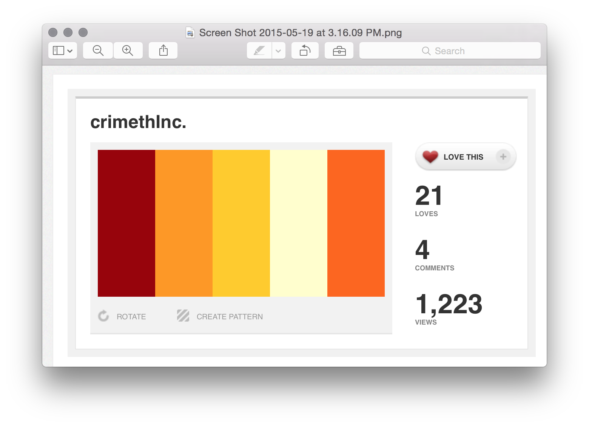
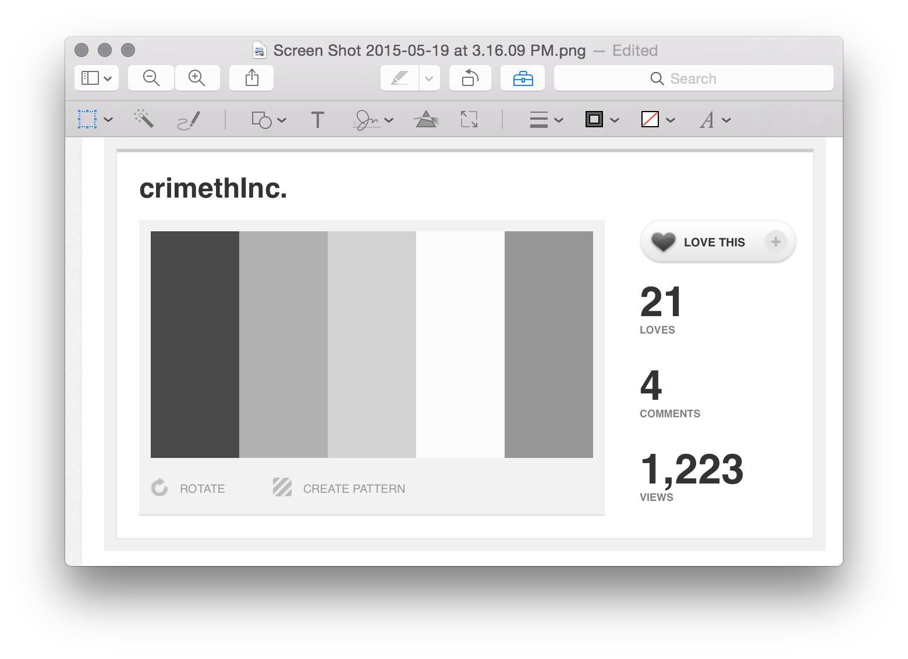
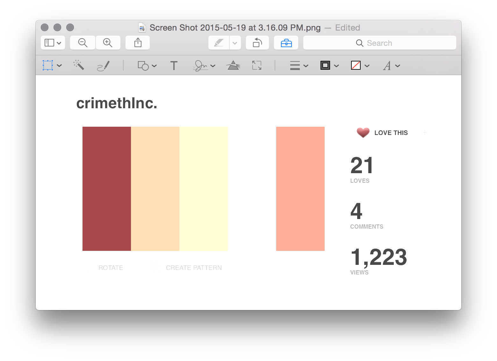
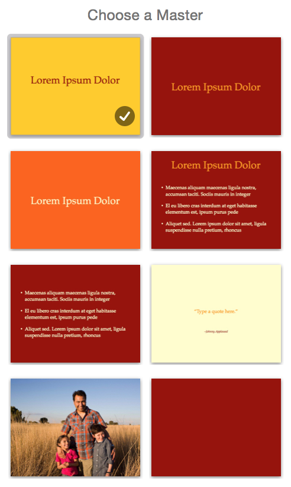

Yesterday at [UIKonf](http://uikonf.com), I gave a presentation on Teaching and Learning, which described the beginning of my own career (surrounding blogging), reasons why you should blog, and some first steps to get started.



It was well-received and after the talk, several people asked me to share how I prepare and present conferences talks. So here we are.

I've developed my technique for preparing and delivering talks over the past few years. At Teehan+Lax, I had a [two-day course](http://podiumconsulting.com) on public speaking, which has heavily inspired my technique now.

Note that this post is _not_ a set of instructions. Rather than prescribe how you should do public speaking, I'm only describing how I do it. Hopefully you'll find something useful.

## Proposal

The first step in giving a presentation is typically writing a proposal that you submit to a conference, and then the conference picks which proposals to accept. This is called the "call for proposals" or "call for papers" or just "CFP."

Writing a proposal is something that I'm not great at. If you want to write an amazing proposal, you should go through the whole process to actually make your talk before you even submit it (that means, as I'll describe, writing an audience profile, communication objectives, and structure). But that's a lot of work ¯\\_(ツ)_/¯ So I kind of wing it and sometimes it works.

I know some people submit multiple proposals to anonymous CFPs in the hopes that this "shotgun method" will yield at least one accepted talk. I don't really like this because I feel like if you do several proposals rather than just one, the quality of each can't help but suffer. I'd rather submit one good proposal than three mediocre ones.

One thing I like to do is keep the proposal as generic as possible without losing meaning. Weeks or months can go by from my submitted proposal to the actual talk, and keeping my proposal vague lets my talk reflect the world as it exists when I give the talk, and not the world when I proposed it.

OK, so say I got accepted. Awesome! What now?

## Audience Profile

I actually consider this the most important step in the whole process. In order to build a talk, I think long and hard about my audience _first_. Some things to consider:

- What is their background knowledge, with respect to my topic?
- Why are they at the conference?
- What do they expect from my talk?
- What are their business goals? What's stopping them from achieving those?
- What do they aspire to?
- What are they afraid of?
- What are their biases?

That's a lot, but it's important to answer every question. Knowing who I'm speaking to is going to help me in the next step.

## Focus

For me, focus is the most difficult part of building a talk. I used to construct my talk based on what I wanted to talk about. But that's a conversation, not a presentation.

Instead, I think about _why_ I'm giving the presentation.

- What do I want my audience to actually _do_ as a result of listening to me speak?
- What do they actually need to hear in order to motivate those actions?
- How do I want them to feel after my talk is over?

These are important questions. The first question makes me answer why I'm giving the talk at all. I use my answer to figure out what they actually need me to tell them.

The third question is what I feel separates my early presentations from my recent ones. It's not enough to tell people a bunch of stuff. Telling someone something isn't enough to inspire them to do that thing. I need to make my audience _feel_ something, too. Only when they have the knowledge _and_ the feelings will they be compelled to actually do what I want.

## Structure

Every talk benefits from structure. Compare and contrast the following two talks:

> Hello! Here's a new API. Let's talk about it for an hour.

Or...

> Hello! Have you ever had X problem? Well, so have I. And this new API solves X! Let's talk about the history of the problem, how the API solves it, and next steps for you to use this new API.

I've seen (and given) so many programming talks that jump directly into the technical details – bypassing the context of _why_ what the audience is about to hear is important.

There isn't just one way to structure a talk, but it's important that I structure it somehow. Jumping directly to details is a really easy way to lose my audience before I've even gotten to the third slide.

I generally structure my talks in this format:

- A story relevant to my message.
- The agenda, usually three points.
- Those three points.
- Conclusion, which ties back to the story at the beginning.

Sometimes I have only two points, and sometimes four (if one is small). The points are essentially the answer to "what the audience needs to hear" from the focus step.

Even talks about programming need structure.

## Design

So, design. This is the part that people usually skip directly to, but design is useless without a profile, focus, and structure.

Actually, no – design can be _worse than useless_ without sufficient forethought. Designing slides first can actually _harm_ the ability to convey a message, by distracting the audience.

Just like there's a difference between what I want to say and what the audience needs to hear, there is a difference between the slides I want to make and the slides that will actually help my talk.

So.

A few years ago, I read Zach Holman's [Slide Design for Developers](http://zachholman.com/posts/slide-design-for-developers/), and it helped me develop my own style. I started imitating his style at first – even using the same font! But now I feel like I've got my own style. It's just happened through experience.

So how do I design my slides? Well, there are two important parts.

1. Pick a colour palette.
2. Pick a font.

I like to start with a colour and then search [Colour Lovers](http://www.colourlovers.com) for a palette using it. The colour I start with depends on my audience. For example, my recent UIKonf presentation started with the yellow from the German flag, #FFCC00, then I found [this palette](http://www.colourlovers.com/palette/27881/crimethInc.). I don't think anyone noticed, but it's a good jumping-off point to avoid drowning in a sea of endless choices.

One note about colour schemes is that choosing one needs to take accessibility into account. I take a screenshot of the palette and open it in preview.

OK, there are a few things I do. After opening "Adjust Colour", I desaturate the screenshot to make sure that the absolute brightness values of the colours still have a high contrast. This helps make sure that if anyone in the audience can't differentiate between the colours, my slides are still legible.

Then I move the saturation slider back to only desaturate it about halfway, then increase the exposure. This simulates the "washed out" effect that many projectors and stage lights give.

If the colours are still high-contrast enough to distinguish them from eachother, then it's a good palette.

For fonts, I actually _do_ have some instructions for you. Go to [this website](http://designforhackers.com) and sign up for David Kadavy's design email thingy. You'll get an appropriately-named PDF called "All of the fonts you’ll ever need" (you should also [buy his book on design](http://www.amazon.com/gp/product/1119998956/ref=as_li_tl?ie=UTF8&camp=1789&creative=390957&creativeASIN=1119998956&linkCode=as2&tag=ashfur-20&linkId=VRA2F3W35A366BMS)). Depending on the way you want your audience to feel, you might pick a Humanist or Geometric font. It's up to you, but make an informed choice.

I make some master slides in keynote with some cool colour combinations, but I don't feel obliged to stick to them. Sometimes I use one master slide specifically to mark the beginning of a new section. Sometimes I just kind of wing it.

OK, so then I make slides and play around with shapes of words in Keynote. As much as possible, I try to keep font sizes large. Like, ideally at least 80 points. The UIKonf talk has one slide using size 500pt text. Nice.

See, the thing is that I don't want people reading my slides. As much as possible, I try to make a talk that I could give as effectively without my slides at all. The slides are there to support me, not the other way around.

One other thing I've started doing recently is a change to the last slide. I used to go with a slide that said "Thanks!" or "Questions?" or had my contact info. That's good _for me_, but is it good for the audience? Does it help my talk?

No, it doesn't.

Instead, I have a final slide with big letters saying something that embodies the most important part of my message. This is because:

- People need to know that the talk is over, and I need to communicate that with my body language and voice, not just my slides.
- The audience can find my contact information from the conference website if they want it.
- There are usually questions anyway, so having a slide labelled "Questions?" is unnecessary.
- The last slide is probably going to stay there for at least a few minutes during questions. Whatever I put there is going to stick in my audiences mind, so I want to take advantage of that.

Pictures in slides are good, but only if they're big. Like, the entire slide big.

I limit the amount of code I include; if my talk needs to contain a lot of code, I'll use Xcode and do live-coding. That way people can see the code being constructed instead of just the final product.

## Rehearsal

OK, so now it's time to rehearse. This sounds stupid, but I've recently noticed that the talks I rehearse just two or three times go way better than the talks where I just kind of wing it.

I usually rehearse in front of my wife. She's not a developer, but the rehearsal isn't to judge the technical components of my talk (that's what the profile, focus, and structure steps are for). She gives me feedback about how things flow, places where stories could be connected, and my general delivery. It is invaluable.

Sometimes I don't have someone to rehearse with, so I record myself and watch the video. It feels terrible – like I'm a dog having my nose rubbed in a mess I've made – but it is _so useful_.

I've had a hard time avoiding "filler words" like "um", "uh", "and, you know..." and I found an exercise that really helps. Get someone to listen to you talk for a minute or two. It doesn't need to be a presentation – just a monologue. Anytime you say one of these filler words, they raise their hand.

Oh my god I had, uh, no idea that, I, you know, do that so often. Yeah.

With practice, I got better.

## Presentation

Alright, so the big day is here. I'm where I've been told to be by the organizers. I put my slides and/or Xcode on their own virtual desktop and turn on Do Not Disturb on my computer and iPhone. I make Xcode fonts _ridiculously large_ – including the debugging console.

Sometimes I don't have access to my computer during the talk, so I try not to rely too heavily on the presenter notes because I might not have them. That sucks, though.

I try to use repetition a lot – and the end of sections and heavy slides – to reinforce what I've said. Never underestimate the power of repetition to help solidify a point in the audience's minds. In software, the mantra is "Don't Repeat Yourself", but when presenting, this is a terrible idea. Repeat yourself a lot.

Even though I am usually using a microphone, I speak up to project confidence. I try to keep my shoulders back, as far away from my ears as possible to keep a good posture. As I talk, I make eye contact with _individual_ members of the audience for about three seconds at a time – this is really hard for me to do. My eyes want to just sort of wander over the audience, but I want make a connection with audience members.

I try to be animated and convey that I care about my topic. I regularly change my voice: it's pitch, volume, tempo, and rhythm. This keeps the audience interested and engaged.

I also try and make the audience anticipate the end of my talk. I get really excited, raise my tone near the end of a sentence, switch to the last slide (the one with my central message), say that message, and then pause and say "thank you." I never end with "any questions?" because the audience wants to applaud, and asking for questions before that skips the step and makes it awkward.

## Questions

I've been told I should prepare for anticipated questions during rehearsal, but I never do. I think it gives my answers more authenticity. The worst-case is that I say "I don't know", and that's OK. I'd rather not know the answer and admit it than give someone a wrong answer that I made up on the spot.

Whenever I give an answer, I try to reinforce the context that it comes from. I say "In my experience..." or "At Artsy, we..." so that the audience knows that my answer isn't an absolute – it's just an informed opinion.

## Post-Talk

After the talk is done, I post the slides to [speakerdeck](http://speakerdeck.com) and tweet a link. If I'm smart, I've uploaded them and composed the tweet just before the talk so that it's ready to go as soon as I'm done. I also update my (newly redesigned) [speaking page](/speaking/) to point to the slides.

Eventually, hopefully, a video recording of my talk is published. I watch it and take notes on ways to improve my talk next time.

So that's my process. I can't say that it'll work for you, but now you know the sausage is made. Public speaking is not some unknowable skill – for me, it's a performance that is generated from a creative process and guided by a formula. That doesn't make it any less fun.
