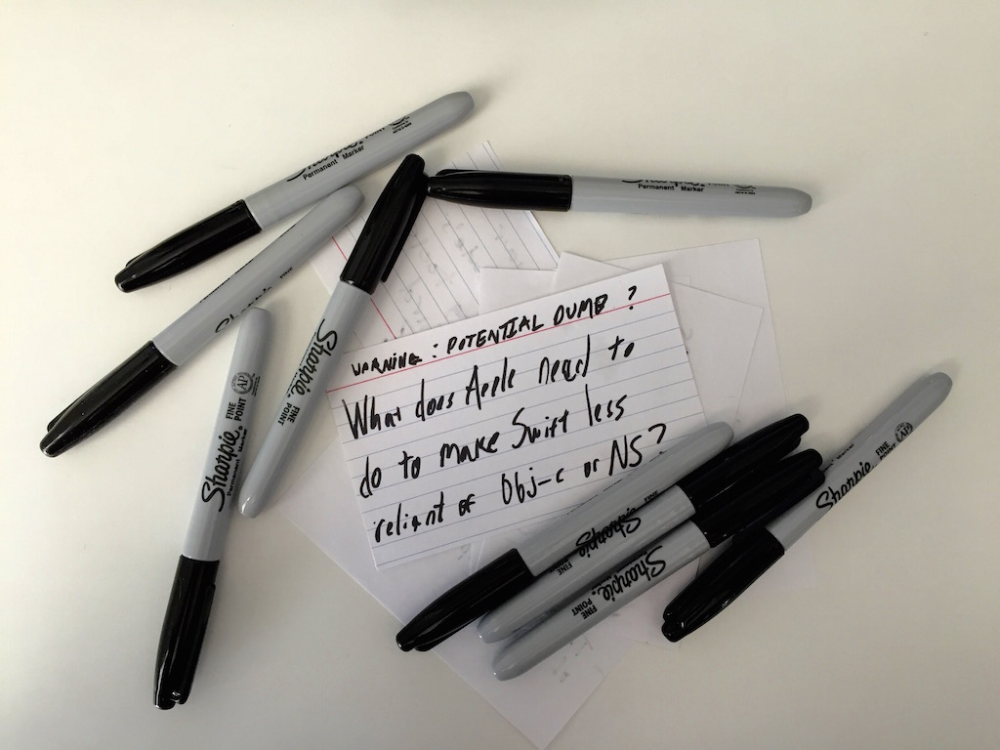

The other day, I read a [really interesting blog post](http://blog.valerieaurora.org/2015/06/23/ban-boring-mike-based-qa-sessions-and-use-index-cards-instead/) discussing Q&amp;A sessions after presentations. I highly recommend reading the article, but the gist is that you get audience members to write questions anonymously on index cards, instead of asking them in front of the rest of the audience.

It sounded like an awesome idea, so I tried it [last night](http://www.meetup.com/Brooklyn-Swift-Developers/events/223159208/).

Things went pretty well. I placed the cards and some markers down on seats before anyone showed up and, in the beginning of my talk, explained how the Q&amp;A would work. I provided sharpies instead of pens because they’re easier to use, and make people write larger so it’s both easier to read and leads to shorter questions.

Everything went really well. I had a bunch of questions, and after I had exhausted the cards, there were some additional follow-up questions from the audience. These were asked out loud, in the usual way.

Anyway, there was one card in particular that stood out to me.

There at the top, in all caps, was a _warning_ that the question-asker wasn’t sure if their question was worth asking. Or if it was an intelligent question.

It’s a sign of the tech culture we live in that – even anonymously – people asking legitimate technical questions in a learning environment feel the need to guard themselves against being dismissed or ridiculed for asking a “dumb” question.

I’m very happy that the person asked their question, which in fact is very interesting. I imagine the question likely would’ve gone unasked if they had to stand up to ask it.

So yeah. Index card Q&A sessions. I’m convinced.
