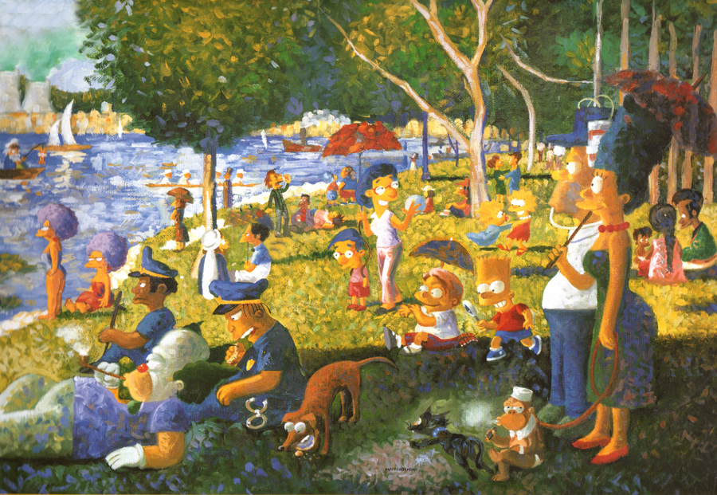
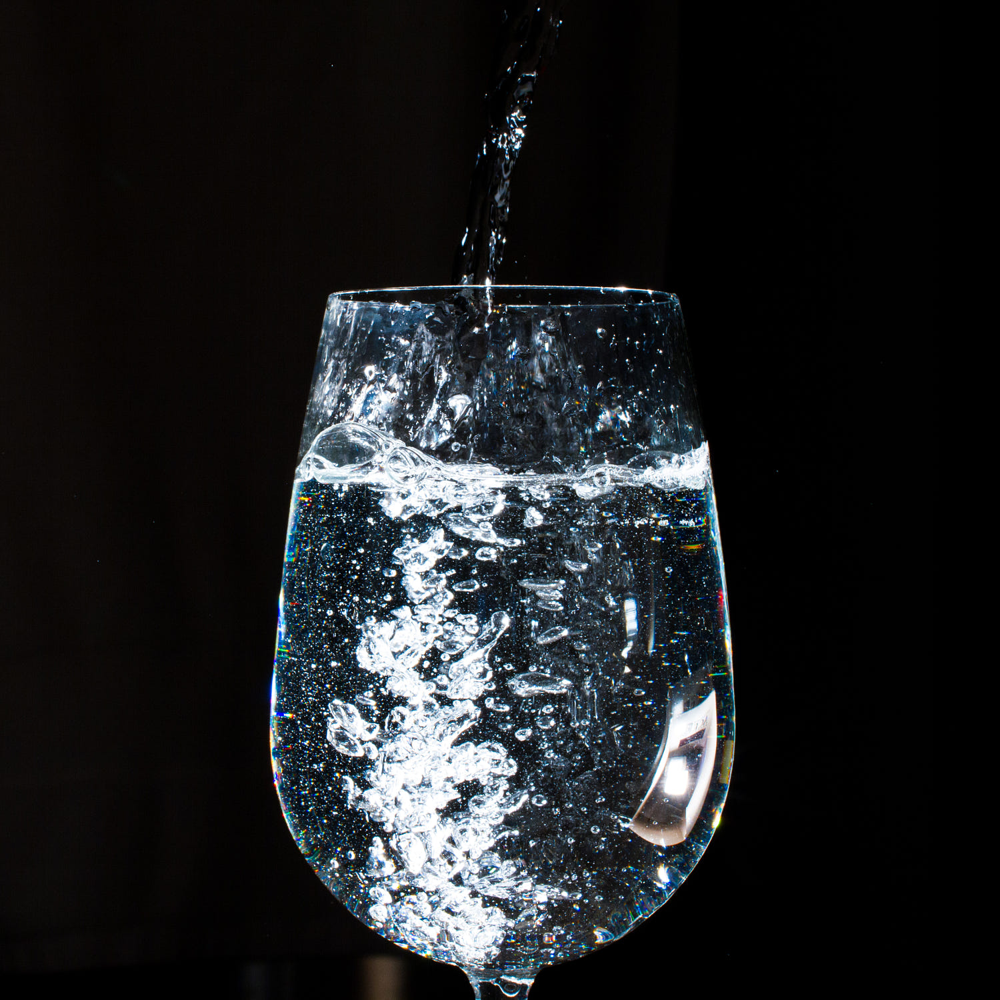

I've heard that everyone is born a sketcher – that we all drawn as children – until we reach a certain age. Then we realize that our drawings aren't accurate. That they don't reflect reality. That we lack the skill to produce something "good."

But what is good?

_Why_ do children draw? Because it's fun. It has value to them not because of the finished drawing, but because the act of drawing itself – the act of self-expression – is a fulfilling process. As adults, why do we ignore this value? Why do we only value art based on its appearance or market price? On what a drawing or painting or photograph _looks_ like?

I've [realized](/blog/art-for-your-own-sake/) that I don't really care about my _photographs_, that I actually only care about my _photography_. The photos I make are valuable _only_ in their relation to the process of creating them.

This gets to the heart of my problem: we place emphasis primarily on the _skill_ involved in making art. This has been true throughout art history, like when [pointillism](http://arthistory.net/artstyles/pointillism/pointillism1.html) was first shunned by mainstream art critics because it didn't accurately reflect the way the world _actually looked_.

It was unrealistic, so it was bad.

But pointillism is an incredibly valuable approach to painting, and the artworks that came out of that era are still some of the most famous paintings in the world.

Certainly, it takes skill to make a painting in the style of pointillism. But as art history marched forward, we saw less and less of an emphasis on the importance of skill, in the practical sense. [Craig Damrauer](https://www.artsy.net/artist/craig-damrauer) expressed, as a work of art, the following equation.

> MODERN ART = I COULD DO THAT + YEAH, BUT YOU DIDN'T

Art can be valuable without skill, and it can be worthless with skill. Some of my favourite [Instagram shots](https://instagram.com/ashfurrow/) involve almost no skill – I see something interesting and I take a picture. Some composition, minimal editing, and bam, something cool.

<Narrow addBottom>

<blockquote class="instagram-media" data-instgrm-captioned data-instgrm-permalink="https://www.instagram.com/p/zBKjTVjBqI/?utm_source=ig_embed&amp;utm_campaign=loading" data-instgrm-version="13" style=" background:#FFF; border:0; border-radius:3px; box-shadow:0 0 1px 0 rgba(0,0,0,0.5),0 1px 10px 0 rgba(0,0,0,0.15); margin: 1px; max-width:540px; min-width:326px; padding:0; width:99.375%; width:-webkit-calc(100% - 2px); width:calc(100% - 2px);">
 <a href="https://www.instagram.com/p/zBKjTVjBqI/?utm_source=ig_embed&amp;utm_campaign=loading" style=" background:#FFFFFF; line-height:0; padding:0 0; text-align:center; text-decoration:none; width:100%;" target="_blank"> 
 

 
 

 

 

 
 View this post on Instagram

 

 

 

 

 

 

 

 

 

 
 

 

</a>
<a href="https://www.instagram.com/p/zBKjTVjBqI/?utm_source=ig_embed&amp;utm_campaign=loading" style=" color:#c9c8cd; font-family:Arial,sans-serif; font-size:14px; font-style:normal; font-weight:normal; line-height:17px; text-decoration:none;" target="_blank">A post shared by Ash Furrow 🏳️‍🌈 (@ashfurrow)</a>

</blockquote>

</Narrow>

And some of my least impressive ["good" photos](https://500px.com/ashfurrow) required notable technical skill.

My point is, I enjoyed making both these photos, even though one sucks. Both are valuable to me.

Everyone knows that art is about self-expression, but society rarely considers the value created when making art. In authoring books. In recording a song. In writing a stand-up comic routine.

The emphasis that society places on art is only a byproduct of its original value. Art is only a side-effect of the artistic process: something that can be experienced but can never be sold.
