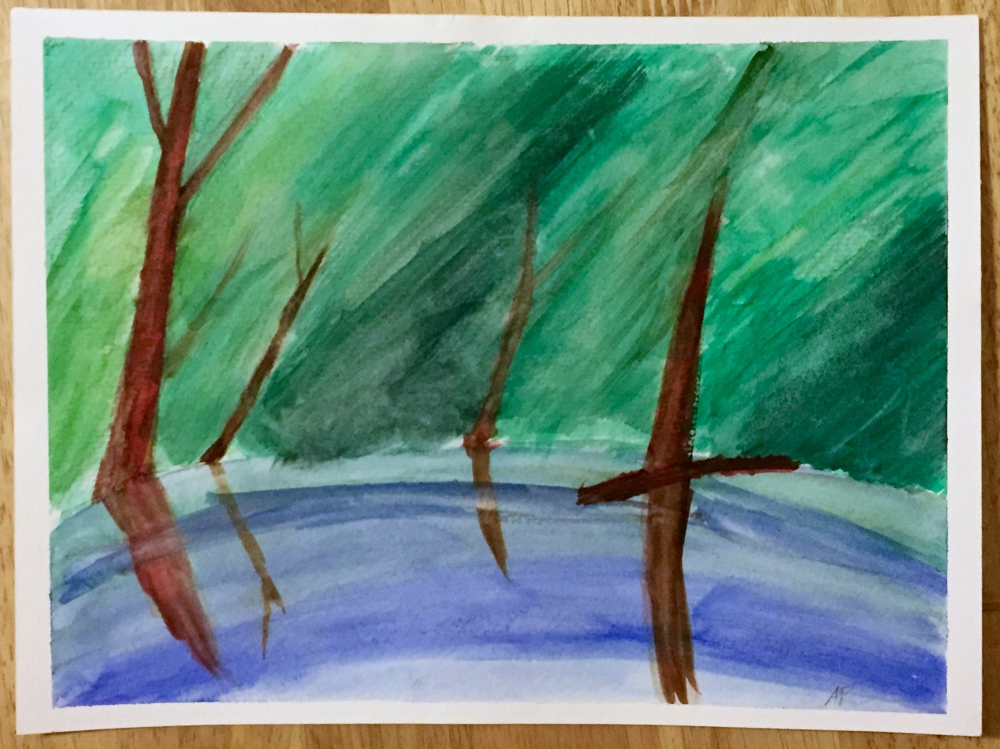
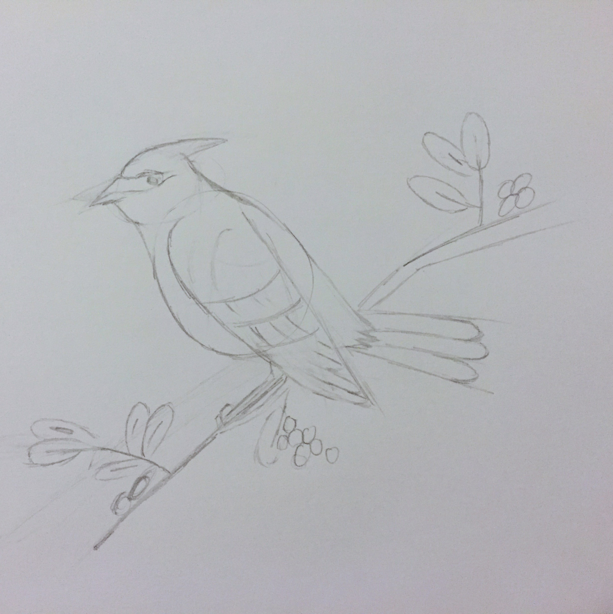
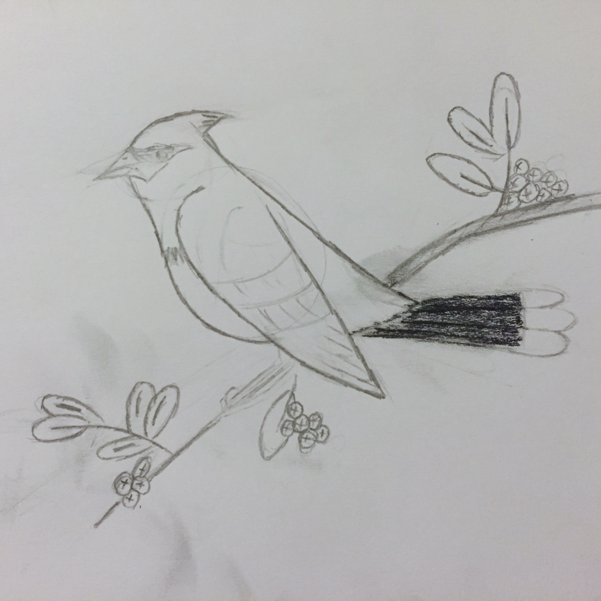
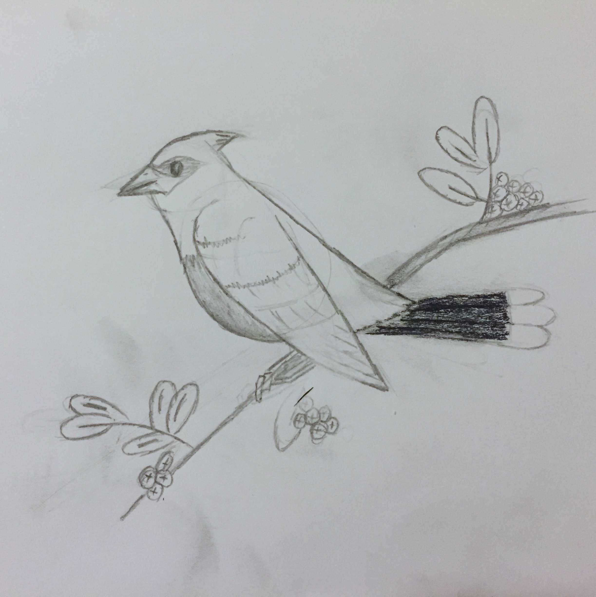

I've never been able to draw. When I was a kid, I would try but my drawings look terrible – nothing at all what I was trying to create. In middle school, I remember periodically checking a book out from the library titled "How to Draw Superheroes", but I gave up overtime. I just. Couldn't. Draw.

So I never tried again.

Until last week.

Last week was Artsy's offsite, the annual companywide meeting held outside NYC. In addition to team-building and brainstorming exercises, Artsy also had a number of "choose your own adventure" style activities. I signed up for a watercolour class.

<!-- Originally this had an embed of https://instagram.com/p/5xqxoLMT_n but the account is private now. -->

<!-- That's me, on the dock. -->

The painting wasn't really what was important to me, it was something earlier. I was sketching the rough outline of the shore line – it was frustrating, since I couldn't make it look right. But my hand was rubbing a part I'd already drew, and it smudged the graphite.

I liked it.

I took my hand and smudged more of it. It didn't look like the shore, but I liked it. I _really_ liked it. So I kept doing it.

That evening, after dinner, there were five short talks given by colleagues. Lots of different topics, but an intern named Kevin gave a great talk on the idea of pursuing discomfort to become a better artist. It was at that moment that I decided to learn to draw.

So over the weekend, I stopped by a discount parties supply store on Avenue A and picked up a ["How to Draw" kit](http://www.dickblick.com/products/generals-drawing-pencil-set-no-30/). I figured a kit, with, like, a few types of pencils and stuff would be a good start, since I didn't know what I needed. It even had a short booklet that had instructions (in three languages!). Nothing special, but I was ready.

So last night, I sat down with a pencil and paper. I started drawing a branch for a bird to stand on, but my wife pointed out that I should follow the instructions. She was right.

I drew those stupid circles you're supposed to start with, even though that never made sense to me. Why would you draw something that isn't part of the finished product?

But then I looked, and whoa.

So I kept at it. Added some broader details, then finer ones. It was going really well. I was just copying another drawing, but I was having fun. And I was drawing! _Me_!

About an hour in, my hand cramped, so I stopped. I took another photo, signed and dated my drawing, and reflected.

Yeah, it's not an objectively "good" drawing, but I don't really care about that. If you handed me this and asked if the person who drew it could draw, I'd say "of course."

What other things are there that "I can't do", but I've never really _tried_?

A few years ago, I couldn't do web development. Today, I designed and developed this blog, which is pretty snazzy. It took a friend pointing me at [Middleman](http://middlemanapp.com), and some evenings spent messing around with [Sketch](http://bohemiancoding.com/sketch/). I got lots of guidance along the way, from friends and colleagues, but what was all that, really?

Some time, and some patience.

I never learnt to draw because I never really gave it a chance. I wanted immediate results and got deterred when my drawings didn't instantly meet my expectations.

What else is out there that "I can't do"? I wonder.
