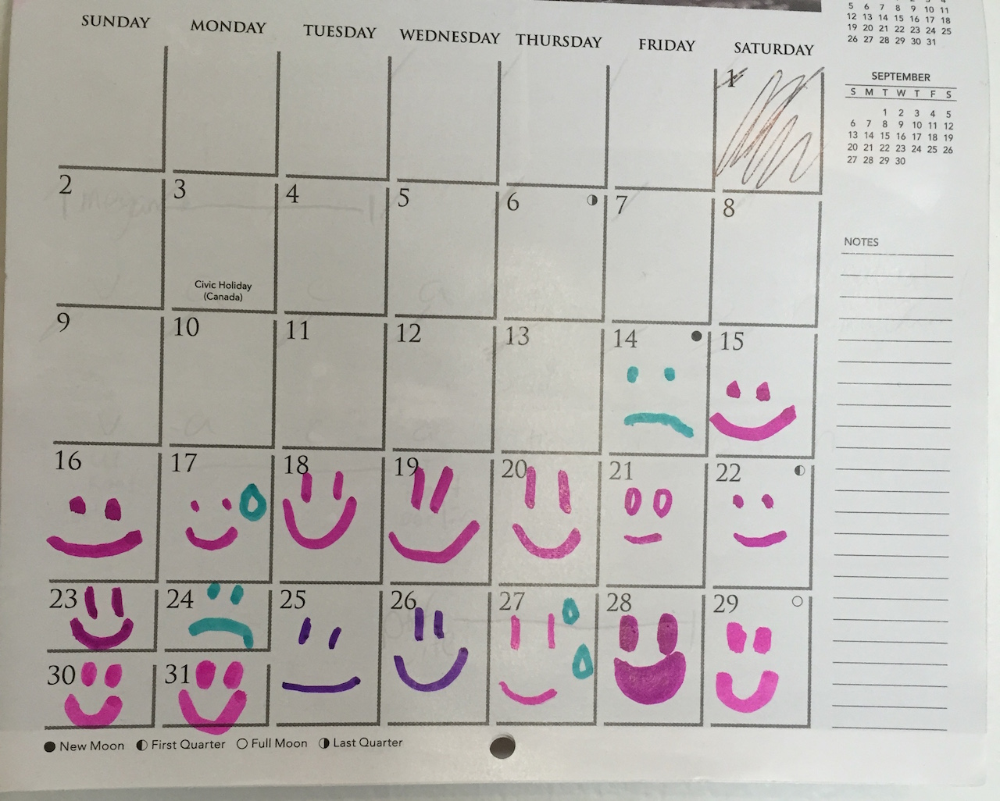
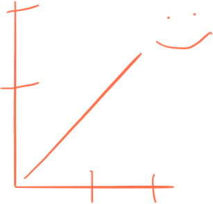
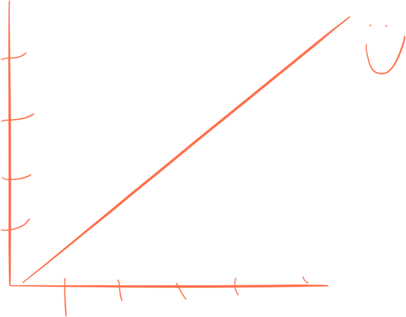
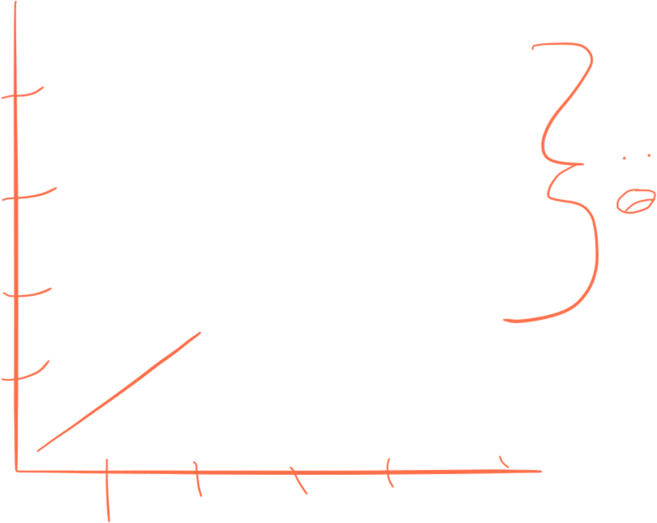
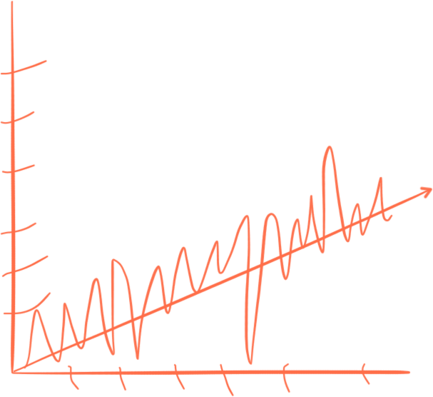
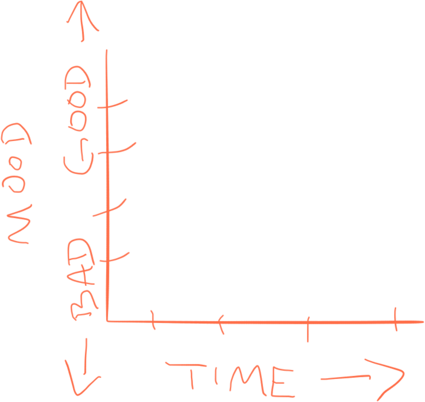

A while ago, I cam across a two-part series of drawings which discussed depression ([Part I](http://hyperboleandahalf.blogspot.nl/2011/10/adventures-in-depression.html) & [Part II](http://hyperboleandahalf.blogspot.nl/2013/05/depression-part-two.html)). I related to a lot of the themes Allie Brosh depicted from her own struggles with depression. I got really excited when I found [her book](http://amzn.to/1McmNmt).

It's amazing how simple drawings can relate such a broad range of feelings. Words often get in the way of communicating, especially about something as personal and subjective as depression.

Over the past few months of therapy, I've gained a better picture of my own depression, and I want to record these insights. Maybe someone else will find them useful or informative, but mainly this post is so I can understand myself better.

---

I was pretty low earlier this year, due to a bunch of problems that seemed to gang up on me all at once. Concerned, my wife made me an appointment with a therapist late in May. This would be the first talk therapy I'd have done since 2010.

Things started to improve. Slowly, but noticeably.

A few weeks ago, I decided to record my sustained progress somewhere – in case I ever needed proof that things _can_ improve. Things like that can really help when I feel hopeless. This is kind of like a quantified self(-esteem). I can't manage what I don't measure.

Before going to bed, I'd record how my day went on a calendar. Good days got smily faces and bad days got frowny ones. There's a lot you can express in a smily face, so I could convey subtlety.

My calendar got thinking about graphing depression, and how it's not nearly as straight-forward as I thought.

---

So after a few weeks of therapy, things were looking pretty good. I was doing a lot better – my mood had improved a tonne.

Then I kept getting better. Things kept improving, my mood got more stable, I started socializing with friends again – an overall improvement.

Super cool, eh?

The thing is, this really put my initial improvement in perspective.

A few things came to mind. First, the original improvement felt _a lot_ smaller. Even though it was difficult and even though it took a lot of effort, somehow that initial upswing just didn't seem as significant. It made me a bit sad, but then I realized that this sadness was irrational (recognizing and dismissing irrational, automatic thoughts has been an important part of my treatment).

Second, it made me realize that as good as I feel _now_, I still have a long ways to go. To be honest, I feel a bit intimidated. But I recognize that any progress is difficult, and getting as far as I have is proof that I can keep going.

---

But there's a problem. Those graphs are all lies. They aren't incorrect, just incomplete.

My calendar conveyed a lot of subtlety, which a dinky little line that goes mostly in the "up" direction just can't do. In reality, things go up and down _all the time_, and (hopefully) the average baseline trends upwards.

Somedays go really well, and some days I find myself feeling just like I did before I started therapy. My baseline – my homeostatic mood – has been improving, but there are still really bad days.

_Even this graph_ is an oversimplification. The problem stems from the idea that the vertical axis reflects an absolute measurement of "mood" – it implies that my mood can be categorized as either "good" or "bad", or somewhere between the two.

But that's not really the case. A person's mood is not reducible to a number line – moods are made up of a variety of feelings, all experienced at the same time.

I've learnt that depression isn't a spike in sadness or a dip in happiness. Depression is an utter absence of feelings. It is flatness. An inability to feel anything.

I'm not sure that depression can be graphed to the same level of accuracy as heart rate or blood pressure. It's something that is wildly unpredictable. _Sometimes_. Often I can see a depressive episode on the horizon. But sometimes they hit me from come out of the blue.

---

In [Part II](http://hyperboleandahalf.blogspot.nl/2013/05/depression-part-two.html) of her discussion on depression, Allie Brosh explains that the first feeling to return to her was [hatred](http://1.bp.blogspot.com/-JRfSp-ALu3Q/Uga2ko-8r0I/AAAAAAAAKKo/dxhhBX89w0E/s1600/ADTWO39.png).

> But hatred is technically a feeling, and my brain latched onto it like a child learning a new word.
>
> [Brain throwing hate]: "I HATE SUN! I HATE PURPLE! I HATE ME!"

This last weekend – Labour Day weekend – was very flat for me. I spent most of my long weekend staring at the ceiling, sometimes a wall. I threw myself at some [work on my website](/blog/blog-infrastructure/) as a distraction, but it didn't really help.

I'm bouncing back, but it's slow. Last night on my way from work, _all_ I could feel was anger. This morning on my way to work, I yelled at a taxi driver who had cut me off. He looked scared, like he was afraid I was going to open his car door and hurt him. I didn't like that. I don't want to be someone that people are afraid of.

There's no takeaway here, no lesson learned or advice to give. I'm figuring this out as I go along, but I'm fortunate enough to have a family that loves me, a supportive work environment, and access to professional help.

I think I'll keep focusing on the good feelings, on trying to get a smily face on my calendar at the end of the day.

