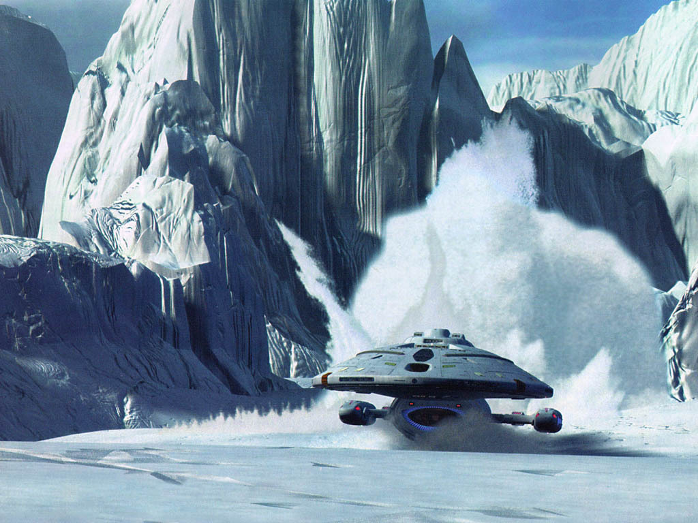
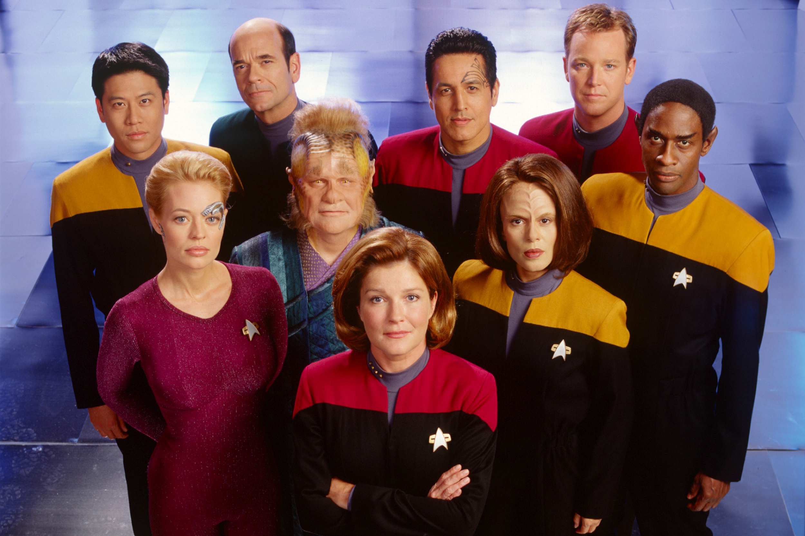
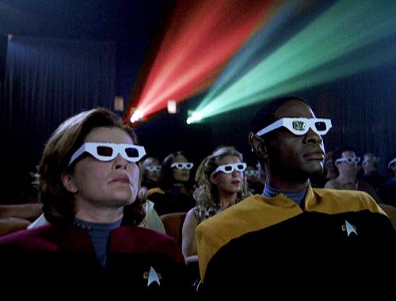

_Star Trek Voyager_ is one of the best pieces of science fiction television ever. After listening to [Brianna Wu discuss it on _Unjustly Maligned_](https://www.theincomparable.com/ump/16/), my wife and I decided to go back and watch it through again.

Now, all TV has good episodes and bad episodes. We only wanted to watch the good ones. A while back, we used this [handy guide to _TNG_ in 40 hours](https://medium.com/maxistentialism-blog/star-trek-the-next-generation-in-40-hours-c4a6762cbd3) to go through just the best episodes, but I couldn't find a corresponding resource for _Voyager_. So here we are.

## Contempt

A lot of Star Trek fans dislike _Voyager_. After _TNG_ resurrected the franchise in the late Eighties, things looked good for Star Trek, but TNG was plagued by a lot of problems. Fundamentally, two sets of writers were battling for control of the series – one group wanted to write interpersonal dramas, and another group wanted to write planet-of-the-week romps. Once _TNG_ ended, the first group went on to write _DS9_, the space soap opera, and the second group wrote Voyager.

So that's how Voyager got its (somewhat deserved) reputation as a bit campy. It's even a bit loathed by nerds. But I would agree with Wu, who pointed out that _Voyager_'s "hit rate" is higher than _TNG_'s. Pick any random episode, and it's more likely to be a good one. Additionally, it's episodic nature makes it easy to drop in for an episode or two, unlike _DS9_.

## Redemption

So why do I love _Voyager_ so much? The characters! It may seem counterintuitive to like a show written as episodic, adventure-of-the-week style stories because of the characters, but they are _so awesome_.

Don't get me wrong, I really like _TNG_, but something always seemed so clean about it. Same with DS9. The stakes seemed so artificial, because the Federation and Starfleet always seemed so powerful. In their perfect future, there's so little drama that it's hard for me to care about the characters.

_Voyager_'s crew is stranded, alone, on the other side of the galaxy. They have no back up. If they're damaged, they can't swing by a starbase for repairs. A small crew of 150 people struggle to make their way across the galaxy based only on their wits, making allies and defending themselves against enemies along the way.

What threatens the characters aren't some vague threat of Romulan invasion like with _TNG_, or a giant war with the Dominion like _DS9_. Instead, the characters are fighting **just to survive** – it's a much more relatable situation. There is a constant danger of running out of food, out of power, and out of hope. The characters' grit is what keeps them alive, but it's not an inexhaustible resource.

It's no surprise that one of Voyager's most influential writers, [Ronald D. More](https://en.wikipedia.org/wiki/Ronald_D._Moore), went on to create the wildly successful _Battlestar Galactica_ reboot. A small group of humans, lost in space, trying to survive against all odds. Sound familiar?

---

So hopefully I've convinced you to give Voyager a go. If you're still on the fence and looking for a teaser, then load up the Season 3 episode _Macrocosm_ ([Amazon Prime Video](http://amzn.to/1OY6wSV) or [Netflix](http://www.netflix.com/movie/70158331)). It's a fun, thriller of an episode that features the Captain Janeway's commitment to do whatever is necessary to protect her crew. It showcases what I love about _Voyager_: fun and exciting stories seamlessly intertwined with character development. If you like _Macrocosm_, I think you'll really love the rest of _Voyager_.

## Season 1

Like most television, the first few seasons have the writers and actors finding their feet. On _Voyager_, the cast really hit the ground running and produce a surprisingly awesome first season. The only reason I'm including so few episodes is because things get _even better_ later on.

Find season 1 [on Netflix](https://www.netflix.com/watch/70158331) and [Amazon Prime](http://amzn.to/1OY6uKV).

- **S01E01**: Caretaker
- **S01E11**: State of Flux

## Season 2

Season 2 is when the writers and actors begin to find their groove. The stories explore the characters and we learn more about who they are, how they respond to threats, and see them grow. _Meld_ and _Investigations_ feature some of my favourite acting. There's a few arcs I don't really enjoy (mostly involving Kes) but on the whole I give it a 👍

Find season 2 [on Netflex](http://www.netflix.com/movie/70158331) or [Amazon Prime](http://amzn.to/1OY6jzb).

- **S02E08**: Persistence of Vision
- **S02E16**: Meld
- **S02E20**: Investigations
- **S02E26**: Basics, Part I

## Season 3

The third season is _really_ fun. In _Future's End_, the crew is accidentally sent back to Earth, circa 1995. Sarah Silverman even guest stars! The Doctor gets a mobile emitter, allowing him to leave sickbay, and the crew finally encounters the Borg, who will remain a persistent threat throughout the show.

Find season 3 [on Netflix](http://www.netflix.com/movie/70158331) or [Amazon Prime](http://amzn.to/1Q7HTRj).

- **S03E01**: Basics, Part II
- **S03E08**: Future's End
- **S03E12**: Macrocosm
- **S03E25**: Worst Case Scenario
- **S03E26**: Scorpion, Part I

## Season 4

Season 4 swaps out Kes for Seven of Nine, a human rescued from the Borg collective. This is where the series got _really_ good, in my opinion. Seven's journey to discover herself exposes the humanity of those around her. Her relationships with Janeway and the Doctor are sharply contrasted – Janway takes on a maternal mentorship role, while the Doctor helps Seven adjust to human socialization (something he's had to do, as well).

Whether it's exciting drama in _Year of Hell_, finally making contact with Starfleet in _Message in a Bottle_, or the fun romp with space Nazis in _The Killing Game_, there's a lot to like in season 4.

Find season 4 [on Netflix](http://www.netflix.com/movie/70158331) or [Amazon Prime](http://amzn.to/1OY6muX).

- **S04E01**: Scorpion, Part II
- **S04E05**: Revulsion
- **S04E08**: Year of Hell
- **S04E13**: Waking Moments
- **S04E14**: Message in a Bottle
- **S04E18**: The Killing Game
- **S04E21**: The Omega Directive
- **S04E23**: Living Witness
- **S04E24**: Demon
- **S04E25**: One
- **S04E26**: Hope and Fear

## Season 5

Yet more time travel in season 5! We've got fun and clever writing with _Timeless_ and _Relativity_, and darker, more serious stories in _Latent Image_ and _Course: Oblivion_ (one of my favourite episodes). The crew also meets up with another Starfleet ship that's been stranded, leading to an exciting cliffhanger at the end of the season.

Find season 5 [on Netflix](http://www.netflix.com/movie/70158331) or [Amazon Prime](http://amzn.to/1Q7HXQW).

- **S05E06**: Timeless
- **S05E11**: Latent Image
- **S05E14**: Bliss
- **S05E15**: Dark Frontier
- **S05E18**: Course: Oblivion
- **S05E20**: Think Tank
- **S05E24**: Relativity
- **S05E26**: Equinox, Part I

## Season 6

The penultimate season is probably my favourite, with season 7 in a close second place. We see a lot of the earlier relationship-building really pay off; we know the characters and they know each other. We celebrate their victories and commiserate their defeats – their struggles feel real, and they feel meaningful.

The show also branches out into new formats of non-linear storytelling with _One Small Step_, _Blink of an Eye_, _Fury_, and _The Haunting of Deck Twelve_. Finally, the season ends with a dramatic cliffhanger that largely expands the mythos of the Borg.

Find season 6 [on Netflix](http://www.netflix.com/movie/70158331) or [Amazon Prime](http://amzn.to/1Q7HWwp).

- **S06E01**: Equinox, Part II
- **S06E08**: One Small Step
- **S06E09**: The Voyager Conspiracy
- **S06E10**: Pathfinder
- **S06E12**: Blink of an Eye
- **S06E21**: Live Fast and Prosper
- **S06E23**: Fury
- **S06E25**: The Haunting of Deck Twelve
- **S06E26**: Unimatrix Zero, Part I

## Season 7

Finally, _Voyager_ accomplishes regular contact with Starfleet, allowing us to explore new storylines without diverting too much from the journey home. In _Friendship One_, Starfleet even sends the crew on their first official mission since being stranded.

The mid-season _Workforce_ two-part episode is quite compelling, we see the beginnings of a holographic rights movement in _Author, Author_, and the show begins wrapping up character arcs near the end. I cried during _Homestead_ when Tuvok says goodbye to Neelix.

Of course the series finale is a fun, well-produced story that – even if it's a bit over the top – features the best of Star Trek. Kate Mulgrew does an excellent job playing her older self, and we finally see the crew make it back to Earth.

Find season 7 [on Netflix](http://www.netflix.com/movie/70158331) or [Amazon Prime](http://amzn.to/1Q7HP42).

- **S07E01**: Unimatrix Zero, Part II
- **S07E06**: Inside Man
- **S07E11**: Shattered
- **S07E16**: Workforce
- **S07E20**: Author, Author
- **S07E21**: Friendship One
- **S07E23**: Homestead
- **S07E25**: Endgame

---

We don't learn much about the aftermath of the series finale, which I think is kind of nice. Unlike _TNG_, the characters weren't ruined by a series of slapped-together action movies with no real plot.

If you like what you watched in this guide, it's worth going back to watch some of the episodes you skipped. I had a really hard time trimming this down to only 40 hours of television, and had to leave out some great episodes.

