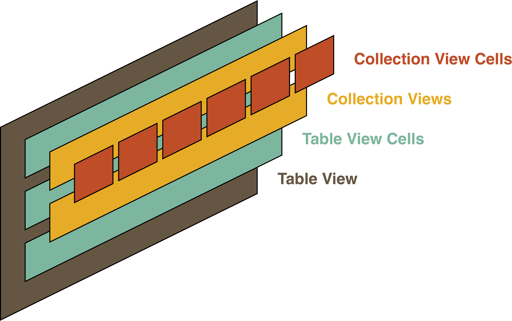
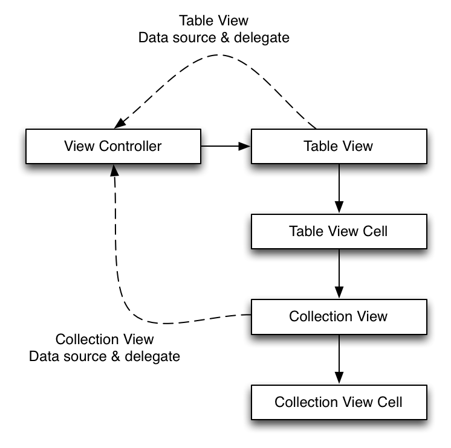
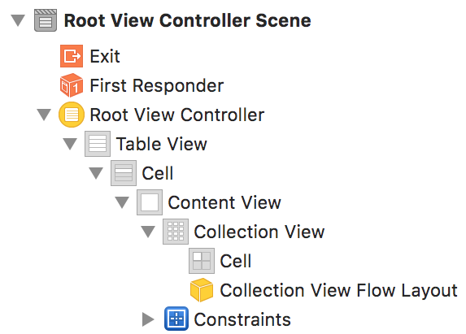
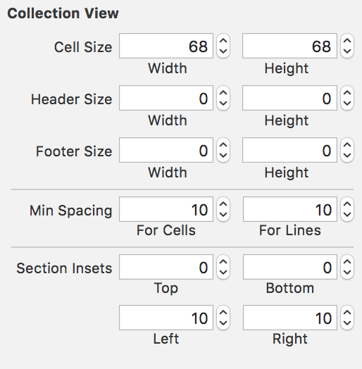
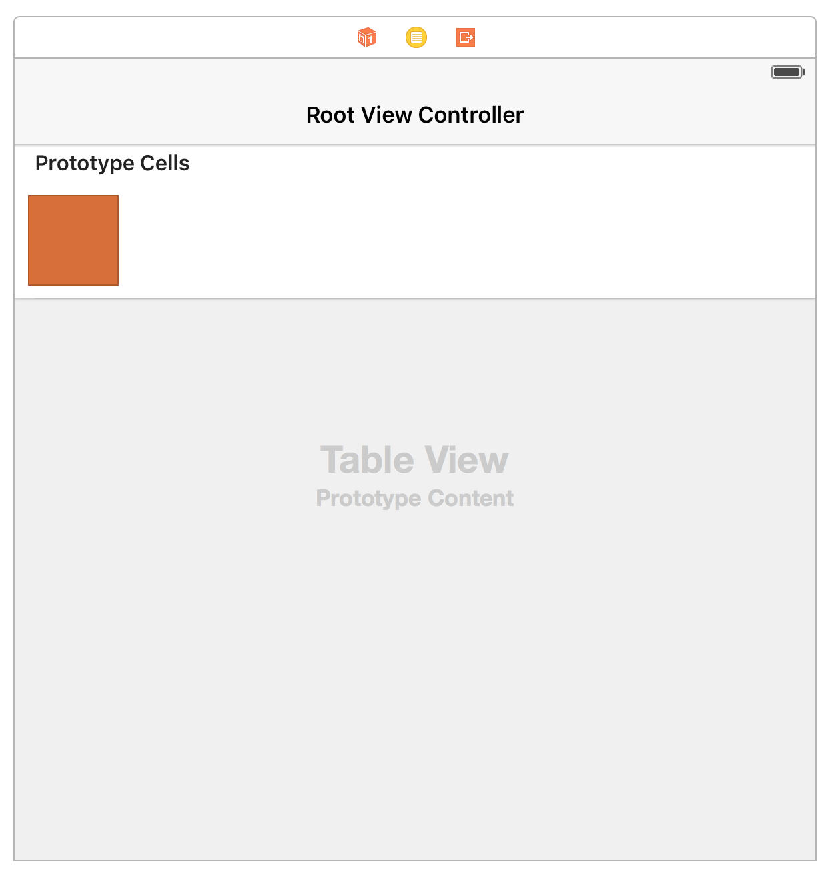
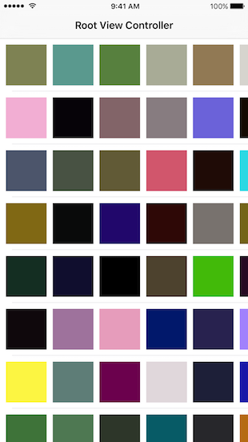

A few years ago, I wrote this post on [putting a collection view inside a table view cell](/blog/putting-a-uicollectionview-in-a-uitableviewcell/). Collection views were still pretty new and there wasn't a lot written about them, so my post got pretty popular. It now accounts for over a fifth of my entire blog's traffic.

Since Swift was announced, I've been getting regular requests to rewrite my tutorial in Swift. Which brings us to today's topic.

Having a collection view within a table view cell has become a common design pattern used in apps like Spotify, the App Store, and even the [Artsy app](http://artsy.net/iphone). It's useful for having a vertical list of things (the table view), with each containing a horizontal list (the collection view).

(Like most things in programming, a little upfront planning can save a lot of work down the road, so let's think about what we want to do first.)

If we step back and think about this from a user interface perspective, it'll give us a hint at how we can structure our code, too.



So the collection view cells sit within the collection view (just like they normally do). And each collection view fills an entire table view cell (an entire row of the table view). And then the table view cells are inside the table view (again, just like normal).

OK, cool. The only thing that's odd here is the collection view _inside_ of a table view cell. That's pretty unusual, but since they're all `UIView`s, it's totally possible. The difficult part is "connecting" the collection views to a data source.

There are two basic approaches here. You can store the information needed for the collection view data source in the table view cell, or you can keep it in the view controller and find a way to distinguish between the collection views. The first option sounds easiest, but it violates [Model-View-Controller](https://developer.apple.com/library/ios/documentation/General/Conceptual/DevPedia-CocoaCore/MVC.html), which says that views should not have direct access to models. Let's take the second approach, since it adheres more closely to MVC.

So our view controller is going to act as a datasource and delegate for both the table view, and _every_ collection view.

<Narrow>



</Narrow>

Often, a collection view's data source is its view controller. The problem is that we only have _one_ view controller but _many_ collection views. We need some way to distinguish between a collection view on the first row, and one on the second row, and third, and fourth...

We need a way to store which table view cell a collection view is in. Since my table view only has one section, I really only need to know which _row_ my collection view is in. A row is just an `Int`.

As luck would have it, `UIView` has a useful property: `tag`. The documentation describes `tag` as the following.

> An integer that you can use to identify view objects in your application.

This will be _perfect_ for storing which row the collection view is in.

OK, so it sounds like we've got a plan with three components: a view controller class, a table view cell class, and a storyboard to glue everything together. Let's do it!

So you'll need to have a table view setup – drag a "Table View Controller" onto the storyboard. Create a swift file with a `UITableViewController` subclass and set the custom class property in the storyboard to use this new class.

Next, configure your table view cell: give it a reuse identifier (I used "Cell") and a custom height if you want to (I used 88pt). Also create a new swift file for your `UITableViewCell` subclass and set the prototype cell's custom class.

Drag a collection view onto the cell (Xcode will make it a subview of the cell's content view). Resize it to fill the entire cell and hit "add missing constraints" to make autolayout do its magic. Your view hierarchy should be will look something like this:

<Narrow>



</Narrow>

All that's left to do is configure the collection view. I set its size, spacing, and content insets to make the cells vertically centred. I also set its scroll direction to "horizontal", unchecked "Shows Horizontal Indicator", and set its background colour to white.

<Narrow>



</Narrow>

Finally, I set the reuse identifier of the collection view cell to "Cell" (it needs to be something). And that's it for our storyboard configuration. On to the code!

<Narrow>



</Narrow>

Now that we have our interface set up and configured, it's time for the code. Open the file with our `UITableViewCell` subclass. We're going to add one property: a reference to its collection view.

<Wide>

```swift
class TableViewCell: UITableViewCell {

    @IBOutlet private weak var collectionView: UICollectionView!

}
```

</Wide>

Make sure to connect this collection view outlet to the cell's collection view in the storyboard.

This is a standard `IBOutlet`, except I marked it as private. This is to create a separation of concerns – our view controller shouldn't be accessing the collection view through the table view cell.

Instead, we'll create a function to set the delegate, datasource, and row number on the collection view. Here, note how we can use [Protocol Composition](https://docs.swift.org/swift-book/LanguageGuide/Protocols.html#ID282), available [since Swift 3](https://github.com/apple/swift-evolution/blob/master/proposals/0095-any-as-existential.md).

<Wide>

```swift
func setCollectionViewDataSourceDelegate(dataSourceDelegate: UICollectionViewDataSource & UICollectionViewDelegate, forRow row: Int) {
    collectionView.delegate = dataSourceDelegate
    collectionView.dataSource = dataSourceDelegate
    collectionView.tag = row
    collectionView.reloadData()
}
```

</Wide>

(**Update**: Thanks to [a reader's feedback](https://github.com/ashfurrow/Collection-View-in-a-Table-View-Cell/issues/1), I've added a call to `reloadData()` – take a look at their GitHub issue for a discussion why.)

The `D` type conforms to both the datasource and delegate protocols. Cool. And we set the collection view's `tag` property – awesome.

OK so the next thing we need to do is set up our view controller and get it to display some of our becollectioned table view cells. I'm going to set a property on our view controller to be equal to some random generated data.

<Wide>

```swift
class ViewController: UITableViewController {

    let model: [[UIColor]] = generateRandomData()

    ...
```

</Wide>

The `model` property is an array of arrays of `UIColor`. This seems pretty weird at first, but let's think about it. Each table row has an entry in the outer array, and each row _also_ needs an array of things for the collection view cells. So we have an array of arrays. The `UIColor` part is used to set the background colour of the collection view cells.

(Note: If you want to see how to generate random colours, [check it out here](https://github.com/ashfurrow/Collection-View-in-a-Table-View-Cell/blob/master/Table%20View%20in%20a%20Collection%20View/Helpers.swift).)

Next we have the bare necessities to display some table view cells.

<Wide>

```swift
override func tableView(tableView: UITableView,
    numberOfRowsInSection section: Int) -> Int {
    return model.count
}

override func tableView(tableView: UITableView,
    cellForRowAtIndexPath indexPath: NSIndexPath) -> UITableViewCell {

    let cell = tableView.dequeueReusableCellWithIdentifier("Cell",
        forIndexPath: indexPath)

    return cell
}
```

</Wide>

Very straightforward. Now we just need to set the collection view's delegate/datasource and row number. We can do this with a different `UITableViewDelegate` function, one that is called _just before_ the cell is about to be displayed.

<Wide>

```swift
override func tableView(tableView: UITableView,
    willDisplayCell cell: UITableViewCell,
    forRowAtIndexPath indexPath: NSIndexPath) {

    guard let tableViewCell = cell as? TableViewCell else { return }

    tableViewCell.setCollectionViewDataSourceDelegate(self, forRow: indexPath.row)
}
```

</Wide>

OK awesome! But now we have a problem. We've told the collection view to use `self` as a delegate and datasource, but we don't conform to those protocols yet. No worry, let's add an extension to `ViewController`.

<Wide>

```swift
extension ViewController: UICollectionViewDelegate, UICollectionViewDataSource {
    func collectionView(collectionView: UICollectionView,
        numberOfItemsInSection section: Int) -> Int {

        return model[collectionView.tag].count
    }

    func collectionView(collectionView: UICollectionView,
        cellForItemAtIndexPath indexPath: NSIndexPath) -> UICollectionViewCell {

        let cell = collectionView.dequeueReusableCellWithReuseIdentifier("Cell",
            forIndexPath: indexPath)

        cell.backgroundColor = model[collectionView.tag][indexPath.item]

        return cell
    }
}
```

</Wide>

Super! In both of these methods, we use the `collectionView.tag` property to determine which of the outer arrays to access. That gives us our list of colours for the collection view. Based on that list, we can return the number of items in the collection view, or a configured cell to display. Neat!

(I know we're accessing the `tag` property here, but we're doing it _directly_ on the collection view instead of through the table view cell. I admit that it's still a [leaky abstraction](https://en.wikipedia.org/wiki/Leaky_abstraction), but this is a demonstration of the basic principles.)

(Also note that we're not actually implementing any delegate functions yet. This depends on your codebase, but a `cellForItemAtIndexPath` implementation would go here.)

OK cool. We can build and run our app and we see everything looks fine.

<Narrow>



</Narrow>

But does it _feel_ fine? Something is wrong, but what is it? Well, remember that the table view cells are being reused, so our collection views are being reused too. When they are, they're starting off already scrolled instead of at the beginning of the collection view.

What we want is to have our interface "remember" where each of the collection views was scrolled to. This would let us scroll new collection views to the beginning, and scroll reused collection views to wherever they were left off.

Let's use a computed property on the `TableViewCell` class.

<Wide>

```swift
var collectionViewOffset: CGFloat {
    get {
        return collectionView.contentOffset.x
    }

    set {
        collectionView.contentOffset.x = newValue
    }
}
```

</Wide>

Nice. OK, now we just need to use the property.

Returning to our view controller, we can modify the `willDisplayCell` function and add another function. These will retrieve and set the collection view offsets.

First create a new dictionary to store the offests, corresponding to their rows.

<Wide>

```swift
class ViewController: UITableViewController {

    let model: [[UIColor]] = generateRandomData()
    var storedOffsets = [Int: CGFloat]()

    ...
```

</Wide>

Now we can store and retrieve the offsets stored here. If an offset hasn't been recorded yet, we will use [Swift's coalesce](https://developer.apple.com/library/ios/documentation/Swift/Conceptual/Swift_Programming_Language/BasicOperators.html#//apple_ref/doc/uid/TP40014097-CH6-ID72) operator to default to `0`, the beginning of the collection view.

<Wide>

```swift
override func tableView(tableView: UITableView,
    willDisplayCell cell: UITableViewCell,
    forRowAtIndexPath indexPath: NSIndexPath) {

    guard let tableViewCell = cell as? TableViewCell else { return }

    tableViewCell.setCollectionViewDataSourceDelegate(self, forRow: indexPath.row)
    tableViewCell.collectionViewOffset = storedOffsets[indexPath.row] ?? 0
}

override func tableView(tableView: UITableView,
    didEndDisplayingCell cell: UITableViewCell,
    forRowAtIndexPath indexPath: NSIndexPath) {

    guard let tableViewCell = cell as? TableViewCell else { return }

    storedOffsets[indexPath.row] = tableViewCell.collectionViewOffset
}
```

</Wide>

Awesome! Let's see how it looks in action.

<Narrow>


</Narrow>

Of course, you can find all the code in a [demo project on GitHub](https://github.com/ashfurrow/Collection-View-in-a-Table-View-Cell). If you have suggestions or questions, just [open an issue](https://github.com/ashfurrow/Collection-View-in-a-Table-View-Cell/issues/new) on the repo and I'll get back to you.

---

When I wrote the [original tutorial](/blog/putting-a-uicollectionview-in-a-uitableviewcell/) in 2013, I did things differently. Since then, I've learned and gained experience, and the tools have changed. In Swift, we write fewer lines of code because code is more expressive. I've also chosen to use Storyboards to set up the user interface, something I avoided two and a half years ago.

Not only has Swift made this tutorial more easy to code, it's made it more easy _to teach_. There's so much less boilerplate I need to explain in order to accomplish our goal. As much as I love to learn new things in Swift, teaching others in Swift is just as satisfying.
