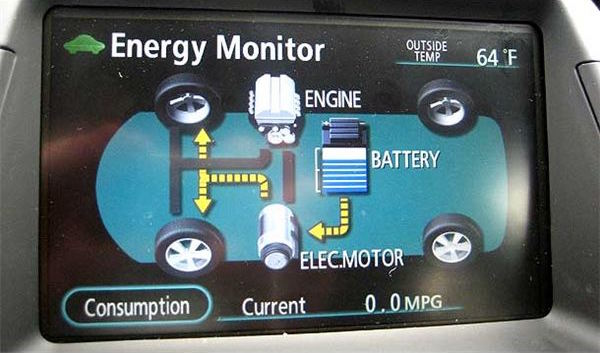
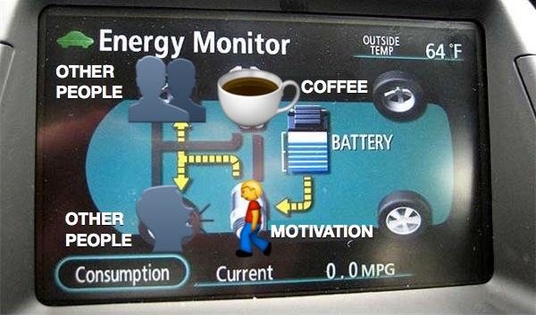

Consider hybrid cars: they have two motors with independent power sources, but everything interoperates in a really clever way. For example, speed and acceleration will determine if using the electric motor or the gasoline engine – or both – is most efficient.

But the engine also produces electricity which can be used to charge the battery or power the electric motor. Quite a complex system!

I was impressed when, recently in a taxi, I saw this information displayed visually on the car's dashboard. It looked something like this.

To display a model of such a complex system in a way that a human can interpret at-a-glance while driving is no small feat; the user interface is quite impressive. I realized that its metaphors were applicable to people, too. Specifically, to me.

I have a finite amount of energy that comes from different places. Throughout the day – typically – I spend energy from my "battery" to interact with others. This is [introversion vs extroversion](http://themetapicture.com/how-to-interact-with-the-introverted/) on a fundamental level. But [I am neither](/blog/ambiversion/).

Sometimes, spending time with people isn't a cost; sometimes it doesn't take energy. Sometimes, like an extrovert, I _get_ energy from others. Similar to regenerative braking on hybrid cars, I can use the energy from others to recharge my battery.

What I've really noticed is that this ability for me to _get_ energy from people really depends on my mood. If I'm feeling down, like over the past month, it's hard for me to really enjoy and appreciate – and recharge from – time with others. I've been spending all my energy throughout the day and trying to recharge at night.

But today, for the first time in a while, I felt recharged by being around others. I felt fulfilled.

I'm not saying this metaphor makes sense to other people – it's not meant to be prescriptive. But it does make sense to me as a model for how to gauge myself and plan for different situations. Maybe I can be more strategic about where and when I spend my energy, maybe optimizing for the highest chances of getting energy back.
