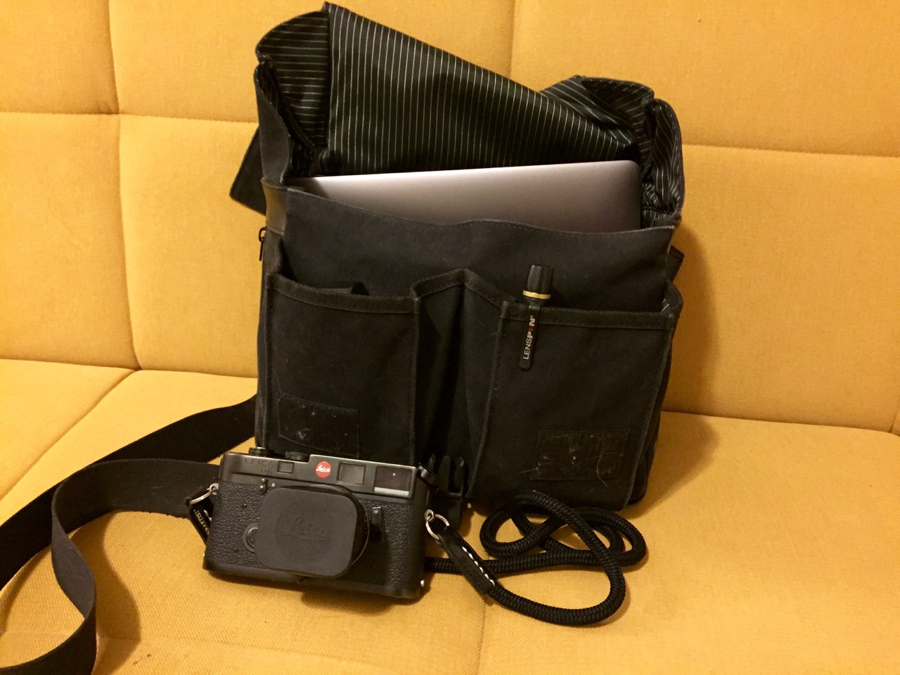
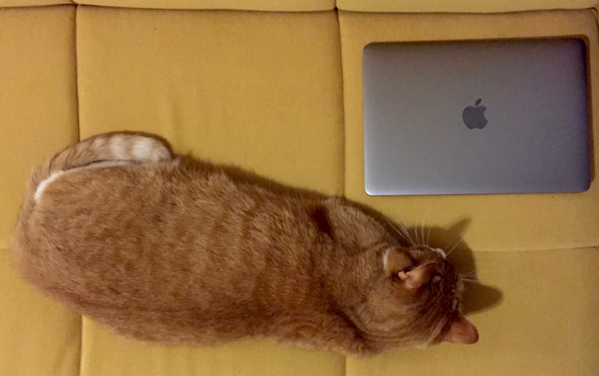

For my day-to-day bag, I like to carry my camera with me. I use small rangefinder cameras, so I don't need a large camera bag. However, my 15" Retina MacBook Pro doesn't fit in a small bag, so it needs its own separate carrier. For the past few years, I've been looking for a suitable solution: a bag that has room for a 15" laptop, but is no bigger than needed for a camera (one that's _just_ too big to fit in a laptop case).

Such a bag does not exist.

In the end, the only way to get a bag that held both items was to change the size of my laptop.

For some time now, I've been frustrated with my MacBook Pro. At 15", it's pretty hefty and it takes up a lot of space. Carrying it around New York or while travelling takes a physical toll, and it's impossible to use on flights.

I decided to buy a 12" MacBook after a few months of consideration. The MacBook offered what I was looking for in a replacement laptop: a beautiful screen to edit photos with, and the capability to use Xcode when away from the office.

Xcode runs fairly well. I've run some [performance tests on the new MacBook and other hardware](https://github.com/ashfurrow/xcode-hardware-performance) (and I'll be adding more as I can test on more computers). It's obviously slower than the MacBook Pro or my Mac Pro at work, and Xcode is noticeably slower.

After using it all weekend on a variety of open source tasks, I'm convinced this computer is more than sufficient for using Xcode. It's slow, yes, and you'll be a slower developer as a result, but the tradeoff offered by its portability is worth it (at least to me).

Photo editing is significantly slower, and it has affected my workflow in a way different from a slower Xcode. I'm used to waiting for Xcode to do something, like to compile an app, but I expect Lightroom to react immediately to my changes. On the MacBook, this is not the case.

To make editing photos an unaggravating experience on the MacBook, I need to apply computationally expensive edits to the photos _last_. For example, "Dehaze" is a really expensive effect while "Saturation" is a really inexpensive effect. By leaving the expensive effects until the end of the editing process, I minimize the time that my edits aren't reflected in real time.

When I hear things like "TurboBoost" in marketing, I usually brush it off. But I can tell when my computer – the cheapest, slowest model – seems to "boost" from 1.1 GHz to two-point-whatever.

Sometimes, I'll be running a CPU-intensive task and the computer seems to decide to use a slower clock speed in order to save power or cool down or whatever. This kind of sucks, since it makes running intensive tasks _even slower_.

The machine must have a set of heuristics to determine when to use a faster clock speed. They probably depend on power sources, chip temperature, and how CPU usage. Generally, I've noticed that it performs much more consistently while plugged in. This suggests that the MacBook is more willing to run the chip faster (and hotter) if its getting power from the wall and not from the battery.

The execution of the hardware is so nice – it's a beautiful and capable computer. The screen is perfect for photo editing and it can run Xcode fine. I couldn't believe how rich and loud the speakers were, and my only complaint is with the [terrible awful arrow keys](http://morrick.me/archives/7451) – something I feel I'm already getting used to.

In fairness though, the keyboard has been a joy to use. It took some time to realize that even though the keys travel a shorter distance when you hit them, you still need to hit them as hard as a normal keyboard. At first, my fingers were in an uncanny valley – typing on the hardware keyboard as if it were an onscreen one. Now, going back to the chiclet keyboard on my MacBook Pro feels like a _toy_. A really imprecisely-assembled toy.

People like to say compare this computer to an iPad. In fact, when I asked the Apple salesperson about its performance, he said "it's fine as long as you don't mind using a laptop with the processing power of an iPad." What he and others are apparently forgetting is that _iPads are amazing_. I feel like I got an iPad that has a hardware keyboard and can run Xcode and _it is awesome_.

