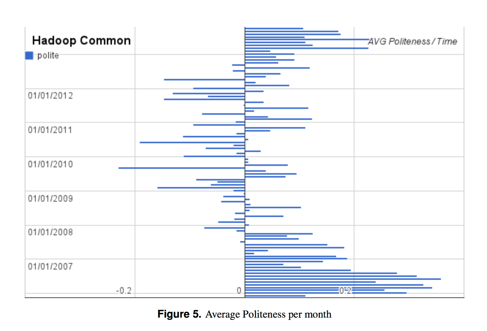
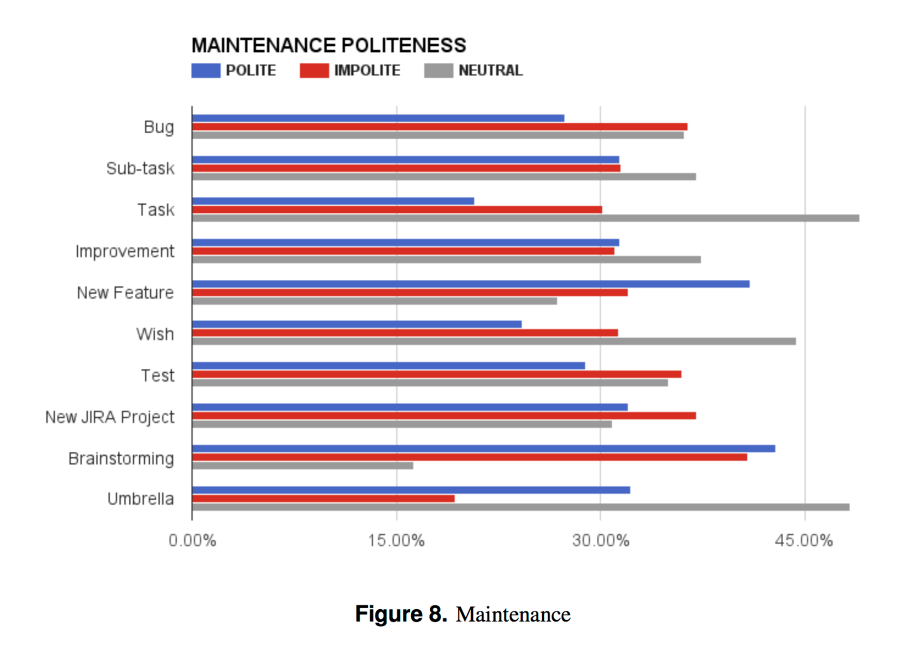
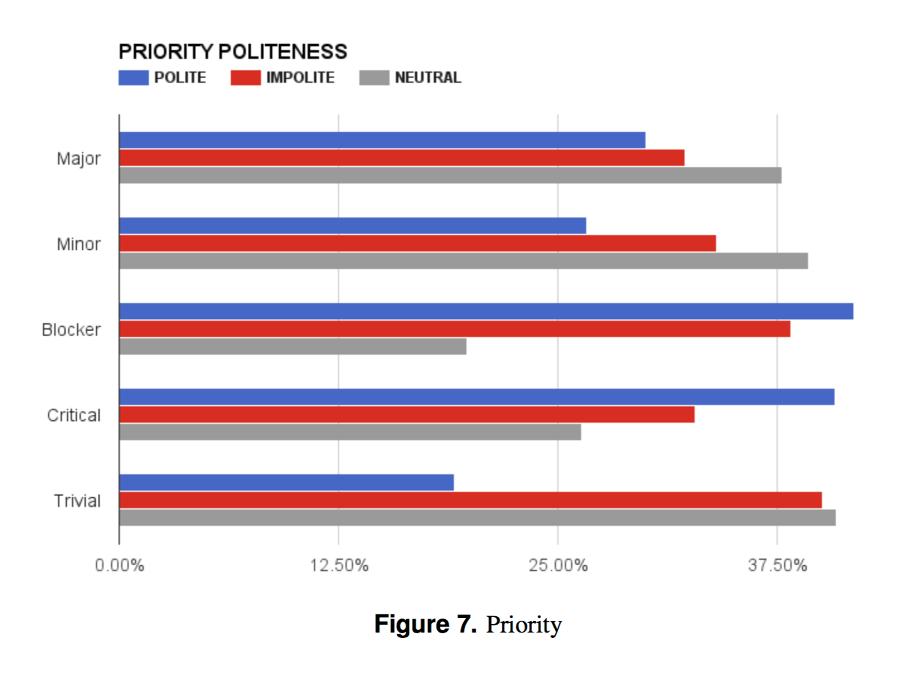

I came across a study today that discussed politeness in the context of open source communities. Being a Canadian open source developer, I was naturally intrigued.

[The study](https://peerj.com/preprints/1515v1/)'s autors examined a _tonne_ of tickets from big open source projects, like Hadoop and Casandra. Their data (and paper) are open source, so I took a look and the _zip file_ is seven hundred megabytes.

Their goal was to discover if (and how) politeness of JIRA ticket comments is correlated with the following areas:

- How fast does it take to close a ticket?
- How well does the project attract new contributors?
- What about holding onto existing ones?
- Does average politeness vary over time?
- How does average politeness vary with the type of issue?
- What about issue priority?

The answers to the first two questions were just as I expected: politeness is positively correlated with quickly-closed issues and with gaining/maintaining contributors.

The level of politeness does change over time, but not with any specific day of the week. The authors note that open source projects sometimes become neutral (or even impolite) for a time before returning to a polite norm. Interesting.

The most interesting bits, to me, are the last questions. How does average politeness vary with the type of issue? With its priority?

Lots of interesting bits here. The things that stick out to me are:

- High-level discussions like brainstorming appear polarizing.
- Tasks are neutral/impolite, but \_sub_tasks are polite.
- New features are polite.
- But wishes are _not_ polite.

Very interesting! I wonder how the level of detail in discussion between tasks and subtasks influences the tone of the discussion? Are people more polite when asking for new features because they want something? Then why are wishes so impolite?

There are a lot of interesting questions you can ask about the data in this paper – but you don't have to _just_ consult the data. How does these observations jive with your own experiences?

So major issues have about even politeness/impoliteness, but minor ones are skewed towards being impolite. Blockers are polarizing, critical issues seem to be way more polite, and trivial issues are _super_ impolite.

By acknowledging the differences in politeness that are correlated with issues' type and priority, we can act in a way to promite polite discussions. Our words can affect the tone of an entire conversation, even online.

The next time you're commenting on a bug, consider that bugs are mostly neutral and impolite. Or the next time you're discussing something trivial, remember that these are overwhelmingly impolite discussions.

I found an [amazing Hacker News comment](https://news.ycombinator.com/item?id=10598037) describing ways to be a delightful OSS contributor; a lot of their advice surrounds the problem areas outlined by the study.

We can be [nicer open source contributors](/blog/minswan-for-ios/), and we can make nicer open source communities.

Not _just_ for the sake of being nice, but _also_ because it's correlated with quick issue turnaround and project health. It's a win-win.
