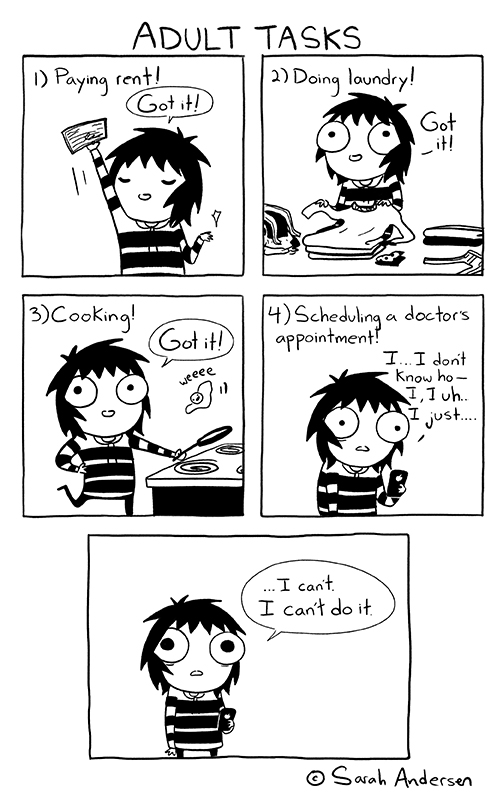

When you interact with someone online – GitHub, Twitter, whatever – you don't often see them discuss _struggle_. They'll be witty, or share something cool they've done, or maybe a recording of a talk they gave. But they don't normally talk about struggling to write their pithy tweet, or falling out of love with their side project, or pushing against writer's block. I think that's a shame, because those struggles are normal.

I mean _really_ normal. _Ridiculously_ commonplace. Sure, _you_ have struggled, but you know what? Your boss has struggled. Your best friend has struggled. That person you admire? Yeah, they've struggled, too.

> From the time he was a young boy, the King of Pop exuded energy, strength, and charisma onstage, while his personal life was characterized by crippling sensitivity, loneliness, and struggle. As Jackson heartbreakingly said, “It hurts to be me.”

What [this article](http://www.huffingtonpost.com/entry/artists-sensitive-creative_567f02dee4b0b958f6598764) fails to note is that _this is completely normal_. Michael Jackson said "it hurts to be me", but an equally accurate statement might be "it hurts to be human."

Struggling is normal, which is why I'm so frustrated that our society [dictates](http://jezebel.com/youre-not-adulting-youre-acting-your-fucking-age-1746878718) that we appear to have flawlessly arrived at our successes, that we hide our failures out of shame. The truly sad thing is that the world doesn't have to be this way. In fact, it wasn't always this way at all.



Struggle and failure are a part of all of our lives – and I'm tired of hiding it. So when I teach, I make sure to add comments like "this is tricky" or "a lot of people have a hard time with this." I've noticed others doing this, too.

One of my favourite YouTube channels, [PBS Space Time](https://www.youtube.com/channel/UC7_gcs09iThXybpVgjHZ_7g) is really really great at this. I mean, they're discussing things like General Relativity and 4D spacetime, so obviously this stuff is hard, right? But they make sure to say things like "this stuff takes months, not minutes, to sink in." They make sure to tell people that _it's normal_ to struggle to understand the nature of reality.

But other stuff is hard too! Everyone struggles with difficult concepts, but people struggle with "normal" stuff, too. Has the following ever happened to you?





It's happened to me for sure.

So I'm really excited to see other awesome people in our community talk openly about struggling. My colleague talked about getting bummed out and struggling with difficult choices in [his yearly review](http://orta.io/on/being/29/). My friend [talked about her anxiety](http://www.mennenia.com/articles/2015-12-23-goodbye2015/) recently. I'm really glad to call these two people friends, and I'm proud of them for being open about their struggles. I want us to learn from their example.

If you have a hard time at work, if you feel inadequate on Twitter, if you struggle to understand memory leaks and reference cycles, _that's ok_. Seriously – I've felt all of those things, too. It's normal.

> You’ve got sadness in you, I’ve got sadness in me – and my works of art are places where the two sadnesses can meet, and therefore both of us need to feel less sad.
>
> —[Mark Rothko](https://youtu.be/qFnNgTSkHPM?t=412)

I don't really know where to go from here. I want to make 2016 a year where we all stop being so needlessly hard on ourselves. But I don't know how. Two and a half years ago, when [I wrote about my depression](/blog/depression/) for the first time, I said:

> I wish that I had something more substantial to add to the dialogue than "me too", but sometimes it’s worth knowing that you’re not alone, and that it can get better.

Since then, people have written to me thanking me sharing because it made them feel better knowing they weren't alone. I read something similar from a [prominent lawyer who talked about his depression](https://popehat.com/2015/05/21/happy-to-be-here/):

> The more I talk to other people with this disease the more I get that I'm not alone.

I'm not sure if just talking about how we struggle is enough, but I think it's a good starting point. Don't worry if you're having a hard time, _that's normal_. Everybody struggles.

❤️
