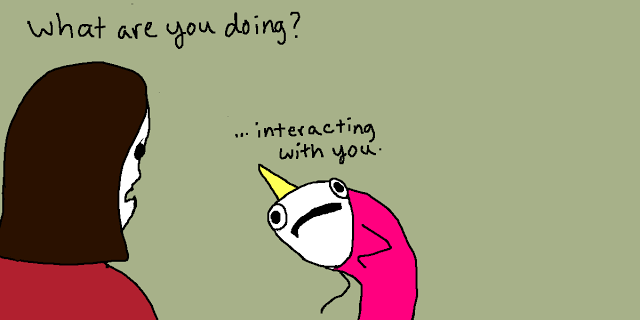

I always thought that perfectionism is a compulsion to do things perfectly, and I guess that's true. And you know how the phrase "Haha my greatest weakness is that I'm a perfectionist" is a [common thing people say in job interviews](/blog/the-dark-side-of-perfectionism/)? That's pretty messed up, eh?

Like, this is a _compulsion_ we're talking about. It's not just an affinity for perfection, but an _irresistible urge_ to be nothing less than perfect. If someone has a compulsion to constantly wash their hands, we say that they should talk to someone. But if someone has a compulsion to be perfect all the time, we give them a job because _awww yissss perfection_.

---

So obviously this post is about me. Specifically, I'm coming to terms with a lot of how my childhood has shaped who I am today, especially about perfectionism.

I've only recently realized that perfectionism isn't just a compulsion about _what_ you do, but also about _how_ you do it.

Whoa.

Story time. So the other day, my wife casually drops this into our conversation, as though this is something that everyone knows and not a sentence designed to obliterate me: "not everything you do has to be perfect."

Holy shit.

I stopped what I was doing, turned around to her and asked her to repeat herself. Then we talked and I cried for an hour while my entire sense of self seemed to collapse around me.

My whole life, as long as I can remember, I've struggled with anxiety about how I behave and what people think of me. And I thought – until last week – that I had a good handle on that anxiety. But I was wrong. In fact I've never been wronger about anything in my whole life.

Let's take a look at an example. See if you can spot the anxiety.

When I'm in an elevator with a colleague, my mind is constantly racing with questions. "OK, how do I act? How do I stand? Where do I look? Do I smile? Am I smiling too much? How do I react if they make small talk? Oh jesus what was the weather like this morning?" And so on. 

I'm not even really aware of it, it just kind of happens on its own. And that's just an elevator ride.

<Narrow>

</Narrow>

This actually ties into something my therapist said to me. I've been trying to unpack it for a few weeks, because just like "not everything you do has to be perfect", it calls into question a lot of my assumptions about how being a person works. My therapist said:

> In social interactions, it is everyone's responsibility to communicate their own needs.

Holy shit. It's like saying, "hey, did you know you don't have to be super on-your-toes all the time?" 

Like, imagine you could talk to dogs, and told one "hey did you know you don't have to bark all the time at everything?" They wouldn't know how how to respond. Not just because they're a dog, but because it calls into question one of their most fundamental beliefs – a belief they didn't even know they held. "What do you mean, I don't have to bark at things? I don't understand."

There's just a _massive_ amount of energy I've been spending on making sure I meet others' expectations, and it turns out _I don't have to_. If someone needs something from me, they'll let me know.

Whoa.

It's difficult to describe just how fundamental this revelation has been. My whole life, I've been behaving in a way to make sure that I meet (hopefully exceed) others' expectations. Anything less than perfect is a failure. 

And I didn't have to at all. All that time, all that energy, totally unnecessary. All it did was tire me out.

And that's my perfectionism: the idea that I need to be a perfect colleague, friend, programmer, husband, son, whatever, every second, every day, always. 

But I don't.

I think I came close to this realization in 2015, but fell just short of the bigger picture. See, I've always tried to make my code perfect, but with a colleague's help, I came to appreciate the balance between idealism of perfect code and pragmatism of shipping code that's not perfect (but works). However, reaching and maintaining that balance is just another form of "doing things perfectly." 

My brain seems to have abused the idea of making compromises about code quality. It said "oh, you don't need to be perfect all the time? Well let's try and be perfect about figuring out when you're allowed to be not-perfect, k?"

That's not the same. Silly brain, who put you in charge?

---

I've always wanted to not give a fuck but I secretly obsess over what people think of me. I'm tired of it. Not giving a fuck sounds like a great goal for 2016. Bring it on.

<Narrow>

</Narrow>

(If you like the pictures in this post, [go buy this book](http://amzn.to/1Sueu7a)).

  