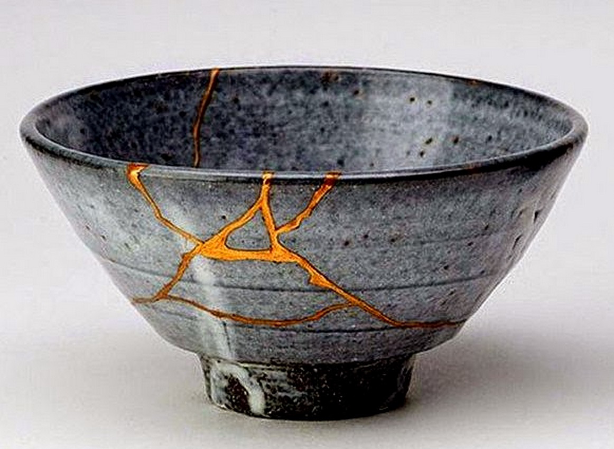
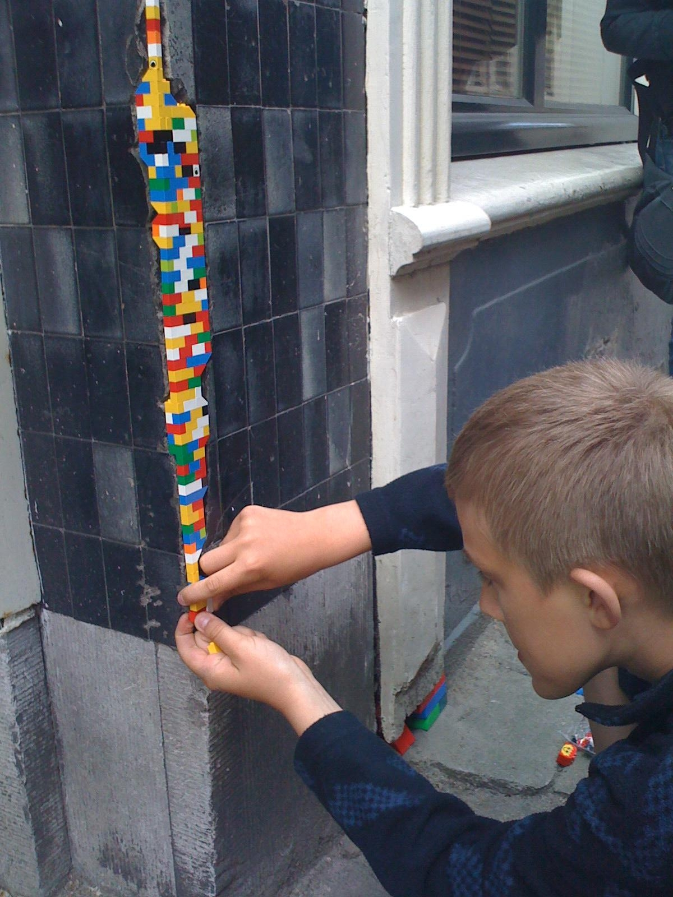

Have you ever heard of [wabi-sabi](https://en.wikipedia.org/wiki/Wabi-sabi)? It's a complex idea from Japanese culture that surrounds the appreciation of the impermanent and the imperfect. I heard about it a few years ago, and finally took a deeper look by reading [Wabi-Sabi for Artists, Designers, Poets & Philosophers](http://amzn.to/1nymvMd).

I was reading [the book's follow-up on](http://amzn.to/1nH66FX) the subway here in New York, when someone approached and asked about wabi-sabi. We got chatting and he sent me the following video.

<YouTube videoID="lT55_u8URU0" />

The video discusses a practice related to wabi-sabi: [kintsugi](https://en.wikipedia.org/wiki/Kintsugi). This is art of repairing things in a way that actually enhances their aesthetic. The repaired is more beautiful than the pristine.

<Wide>

</Wide>

The video explains that when an object is broken, that is not the end of its existence, but rather an important moment in its history. It is a moment of transformation.

> The flaws of its shape aren't hidden from inspection, but emblazoned with golden significance.

Wow, really cool. Beyond just Lacquerware, there are [artists](http://www.wired.co.uk/magazine/archive/2010/08/play/lego-patching-up-a-wall-near-you) around the world doing work with all kinds of mediums that embrace the transformation of repair.

<Narrow>

</Narrow>

The video also draws a parallel with people: we cannot mend ourselves without transformation, and we may choose to _embrace_ this change instead of avoiding it.

So this concept – celebrating damage through thoughtful repair – this idea can apply to objects, and it can apply to people. What else might it apply to?

Being me, my mind drifted to my coding. I started thinking about how kintsugi and wabi-sabi might apply to code. Now, Leonard Koren (the author of those books) argues that wabi-sabi cannot occur digitally, and I agree. "There is no place for wabi-sabi to fully exist in a binary universe." However, that doesn't mean we can't borrow the ideas – and ideals – of wabi-sabi and apply them to crafting software.

Take the wabe-sabi idea of incompleteness. Developers often lament that we never finish a project, we just kind of stop working on it. But is it inherently a sad thing that projects never complete? Or are there external factors driving us to feel sorrow and regret for the bugs we'll never get around to fixing and to the features we'll never complete?

Consider the idea of impermanence. Sure, code can be safely stored "forever", but I've got plenty of Swift 1.2 code that I can't compile anymore. And jeez, what happens when an API you depend on goes away?

I would argue that even if there isn't a bridge between the digital and the analogue, there are benefits to being aware of the parallels between wabi-sabi principles and building software.

So what about kintsugi, then? Can we mend code in a way that increases its aesthetic appeal? How might we emblazon with significance the flaws in our _code_?

What would that look like? Aesthetics are obviously subjective, but what might a codebase look like after it's been shattered, then thoughtfully put back together? Can it be done artfully?

I ask, because there are a lot of developers out there [with broken apps](http://blog.parse.com/announcements/moving-on/), wondering what to do now that Parse is shutting down.

I must confess I don't have an answer. Borrowing from the video one last time, Hemingway said:

> The world breaks everyone and afterward many are strong in the broken places.

Well, the world breaks every piece of software, too. Bits rot, [software entropy](https://en.wikipedia.org/wiki/Software_entropy) increases. What lessons can we learn from repairing our code? How can we mend our code, and ourselves, artfully?

These are questions I'm exploring, and I don't pretend to have the answers. To all the developers out there, wondering what to do now that Parse is going away, I'm sorry that your apps are broken. That really sucks. But maybe this is an opportunity to build something stronger, something more beautiful. In any case, you'll get through this, things will be ok.
