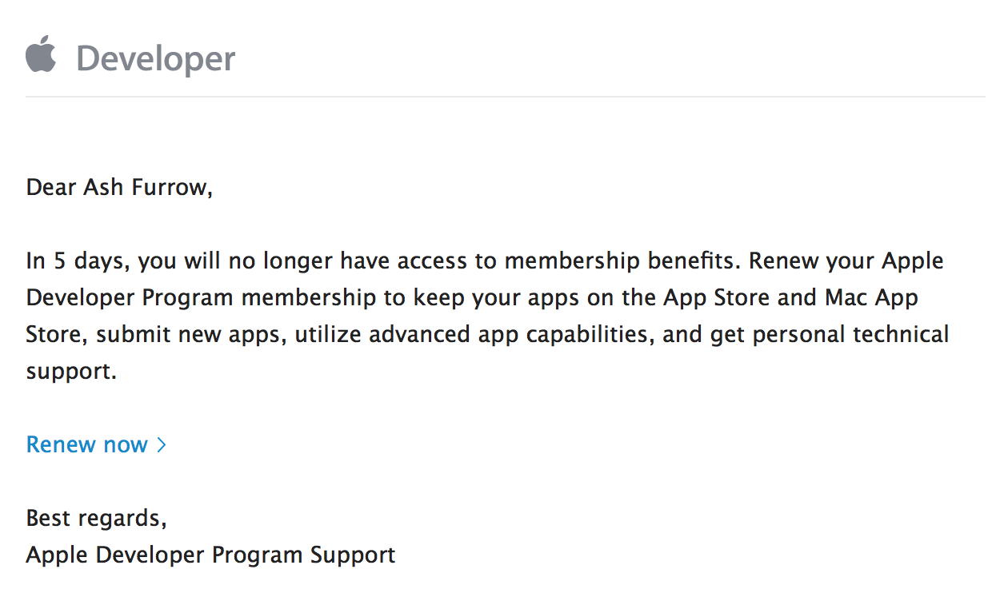

When iOS developers ask me for advice on how to get a job, something I often tell them is that they need a presence on the App Store. They need something with their name on it, to show prospective employers that they have the skills and grit to follow-through with an idea, from inception to polish. Having an app, even a simple one, on the App Store demonstrates an ability to ship software, which is what employers are interested in.

I know this because of my experience getting my first few jobs writing iOS software. Having a few apps on the store – simple ones, mind you – really helped me in interviews. I could point and say "look, I built this." Those apps helped launch my career.

So you can imagine the mixed emotions I have about choosing not to renew my account.

<Narrow>

</Narrow>

I only make a few bucks a month on my apps, so I made them free in December because... why not. They're about to disappear forever, might as well, right? I haven't submitted an update to any of my apps for _literally years_ and I really don't plan to start. Not renewing my account will alleviate the guilt I have about neglecting them.

The problem is this: I've hung onto the idea that I need apps on the store to be taken seriously. I don't think that's true anymore, at least not for my career. My work in the open source community says a lot more about me than a few old apps do.

<Narrow>

</Narrow>

Besides the fact that I'm not looking for a job, these apps are... pretty bad. I mean, _I_ wouldn't download them, and the _one_ app of mine I have on my phone is in a folder. Not even on the first page of the folder, either! These apps aren't helping anyone, and they're not helping me, so it's time to say goodbye.
