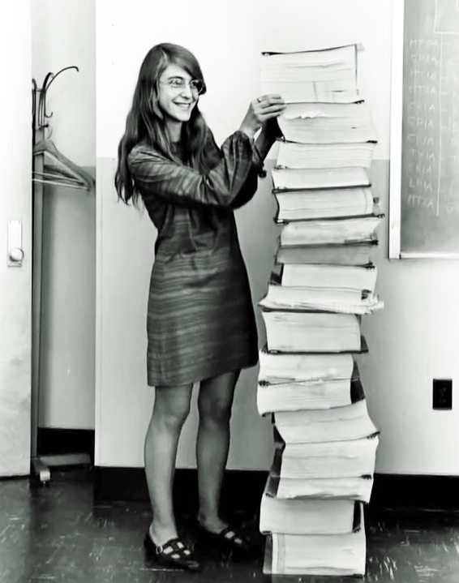
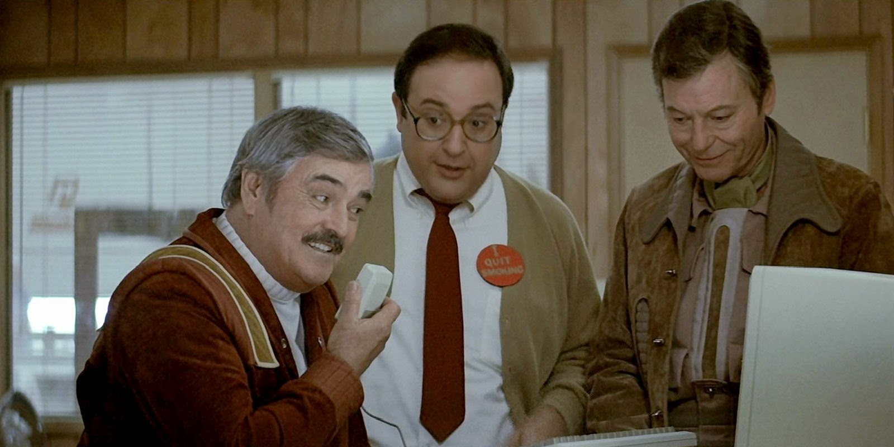

Rome wasn't built in a day, so the saying goes, but it _was_ built. That may not seem impressive until you consider the scope of Roman accomplishments in the context of their limited technology. 

Here's an [aqueduct the Romans built](https://en.wikipedia.org/wiki/Aqueduct_of_Segovia). It's still standing in Spain. 

<Wide>

</Wide>

Let's think about this: a structure, 15 kilometres long and 28 metres tall at its highest point, was built by a civilization with such a poor grasp of mathematics they hadn't yet discovered the number zero. 

Now consider the many gothic cathedrals littering European cities.

<Wide>

</Wide>

They were built without computer aided design software, or modern metallurgy, and their construction [spanned the length of many human lifetimes](https://en.wikipedia.org/wiki/Notre_Dame_de_Paris#Timeline_of_construction). But they were built.

Humans have a history of achieving such amazing feats with such limited tools. We've invented language, agriculture, mathematics, and more, from nothing. These inventions were so monumental that they spanned generations of humans, and I am in awe of just how much our species has managed to accomplish with so little.

Of course, invention with limited tools isn't limited to the Romans or medieval Europeans. Here's an photograph of [Margaret Hamilton](https://en.wikipedia.org/wiki/Margaret_Hamilton_(scientist)), the lead programmer of the [Apollo Guidance Computer](https://en.wikipedia.org/wiki/Apollo_Guidance_Computer), standing next to a print out of all the assembly code used by NASA to fly to the moon and back.

<Narrow>

</Narrow>

Astronauts modified the contents of memory – directly, with hex addresses – to pilot their spacecraft. The software was written directly in assembly, with primitive cooperative multitasking and incredibly limited amounts of working memory. _But it worked_. Our species visited our nearest celestial neighbour using tools that, by today's standards, are limited to the point of disbelief.  

So how will future generations of humans – assuming our species survives – how will they look back on _us_? On software builders? How will they see what we've accomplished in the context of the tools we have? We've built amazing things – cloud computing, mobile computers, strong encryption – and we've built them using only the tools we have today.

What will software builders a hundred years think of us and what we've built and how we've built it all?

I'd like to think they'll be similarly impressed at how much we have accomplished, given the severely limited tools of our time. I hope that we will continue to build better tools, I hope that we won't settle for what is "good enough", and I hope that future generations will be kind to us.

Do you think in a hundred years that software builders will use text editors? Do you think we will still _write_ software?

<Wide>

</Wide>

I sure hope not.

  