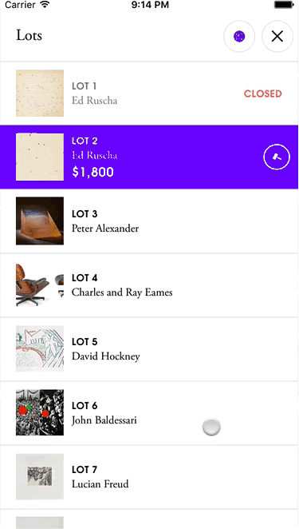
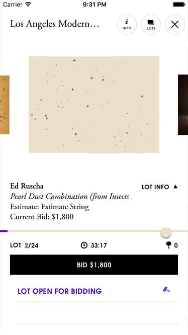

When iOS 6 launched, I was so excited because Apple added a new class to UIKit: UICollectionView. At the time, I was working at 500px, so displaying photos in a grid was like 80% of my job. Understandably, I was excited.

Sadly, collection views are one of the most unjustly maligned classes in UIKit. They have a reputation for being difficult to work with, but I think that if people's expectations of collection views were more informed, they might see collection views for what they are: a flexible, high-performance way to display collections of data.

---

Developers tend to feel let-down or frustrated when they use collection views, because they expect them to be too much like UITableView. But collection views solve a different problem from table views, so it’s not realistic to expect them to behave similarly.

UICollectionView was created to fit a need that developers had: we wanted to display data in a way that was more customizable than UITableView. But Apple wasn't interested in making a _slightly more_ customizable UITableView – pragmatically, the class is already too complex. So instead, they made something _completely customizable_, which consequently doesn’t do as much out of the box.

We shouldn't judge UICollectionView by how familiar it feels compared to UITableView. Collection views solve a very different problem from table views, and when we ignore that, we miss out on all the awesome stuff that collection views _let_ us do.

This post is a story of how collection views helped me implement a really challenging user interface.

Orta and I were looking over the design spec for a major new feature of the Artsy app, but we had a problem. Our designer had an awesome design that we didn’t know how to implement. The idea was that the user is looking at a list of lots in an auction, and we want to make sure that the _current_ lot is always visible. When the user scrolled, the current lot would stick to the top or bottom of the view as the rest of the lots scrolled beneath it. Kind of like UITableView section headers, but in both directions.

<Narrow>



</Narrow>

We weren't quite sure how to implement this, so we let the team know it was a big question mark. But in our haste to estimate how long it would take to build this feature, we jumped to the conclusion that this would be built atop a UITableView. It didn’t occur to either of us that there might be a better, non-UITableView option. For a minimal viable auctions app, it wasn’t strictly needed, and was a big question mark in terms of time, so we put it at the end, if we had time.

A month later, I was speaking at MCE in Warsaw. I had a bit of jet lag and while I didn’t get much sleep, I had an idea about how easily to implement the design: UICollectionView. See, the list of lots in an auction could easily be a flow layout. It’s actually not much code to customize UICollectionViewFlowLayout’s existing look. We can rely on the superclass to do a lot of the work for us, and only have to handle the “always visible” custom cell.

I took a few hours to get a proof of concept, and after some polish, submitted a [pull request demonstrating my idea](https://github.com/artsy/eigen/pull/1411/files) (and a [later PR adding tests](https://github.com/artsy/eigen/pull/1424)). The entire UICollectionViewFlowLayout subclass – where I customized the layout – was under a hundred lines of code.

Orta was impressed with the simplicity of the solution and asked if collection views could be a used to solve a different, difficult-to-implement design we had had problems with. I agreed to take a look.

On the main auction view, iPhone users swipe left and right to traverse forward and backwards through the auction's lots. On larger screens, we have space to show a preview of the next (and reminder of the previous) lot.

<Narrow>


</Narrow>

Our efforts so far had been frustrating – this kind of interface is difficult to build from scratch with UIScrollView. Complicating things was how the lot view controllers themselves were displayed: UIPageViewController, an infamously opaque API.

The first thing I did was to get a plain collection view on the screen and [hook it up to the UIPageViewController](https://github.com/artsy/eigen/pull/1516/files#diff-77077322ef8ed66b1339d23acd77f762R61). Next, I added some cells, each with a label displaying their index path (good tip for debugging). Using the scroll view delegate of UIPageViewController, I kept the scroll view's content offset matched to the collection view's. I experimented a bit until I had a decent understanding of how UIPageViewController works. Matching everything took some time ([GitHub](https://github.com/artsy/eigen/pull/1516)), but it's not the cool part of this story.

Let’s talk about the collection view layout.

My approach to this layout started the same as my approach to the lot list layout: rely on existing UICollectionViewFlowLayout behaviour and customize it. The well-commented layout file was 323 lines long; I [submitted a PR a few days later](https://github.com/artsy/eigen/pull/1516).

The layout ([PR version](https://github.com/artsy/eigen/blob/05d2f381f479340adb01ad845045e41756fd2883/Artsy/View_Controllers/Live_Auctions/Views/LiveAuctionFancyLotCollectionViewLayout.swift) & [current version](https://github.com/artsy/eigen/blob/7ac7620c77b4aff306853d13c0cecf4044b4f4d2/Artsy/View_Controllers/Live_Auctions/Views/LiveAuctionFancyLotCollectionViewLayout.swift)) works by displaying only three cells: the "current" cell that rests in the middle, one previous cell on the left, and next cell on the right. The previous and next cells are smaller, and only have their edges visible.

There's a problem with showing the previous and next cells, though: if you scroll to the previous cell, _its_ previous cell will be visible for a few frames as it slides into place to become the "new" previous cell. I'd normally just add two more cells to the collection view (a previous previous and a next next), but the UIPageViewController behaviour I was matching really worked best with only three cells.

Instead, I created an enum upfront and [figured out](https://github.com/artsy/eigen/blob/05d2f381f479340adb01ad845045e41756fd2883/Artsy/View_Controllers/Live_Auctions/Views/LiveAuctionFancyLotCollectionViewLayout.swift#L142-L152) which role each cell would play (in left-to-right order: previous underflow, previous, current, next, and next overflow). All the math `switch`es on this enum. Based on which direction the user is scrolling, we can know both a cell's "at rest" layout and its "destination" layout. Knowing both the beginning and end will be very helpful later.

After I determined the cell's position, I retrieved its aspect ratio from a custom delegate method. The aspect ratio is important because we need to display the left and right edges of the previous and next lots. A portrait image fitting inside a landscape cell will be centred, with its side edges too far inside the cell to be visible for the user. Next I set up a pipeline of two methods: [one](https://github.com/artsy/eigen/blob/05d2f381f479340adb01ad845045e41756fd2883/Artsy/View_Controllers/Live_Auctions/Views/LiveAuctionFancyLotCollectionViewLayout.swift#L191) to calculate a cell's _size_ and [another](https://github.com/artsy/eigen/blob/05d2f381f479340adb01ad845045e41756fd2883/Artsy/View_Controllers/Live_Auctions/Views/LiveAuctionFancyLotCollectionViewLayout.swift#L235-L288) to calculate its position. Each function return values both at-rest and at destination of the cell. The current cell is bigger, so give it 300x300 size at rest, and make everything else 200x200. But! Remember to apply the aspect ratio to the cell's dimension.

Now that I have the current sizes of the cells at rest and at the destinations, I use that information (combined with the scroll direction) to calculate the `center.x` values for each cell at its rest and its destination. You need to know a cell's size first, because you can calculate its position.

At this point, I know that the size and position of every cell at rest and at its destination, and I can interpolate between those values. [Linear interpolation](https://en.wikipedia.org/wiki/Linear_interpolation) is the mathematic formula to take two values `a` and `b`, and a percentage `r`, to calculate the value at `r`% between `a` and `b`.

<Wide>

```swift
func interpolateFrom(a: CGFloat, to b: CGFloat, ratio: CGFloat) -> CGFloat {
    // abs() is optional, but ideal for my use case.
    return a + abs(ratio) * (b - a)
}
```

</Wide>

I can calculate the percentage that the user has scrolled based on the collection view's `contentSize.width` compared to its `contentOffset.x`. After all the upfront calculations, which store their values in a series of `typealias`'d tuples, it's an easy matter to interpolate between their at-rest and destination size and position. And then we [tell](https://github.com/artsy/eigen/blob/05d2f381f479340adb01ad845045e41756fd2883/Artsy/View_Controllers/Live_Auctions/Views/LiveAuctionFancyLotCollectionViewLayout.swift#L70-L73) the collection view to re-do these calculations every time the scroll view is scrolled.

(That means the layout is doing the computations for at-rest and destination geometry _every_ frame of the transition, even if their at-rest and destination position and size don't change, which is wasteful. I made a [comment](https://github.com/artsy/eigen/blob/05d2f381f479340adb01ad845045e41756fd2883/Artsy/View_Controllers/Live_Auctions/Views/LiveAuctionFancyLotCollectionViewLayout.swift#L190) to look at caching those values...)

Oh, I forgot to mention that the whole thing _also_ has to resize in a neat animation that squishes the centre cell and pushes the previous and next ones away. Since we had the existing infrastructure of the layout pipeline, adding in an additional variable was straightforward ([PR](https://github.com/artsy/eigen/pull/1506)).

<Narrow>



</Narrow>

I wanted to make sure that the layout was easy to maintain for my team, so I laid things out logically and added comments to explain everything. Understanding the file's [current version](https://github.com/artsy/eigen/blob/7ac7620c77b4aff306853d13c0cecf4044b4f4d2/Artsy/View_Controllers/Live_Auctions/Views/LiveAuctionFancyLotCollectionViewLayout.swift) doesn't require anything more than a basic familiarity with collection view flow layouts.

---

Collection views were a familiar, at-hand tool for me, but don't think this was an easy job. It took a lot of work. But it demonstrates that collection views can be used to create immersive interfaces, both simple and complex.

UICollectionView is an unjustly maligned class, avoided by developers because of it's complexity when compared to UITableView. But developers forget that collection views solve a very different problem. And with all the further enhancements that iOS 10 brings, I'll need to update [my book](http://amzn.to/1S6eWUt) 😉
