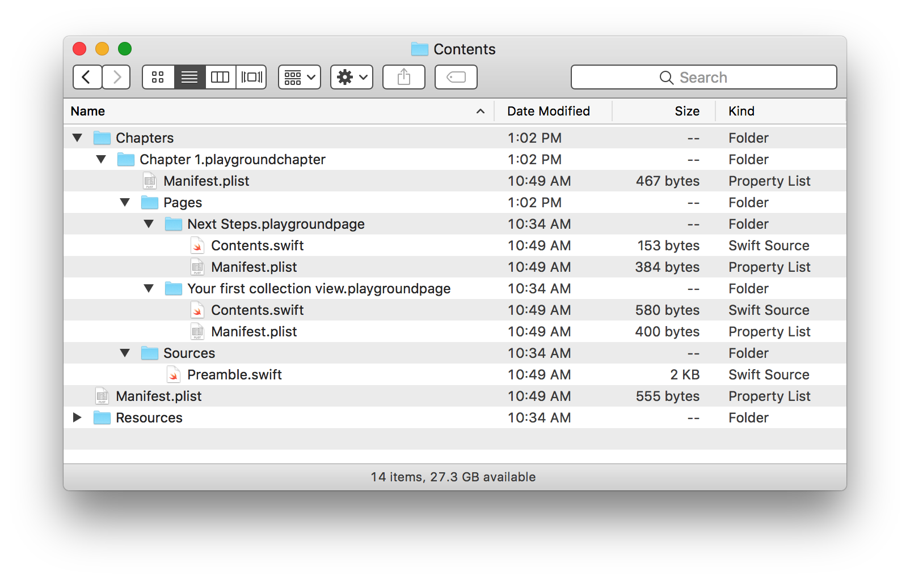

**Update**: As of version 1.0 of the tool, we now support a much improved structure for the source playgrounds. Check out an [updated blog post](/blog/swift-playground-books/) or [the documentation](https://github.com/playgroundbooks/playgroundbook#usage) for more info. We're always looking for new contributors to help with examples, too! For posterity, the original blog post follows.

---

When I heard about Swift playground books during WWDC, I was _super_ excited about what kinds of new ways people could learn to code. And not just learn to code for the first time, but to learn a new framework or technique.

I wanted in.

I watched and re-watched [the Swift playground video][wwdc] to wrap my head around the capabilities of playground books, from an author's perspective, and a learner's too. Playground books are not complex in theory: a nested folder structure with `Manifest.plist` files with book metadata. But that structure needs to be precisely adhered to, or the book won't work on the iPad.







It's easy to make a mistake when building these from hand, so a month ago or so I wrote a "linter" for playground books; it checks your folder structure and `Manifest.plist` contents to made sure everything is correct. My idea was to build my playground book by hand and lint it to make sure I didn't make any mistakes.

But a few weeks ago, Orta suggested maybe creating a _generator_ for playground books. That's... a lot trickier than making a linter. But I [opened an issue][issue] and kept the idea in the back of my head.

Well this week [I finished][pr] and [`playgroundbook`][gem] is released. My idea was that authors should be able to write their books in regular playgrounds that can be opened in Xcode and edited on a Mac (playground books only work on iPad). The idea was simple, but the implementation was difficult.

This really challenged me. There is no one-to-one mapping from playgrounds to playground _books_; I had to prioritize which features to support and then figure out how to support them. The project has some [limitations][limitations]. I'll probably address some of them, but for now the project is good enough.

## How to get started?

Follow the [installation instructions][install] in the readme. Basically just run `gem install playgroundbook`, with `sudo` if necessary.

The readme has instructions on how to use the tool, but here's a more in-depth explanation. You need two things:

- A `book.yml` file that specifies book metadata.
- A bunch of playgrounds that each represent a chapter of your book.

The metadata file looks like this:

```yaml
name: UICollectionView Book
identifier: com.ashfurrow.collectionview
deployment_target: ios10.0 # Optional
resources: Resources # Optional
imports: # Optional
  - UIKit
  - PlaygroundSupport
chapters:
  - Chapter 1
  - Chapter 2
  - etc...
```

`name` is the name of your book, `identifier` is a unique identifier for it, and `deployment_target` is the iOS version you're targeting.

`resources` is an optional directory to include images or other assets to be available to your book's code. I haven't used this feature extensively, so please open an issue if you run into any problems.

`imports` is an array of frameworks to import in each page. Yes, each page needs its own `import` statements. However, these are hidden from the learner. If you don't specify any frameworks, only `UIKit` is imported by default.

Finally, `chapters` is an array of chapters. `Chapter 1` requires a playground named `Chapter 1.playground`. These aren't just any playgrounds, they need to be specifically structured.

## How does it work?

Here's an example playground that can be built into a book.

```swift
import UIKit
import PlaygroundSupport

public func sharedFunction() -> String {
    return "Hello, world!"
}

//// First Page

sharedFunction()

//// Second Page

// TODO: Write the second page.
```

Code before the first quadruple slash comments is preamble that's available to all your pages, which are delineated by those special comments. Code in the preamble can be accessed by pages but _only_ if it is marked `public` (it's a limitation of the playground books format). I know it doesn't make sense to mark things as `public` so you can access them in a playground, but I did warn you that there wasn't a one-to-one mapping 😉

Okay, so each page has a name that comes after the `////` comment.

You can also use special comments in playground books.

```swift
//#-hidden-code
print("This code gets executed but isn't visible in the book.")
//#-end-hidden-code

func /*#-editable-code*/ <#funcName#> /*#-end-editable-code*/() {
    print("The user will be prompted to edit <#funcName#>")
    print("This yields a compiler warning in Xcode ¯\_(ツ)_/¯")
}
```

These comments are in the video but not in the [documentation][docs]. I don't want to risk getting a letter from Apple Legal, so I'm not going to publish an extensive guide here.

One more **important thing**: code in the first page is accessible to the second page and every page after it **only in Xcode**. These pages get split into several files and won't be in the same scope. **So this will not work**.

```swift
import UIKit

//// First Page

var str = "Hi"

//// Second Page

str = "Hello" // This only works in Xcode, it will break on the iPad ❗
```

So watch out!

(Like I said, it's not an ideal solution but it is good enough.)

To build a book from your playgrounds, run the following command terminal in the directory containing the `book.yml` file and all the playgrounds:

```sh
> playgroundbook render book.yaml
```

Then you can AirDrop the playground book to your iPad and use it.

Again, if you run into any problems, [open an issue][new_issue].

---

This was a lot of fun to build, done for the most part using TDD. It's the latest in a [series of Ruby projects][projects]. I'm getting really comfortable with Ruby, plus I just started React at work. Being a beginner in so many different fields at once is intimidating, but I'm getting used it (even enjoying it a little).

[wwdc]: https://developer.apple.com/videos/play/wwdc2016/408/
[issue]: https://github.com/ashfurrow/playgroundbook/issues/14
[pr]: https://github.com/ashfurrow/playgroundbook/issues/15
[gem]: https://github.com/ashfurrow/playgroundbook
[limitations]: https://github.com/ashfurrow/playgroundbook#limitations-of-book-rendering
[install]: https://github.com/ashfurrow/playgroundbook#installation
[docs]: https://developer.apple.com/library/prerelease/content/documentation/Xcode/Conceptual/swift_playgrounds_doc_format/index.html#//apple_ref/doc/uid/TP40017343-CH47-SW4
[new_issue]: https://github.com/ashfurrow/playgroundbook/issues/new
[projects]: https://ashfurrow.com/blog/up-and-running-with-ruby/
