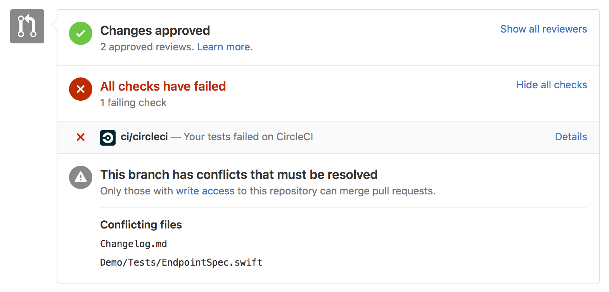
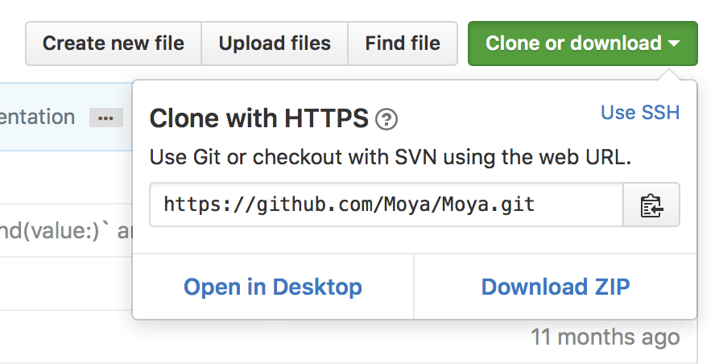

So you've seen an opportunity to improve an open source project and you've submitted a pull request – awesome! Whether it's a typo fix, added documentation, or maybe some code, pull requests from the open source community are what keep a project alive.

Sometimes, in the time between when you make your pull request, and when it's approved by the project maintainers, someone _else's_ pull request gets merged, and _their_ changes conflict with yours. You might recognize this greyed out interface in GitHub:



If this happens, don't worry. Let's walk through the steps to pull down the updates from the other pull request, resolve the conflicts, and update your pull request so it can be merged.

(I'm going to work from the command line, but you should be able to use these instructions for any git tool. I'm also going to assume that you've made your changes on a _fork_ of the project, basically a copy of the repository that you own.)

The first thing we need to do is tell git where to find the changes. As a convention, we're going to call the original repository the _upstream_. This is the repository that your pull request is submitted on. To get the upstream git URL, go to the original GitHub repo page and click the "Clone or Download" button.

<Narrow>



</Narrow>

Copy that URL. Now we need to tell git where the upstream is, and then tell git to fetch information from the upstream.

```sh
git remote add upstream https://github.com/Moya/Moya.git
git fetch upstream
```

Okay, great! Let's make sure that we're on the branch that you've made your changes on, the branch that you're submitted the pull request from. I'm going to assume it's called `my_pr_branch`. It's important that git is on this branch in order to resolve the conflicts from the upstream.

```sh
git checkout my_pr_branch
```

Okay, now we need to pull in the changes from upstream into our pull request branch. We do this with the following command:

```sh
git pull upstream master
```

At this point, you're probably going to have some conflicts. Let's take a look at a conflict I had to resolve recently.

<Wide>

```swift
<<<<<<< HEAD
let newEndpoint = endpoint.endpointByAddingParameterEncoding(parameterEncoding)
let encodedRequest = try? parameterEncoding.encode(newEndpoint.urlRequest!, with: newEndpoint.parameters)
let newEncodedRequest = try? newEndpoint.parameterEncoding.encode(newEndpoint.urlRequest!, with: newEndpoint.parameters)
=======
let newEndpoint = endpoint.adding(newParameterEncoding: parameterEncoding)
let encodedRequest = try? parameterEncoding.encode(newEndpoint.urlRequest, with: newEndpoint.parameters)
let newEncodedRequest = try? newEndpoint.parameterEncoding.encode(newEndpoint.urlRequest, with: newEndpoint.parameters)
>>>>>>> 08b3dcbbc2a98d2b0c8ea04845681e04176fbd8f
```

</Wide>

The changes from my pull request are on the top, and the changes that have been made to the upstream repo are on the bottom. We need to reconcile the two, which can be tricky. Ideally, we would find out why the changes on the top were made so we can incorporate them into our branch, so go check the GitHub history for that file. This process of resolving merge conflicts gets easier with experience.

Unit tests help a lot here, since they'll let you know if you've made a mistake in the conflict resolution. If tests passed on your branch _before_ pulling from the upstream, and they passed on the upstream before being pulled into your branch, then they should also pass after merging the conflicts. If they don't, there's probably a mistake somewhere. If you can't figure it out, don't worry! Just push it to your pull request and ask for help.

In my case, it ended up looking like this:

<Wide>

```swift
let newEndpoint = endpoint.adding(newParameterEncoding: parameterEncoding)
let encodedRequest = try? parameterEncoding.encode(newEndpoint.urlRequest!, with: newEndpoint.parameters)
let newEncodedRequest = try? newEndpoint.parameterEncoding.encode(newEndpoint.urlRequest!, with: newEndpoint.parameters)
```

</Wide>

After resolving conflicts, you need to `git add .` to add all the conflicting files and then `git commit`. This will open up a text editor, probably vim, with a pre-filled commit message.

```
Merge remote-tracking branch 'upstream/master' into my_pr_branch
```

In vim, type `:wq` and your commit is complete. Do a `git push` to add the commit to your pull request, and wait for someone to review.

Resolving conflicts gets easier with experience. Using git gets easier, too, but it still trips me up sometimes. If you get stuck at some point in this process, don't worry. Do a Google search for your problem, and don't give up. If you can't figure it out, add a comment to the pull request asking for help. Make sure to [list what you've tried](http://mattgemmell.com/what-have-you-tried/). You're trying to improve the project and so is the maintainer. We've all got the same goals: to improve the code and to improve the community, but make sure to have fun!
