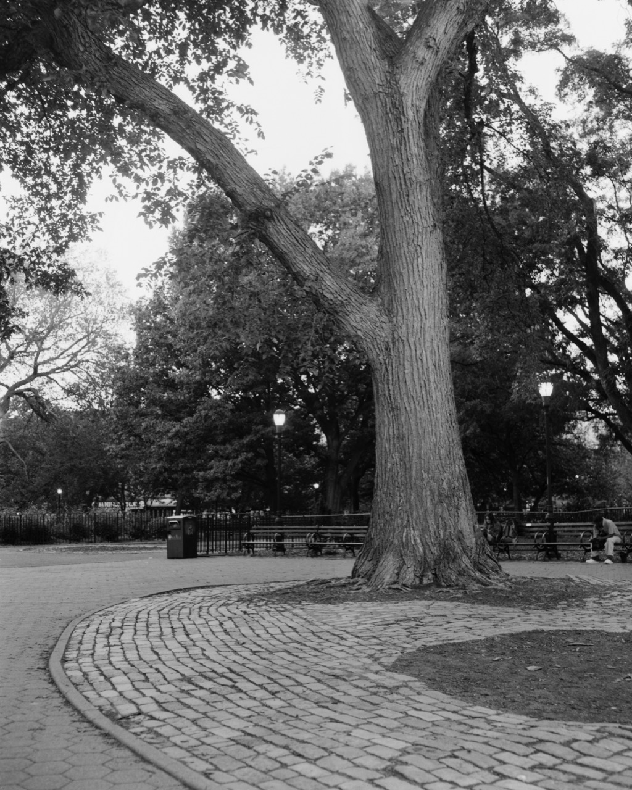
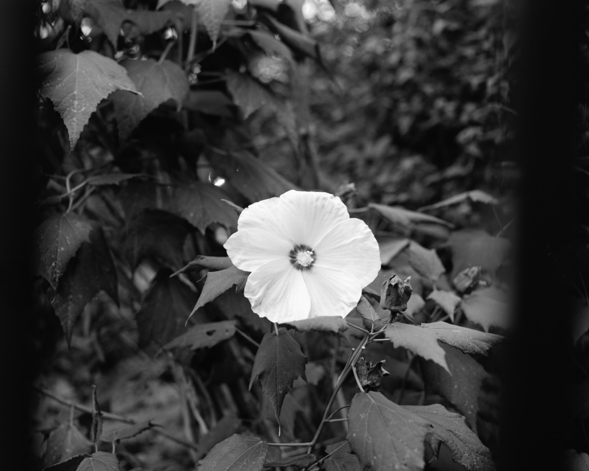

Large format photography is wild, it is totally different from 35mm or medium format, in a few ways. First: the negatives are huge. My camera uses 4x5" film (10cm x 13cm). Second: there is an entirely new way to manipulate the camera: camera movements.

In normal cameras, the plane of focus and film plane are parallel (or co-planar, for math nerds). The plane of focus moves away from the camera in a straight line. LF cameras allow the photographer to change the relationships between these planes by manipulating the optics of the lens. There are mathematical rules that photographers can apply to achieve artist effects.

I've been thinking about getting a LF camera for a while now, and finally broke down and got one. I want to talk about some more motivation why, and what's surprised me about it, and then take a look at some sample photos.



<blockquote class="instagram-media" data-instgrm-captioned data-instgrm-permalink="https://www.instagram.com/p/BLJu98mAMox/?utm_source=ig_embed&amp;utm_campaign=loading" data-instgrm-version="13" style=" background:#FFF; border:0; border-radius:3px; box-shadow:0 0 1px 0 rgba(0,0,0,0.5),0 1px 10px 0 rgba(0,0,0,0.15); margin: 1px; max-width:540px; min-width:326px; padding:0; width:99.375%; width:-webkit-calc(100% - 2px); width:calc(100% - 2px);">
 <a href="https://www.instagram.com/p/BLJu98mAMox/?utm_source=ig_embed&amp;utm_campaign=loading" style=" background:#FFFFFF; line-height:0; padding:0 0; text-align:center; text-decoration:none; width:100%;" target="_blank"> 
 

 
 

 

 

 
 View this post on Instagram

 

 

 

 

 

 

 

 

 

 
 

 

</a>
<a href="https://www.instagram.com/p/BLJu98mAMox/?utm_source=ig_embed&amp;utm_campaign=loading" style=" color:#c9c8cd; font-family:Arial,sans-serif; font-size:14px; font-style:normal; font-weight:normal; line-height:17px; text-decoration:none;" target="_blank">A post shared by Ash Furrow 🏳️‍🌈 (@ashfurrow)</a>

</blockquote>



About a hundred years ago this employee at a German microscope manufacturer wanted to take a camera with him during his walks in the woods, but he had asthma and couldn't carry a LF camera. So he _invented_ 35mm photography. That gives you a sense of much of a pain it is to use these cameras.

When you think of "really old camera", a large format camera is probably what you imagine. It's big, it's got some bellows, it's propped up on a tripod, and the photographer stands underneath a hood to take the photo. _That_ is a large format camera.



<blockquote class="instagram-media" data-instgrm-captioned data-instgrm-permalink="https://www.instagram.com/p/BLPB9qllzfG/?utm_source=ig_embed&amp;utm_campaign=loading" data-instgrm-version="13" style=" background:#FFF; border:0; border-radius:3px; box-shadow:0 0 1px 0 rgba(0,0,0,0.5),0 1px 10px 0 rgba(0,0,0,0.15); margin: 1px; max-width:540px; min-width:326px; padding:0; width:99.375%; width:-webkit-calc(100% - 2px); width:calc(100% - 2px);">
 <a href="https://www.instagram.com/p/BLPB9qllzfG/?utm_source=ig_embed&amp;utm_campaign=loading" style=" background:#FFFFFF; line-height:0; padding:0 0; text-align:center; text-decoration:none; width:100%;" target="_blank"> 
 

 
 

 

 

 
 View this post on Instagram

 

 

 

 

 

 

 

 

 

 
 

 

</a>
<a href="https://www.instagram.com/p/BLPB9qllzfG/?utm_source=ig_embed&amp;utm_campaign=loading" style=" color:#c9c8cd; font-family:Arial,sans-serif; font-size:14px; font-style:normal; font-weight:normal; line-height:17px; text-decoration:none;" target="_blank">A post shared by Ashley Furrow (@ashleyfurrow)</a>

</blockquote>



I love film photography because of the _process_, not necessarily the results. This is mostly true of what drew me to LF. Film photography slows you down, and LF just compounds that slowdown by at least an order of magnitude, and I want that. I want to take super-considered photos and bring that slowness back to MF and 35mm photography. But I also want to experiment with the results.

All the ways to creatively apply optical tricks to photography really appeal to me.

So I bought a Crown Graphic Graflex, one of the later models, probably form the late 50s. It's tough, small, and relatively lightweight, but it doesn't have as full a range of camera movements to manipulate the photo. That's okay, I'll prioritize mastering the basics.

A scanner capable of scanning 4x5" negatives was the only real obstacle I had trouble overcoming. I ordered a 14-year-old scanner for \$30 off eBay, but it didn't work. There're large format scanners around New York I can rent, but I tried scanning the negatives in pieces and stitching the results, and I'm really surprised by how good they look.

My tripod needs an upgrade; my [Manfrotto BeFree](http://amzn.to/2dGCK7h) has been amazing for a long time, but it's optimized to be lightweight and small instead of for stability. My travel tripod _barely_ works, but I'm making due for now.

Looking online, I've found a rich community of LF photographers who have been maintaining websites on this stuff since the 90s. It's really impressive how dedicated they all are, and I've learned a lot already from various forum posts and YouTube videos.

I can't afford to get into some of the cool alternative processes like tintype or platinum prints, they just takes too much room and money. But I really want to. So look forward to more blog posts, probably. Who knows.

Alright, onto the images! I've taken eight exposures so far, here are a few. Excepting for sticking them together, I haven't retouched them at all. The images link to the full size JPEG for any pixel-peeper types.





Let's check out the details on those flower petals...





Beautiful.

With large format, there are so many cool things you can do and so many more ways to screw up a photo. I've already made some really interesting mistakes! I feel a lot like I did when I got my first DSLR – just really excited for all the possibilities. I'm not sure any piece of gear has excited me as much since my first film camera.

