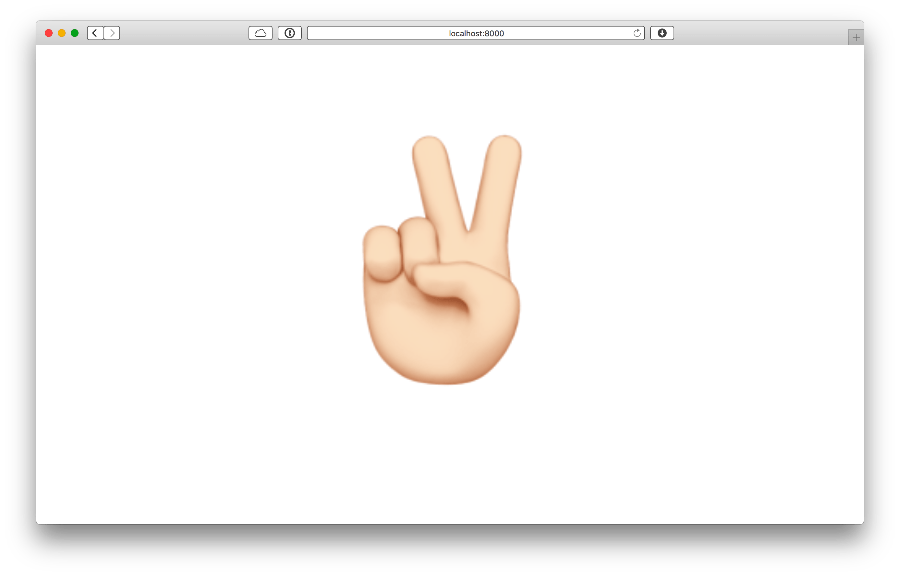

All the cool kids are experimenting with Swift on Linux and I've always meant to but never got around to it. After watching [Ben Scheirman's talk](https://speakerdeck.com/subdigital/swift-on-linux) on the subject, I decided to give it a shot.

At first I tried to use Vagrant and download one of the pre-built Swift binaries for Linux. But the configuration was difficult, and I ultimately couldn't get it to work. Then I tried Docker.

<Tweet tweetID="789879904925921280" />

I don't know the finer points of how Vagrant and Docker differ – but as far as I can tell they're both tools for managing virtual machines, or VMs. A VM is like a computer that runs inside your computer.

There's a [prebuilt Docker image](https://github.com/swiftdocker/docker-swift) for running Swift on Linux that I tried out.

First I had to [download Docker for macOS](https://docs.docker.com/docker-for-mac/). I had some trouble installing with Homebrew, I definitely recommend just downloading the Docker.app from their site.

Next I had to set up the VM. This means downloading the VM image – which is like the disk contents of a freshly installed Linux machine. To do this, use the `docker run` command. This will download the image and create the VM for you, along with some initial setup. The docker-swift readme is a bit incomplete, I had to use the following command:

```sh
docker run -p 8000:8000 -v /Users:/Users --privileged -i -t --name swiftfun swiftdocker/swift:latest /bin/bash
```

- **`-p 8000:8000`** means "map port 8000 of the VM to port 8000 on my actual computer." This lets use access the web server of [Ben Scheirman's sample project](https://github.com/subdigital/swift-rock-paper-scissors).
- **`-v /Users:/Users`** means "map the `/Users` directory of my actual system to the `/Users` directory of the VM." This lets us access files stored in `/Users` on my Mac from within the VM. So I could use Xcode to write Swift, and then compile and run it from the Linux VM. Neat!
- Not sure what **`--privileged`** means, it's apparently the subject of [some debate](http://obrown.io/2016/02/15/privileged-containers.html) but the docker-swift Readme has it so I used it.
- **`-i`** means "interactive" and it keeps the STDIN strem open when docker isn't attached. Not entirely sure why that's important.
- **`-t`** looks important for nerdy terminal reasons. Again, included in the docker-swift Readme so I used it.
- **`--name swiftfun`** sets the name of your new VM, `swiftfun` was recommended by docker-swift.
- **`swiftdocker/swift:latest`** tells Docker where to download the VM image from.
- I think **`/bin/bash`** tells the VM which shell to use, another thing I don't quite understand.

After running that command, I was logged into the VM.

To start and attach to the Docker VM after the first time, I would run:

```sh
docker start swiftfun
docker attach swiftfun
```

I had to experiment with the `docker run` command; because it does some set up that is hard to replicate after the VM is created, I created several VMs before I got it right. Every time I had to rename or delete the old ones.

So after creating the VM and attaching to it, I need to clone the sample project in a shared folder.

```sh
cd /Users/ash/bin/swift-on-linux
git clone https://github.com/subdigital/swift-rock-paper-scissors.git
cd swift-rock-paper-scissors/
```

Next up, the sample project has some dependencies, which in turn require some Linux libraries to be installed. These two commands retrieved the latest list of packages and then installed themes required for the sample project to compile.

```sh
sudo apt-get update
sudo apt-get install -y libcurl4-openssl-dev uuid-dev
```

Cool! Then, following the instructions from the Readme build and run the sample app:

```sh
swift build
./.build/debug/rps --web
```

Finally I went to a normal web browser and typed in `http://localhost:8000` to see the results.







Thanks again for everyone who chimed in on Twitter! I'm going to keep poking around, I don't know if running Swift on Linux is something I want to explore more, but it was fun to get this far, so who knows 😄
