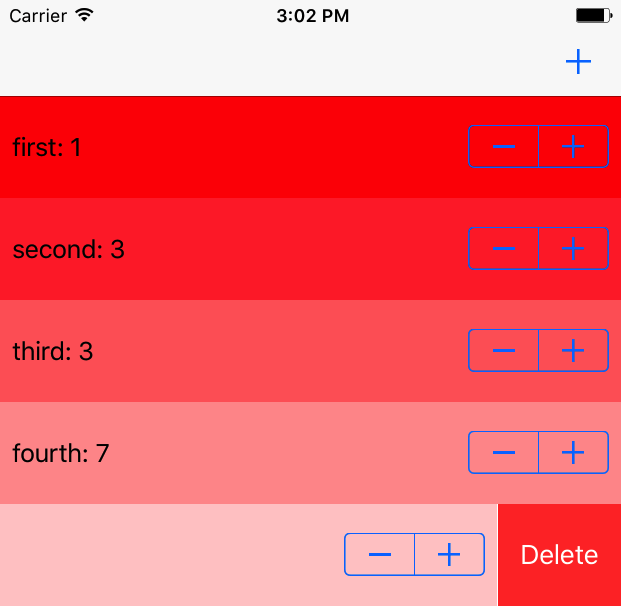

I've wanted to expand my expertise outside of just mobile development for a while now, and a few months ago I got the opportunity to begin building a large new feature in an existing [React][react] app for the Artsy Auctions platform. I was _extra_ excited because the feature's purpose is to make running auctions easier for my colleagues on the operations team, so every line of code I write makes their lives just a little easier. It's been a very rewarding experience.

The React app in question uses [Redux][redux], a state-management framework that I've grown quite fond of. The library itself is so small that it's more accurately described as an _idea_ rather than a framework. And lo, Redux has an implementation in Swift called [ReSwift][reswift].

My friend Junior decided to run an experimental, workshop-based, collaborative learning conference called [The Swift Alps][theswiftalps]. He asked me to be a mentor for the conference and I was honoured to oblige. I decided to use ReSwift in my workshops as a way to explore several other important aspects of iOS and Swift development.

- Explore alternative ways to manage application state in iOS apps.
- Imbue participants with a sense of community-driven software development.
- Normalize the GitHub model of fork/commit/pull request.
- Discover friction points involved in using non-UIKit inspired abstractions for managing state.

<Tweet tweetID="797007786047639553" />

Importantly, my goal was not to _convince_ people to use ReSwift or Redux style state management in Swift; instead, I only wanted to use ReSwift as a way to explore what was possible in terms of state management and demonstrate how software teams can work together to accomplish common goals. In that spirit, I reached out to ReSwift core maintainer [Benjamin Encz][‪benjaminencz‬] to see what sorts of ideas they might have, or chores we could accomplish for them. I distilled their wishlist down to three main goals:

1. Extend an [existing iOS example app][counter_example_original], from displaying/manipulating one counter, to several.
2. Add an iOS target to an [existing macOS example app][todo_example_original].
3. Build a brand new iOS application that used networking to explore asynchronous state changes in ReSwift.

It was ambitious. I had planned three two-hour sessions, each with a fresh batch of participants, each one building upon the work of the others (just like real software development). What the final products would look like, I didn't know, but we were going to try, fail, and learn. Together.

I didn't want this to be like a typical workshop where I direct people to accomplish preset tasks. Instead, I wanted to model this off of the weekly [peer lab][peer_lab] that I help run on Saturday mornings. As a group, we broke down the goals into tasks that groups of two or three participants worked on. They reviewed each others' pull requests, coordinated, and handled merge conflicts. I was only there to facilitate.

We accomplished the first goal and made some progress towards the second. Sadly, slow wifi and Xcode problems hampered transforming the macOS app into a macOS/iOS app. We didn't end up building a new app. Despite these challenges, we learned a lot.

Most of the work went into the first task: augmenting a simple counting application from being able to count one thing at a time to being able to count several things at once. This transition from one counter to many counters is commonly used in Redux web tutorials to graduate from simple to complex state; I wanted to repeat the process for ReSwift. By the end of the day, we had a full app that used ReSwift to full effect, including named counters, dynamic table view reloading based on LCS algorithms, Redux-style selectors, and state persistence.





We tried, failed, and tried again. When I ran out of ideas to augment the app, participants helped me out by coming up with their own goals and distributing work between groups. I was surprised and humbled by how quickly the participants – mostly strangers – were able to come together and form well-functioning teams.

The counter app does a lot more than I had originally intended, and it's now probably too complex to serve as a simple introduction to ReSwift. That's okay, it can [sit alongside the original][counter_example_fork] as a learning resource for others.

I like Redux, and ReSwift is a great implementation of the idea. I'm undergoing a [switch to ReSwift in our auctions code][reswift_pr]. Redux appears to clash with UIKit in only the expected ways that a non-UIKit library would, and the simplicity of the framework helps to minimize dependencies within our large app.

If I were to repeat this workshop, I would do a lot of the groundwork for creating a universal iOS/macOS app, since that became a large time sink. I feel bad that the time put into Xcode project configuration could have been spent exploring more interesting problems. However, the workshop format of having an _idea_ of the goal but not an exact destination or path in mind made the journey more educational, and more fun for everyone.

I'm excited to return to New York and the Auctions team, and bring with me a renewed appreciation for what Redux can accomplish. Travelling often leaves me tired, and I do feel a bit foggy now, but my spirit hasn't been as high in quite a while. I'm looking forward to sharing this enthusiasm with the rest of my team.

[react]: https://facebook.github.io/react/
[redux]: http://redux.js.org
[reswift]: https://github.com/ReSwift/ReSwift
[theswiftalps]: http://theswiftalps.com
[‪benjaminencz‬]: https://twitter.com/benjaminencz
[counter_example_original]: https://github.com/ReSwift/CounterExample
[todo_example_original]: https://github.com/ReSwift/ReSwift-Todo-Example
[peer_lab]: https://artsy.github.io/blog/2015/08/10/peer-lab/
[counter_example_fork]: https://github.com/TheSwiftAlps/CounterExample
[reswift_pr]: https://github.com/artsy/eigen/pull/1985
