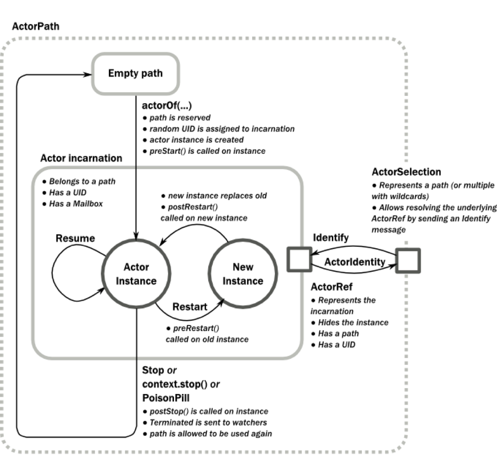

So I'm in Australia to give my talk at [Playgrounds Conference](http://playgroundscon.com) about asynchronous programming. While we wait for the video to be edited and uploaded, I thought I could take you through the talk in blog post form. So let's dive in!

<SpeakerDeck deckID="46f4ab568af449b8ac95aa4939f9e62e" />

Today we're going to be talking about asynchronous programming: what it is, why it's important, and what it can look like in Swift. The topic is quite complicated and I don't have enough time to go into a tonne of detail, but my goal isn't depth, it's breadth. I want to expose you to lots of ideas and give you hints about where to follow up to do your own research.

Today we're discussing four main points:

1. Asynchronous programming is difficult and there is no one "best" way to do it.
2. Swift ships with some asynchronous abstractions, but they're not great.
3. But we can build our own abstractions in Swift!
4. However, compiler limitations mean there are some abstractions we _can't_ build in Swift.

Let's get started.

## Asynchronous Programming: Difficult and Subjective

Before we talk about asynchronous programming, let's define it. To define it, let's contrast it with synchronous programming. "Normal" programming, as contrasted with asynchronous programming, is the kind of programming you probably learned first. It's where program execution starts at the top and executes each line of code in step, moving towards the bottom. The program waits for each line of code to finish before moving onto the next line.

Most of the code Swift developers write is "normal", or synchronous. Let's take a look at an example.

```swift
let returnValue = someFunctionCall()
```

This is an example of a synchronous, or "normal" Swift function call. It is synchronous, meaning from the call site's perspective, it gets executed atomically. It starts, it finishes, all in one line of code.

If all the function is doing is adding two numbers you've already loaded from RAM, it'll be really fast. If it has to retrieve those from RAM first, it'll be orders of magnitude slower. If you're doing something complex like reading a file from disk, then it'll be orders of magnitude slower still. At a certain point, you're wasting CPU time waiting for file I/O, network I/O, or other long-running task to complete.

That's where asynchronous programming comes in: it mitigates this wasted CPU time by letting programs do stuff while waiting for other code to get executed.

Asynchronous programming is where you write code that's executed out of order. Your program continues to execute new lines of code while it waits for previous lines to finish. Then, code gets executed in response to external signals like completed network requests, user interaction, all kinds of things! Code might get executed in parallel, too. Things get complicated quickly!

Like most mainstream languages, Swift is really all about writing synchronous programming, and forces programmers to choose the appropriate abstractions. Which to choose?

It depends.

Software development is all about tradeoffs. Which abstraction you pick depend on which tradeoffs you want to make. Some languages and frameworks have strong opinions about how to do asynchronous programming, like [Node.js](https://nodejs.org). They use something called "non-blocking" functions because they have the benefit of never blocking the main thread. This is critical in JavaScript because there is only one thread, so blocking at any point blocks your whole app. Yikes!

Non-blocking code is great but has its tradeoffs: imagine if almost every function call you made in Swift had a completion closure instead of a return value. That might be terrible, but it might be great! Let's press on and explore.

```swift
let file = readFile()

// vs

readFile() { file in
  ...
}
```

The first example blocks while the second example is non-blocking. The blocking call is simpler to understand, since it happens atomically from the call site's perspective. But it's less performant. The non-blocking call is better for performance but it doesn't have an "immediate" return value, so it's asynchronous nature propagates up the call stack. In effect, the code using it becomes non-blocking. This is annoying for developers, but you get really performant code.

See? Tradeoffs.

Swift doesn't have that same kind of opinionated nature as Node.js, which is a shame because it leads to developers avoiding thinking about abstractions.

To write modern software, you _have_ to write asynchronous code sometimes. And writing asynchronous code involves picking an abstraction; if you don't think about which abstraction would be best in a given situation, you're very unlikely to pick the best one for you.

Let's look at the abstractions built-in to Swift.

## Swift Has Async Built-in. Sorta.

Swift's built-in abstractions are a bit lacking because it's fairly unopinionated about asynchronous programming. Most of its asynchronous abstractions come directly from Objective-C, and aren't that great. Let's explore.

(We're going to limit ourselves to iOS, macOS, watchOS, and tvOS – none of that "Swift on Linux" stuff.)

### Grand Central Dispatch

[Grand Central Dispatch](https://en.wikipedia.org/wiki/Grand_Central_Dispatch) (GCD) is most helpful for managing threading, which is beyond the scope of this post. It's probably not best to use GCD directly, but rather use it to build higher-level abstractions that are easier to think about. However, GCD is _super_ powerful.

### NSOperationQueue

NSOperationQueues are built on top of GCD and allow you to "link" different operations together to form a complex dependency graph. They're really cool! But kind of a pain to use directly. Check out [DRBOperationTree](https://github.com/dstnbrkr/DRBOperationTree) for an example of an even more powerful abstraction built on top of operation queues.

### POSIX Threads

It's possible to use [POSIX threads](https://en.wikipedia.org/wiki/POSIX_Threads) in Swift but it's far too low level, I really discourage this approach.

### Target / Action

[Target/action](https://developer.apple.com/library/content/documentation/General/Conceptual/Devpedia-CocoaApp/TargetAction.html) is a pattern that calls a specific function on a specific object. It is used throughout UIKit, usually for user interaction like button presses or gesture recognizers. This pattern works okay for small uses but doesn't always scale well.

### Callbacks / Completion Handlers

Callbacks are built from closures, short anonymous functions that get executed later on in time. You've probably used these before at the completion of a network request or animation, but let's take a closer look.

```swift
logIn(with: credentials) { result in
  // Handle login success or failure
}
```

Here we have a `logIn(with:)` function that takes a completion handler as its last parameter, and that handler gets executed when the login succeeds or fails.

The thing is, it's hard to stack a callback within a callback. Actually, it's easy, but that's the problem. Soon, you have callbacks within callbacks within callbacks, which are hard to debug and produce messy stack traces.

```swift
getCredentialsFromUser() { credentials in
  logIn(with: credentials) { result in
    // Handle login success or failure
  }
}
```

This "triangle of doom" is the code creeping further and further from the left side of the screen (right side for RTL languages). This is bad enough, but things get worse when you consider handling errors appropriately.

```swift
getCredentialsFromUser() { credentials, error in
  if credentials {
      logIn(with: credentials) { login, error in
        if login {
          // Handle login success
        } else {
          // Handle error
        }
      }
  } else {
    // Handle error
  }
}
```

So now we have error handling strewn throughout our callbacks. Gross! Consider that none of these asynchronous functions work well with the built-in Swift error handling of `throws`. What a shame.

An important consideration when you're writing a function that takes a call back is the callback's _signature_. What information are you going to pass to it? We generally want to pass either a value (in the success case) or something else (in the failure case). A simple approach is to use an Optional.

```swift
(credentials: Credentials?) -> Void
```

A `nil` value will represent a failure, and a non-`nil` value will represent a success. This works well for small cases but has a limitation: what if we want to know _what_ went wrong?

We could just add an optional `Error` parameter, and in some ways that would be an improvement. The `Error` can be used to take appropriate follow-up action after an error is encountered.

```swift
(credentials: Credentials?, error: Error?) -> Void
```

However, we've introduced some ambiguity into our code. What happens if both of the parameters are `nil`? What happens if neither of them are?

An even better approach is to use a Result type.

```swift
(result: Result<Credentials>) -> Void
```

A result represents either a success or an error. Because Swift is so keen on staying unopinionated, it doesn't have a result type built in. You can either use [the Result library](https://github.com/antitypical/Result) or make one yourself.

```swift
enum Result<T> {
  case success(T)
  case error(Error)
}
```

Result uses Swift enums to define two cases: a success, with an associated generic value, and an error with an associated error value. Since the result has to be exactly one of these two cases, there's no ambiguity when writing you code!

If you're going to use callbacks to write asynchronous code in Swift, I highly encourage you to use a Result type as a parameter to the callback. Not only is it clean, but it's also a gateway to using higher-level abstractions. Something something monad.

Callbacks are useful for one-off async methods. You don't need a fancy async approach if all you're doing is, say, fetching some photos from the user's library. But if you find yourself nesting callbacks within each other, look for a better solution.

## Some Async Abstractions are Supported in Swift

As developers, we aren't constrained to only using what our language and frameworks supply. We can use open source libraries and build our own abstractions that are better suited for our needs. There a tonne of abstractions out there to use, let's take a look at a few popular ones.

### Promises & Futures

(Promises and futures are technical distinct but I'm not going into the differences between them. We'll use them interchangeably here.)

A future is a class that represents a future value or error. You write your code based on how you would deal with a future value or error, and later when it happens, the correct code gets run. Lots of libraries already exist in Swift for promises and futures. Let's look at one called [BrightFutures](https://github.com/Thomvis/BrightFutures).

```swift
getCredentialsFromUser()
  .flatMap { credentials in
    return login(with: credentials)
  }
  .onSuccess { login in
    // Handle login success
  }
  .onFailure { error in
    // Handle login error
  }
```

We can see that there are a few big improvements over simple callbacks. First, transforming one future into another is really easy using `flatMap`. Second, error handling is all done at the end in one spot. An error from any future is propagated through the chain, so you don't end up writing duplicated error-handling code. Nice!

### Functional Reactive Programming

I couldn't talk about asynchronous programming without discussing my favourite abstraction: functional reactive programming. Briefly, FRP encapsulates a stream of events that you can observe:

- New value events.
- Error events.
- Completion events.

These streams, called observables, finish with either an error or completion event (never both), and they stop sending events afterwards. I've written a whole [blog post](https://ashfurrow.com/blog/reactivecocoa-vs-rxswift/) about choosing an FRP library, but let's explore some [RxSwift](https://github.com/ReactiveX/RxSwift) examples.

```swift
getCredentialsFromUser()
  .flatMap { credentials in
    return login(with: credentials)
  }
  .subscribe(onNext: { login in
      // Handle login success
    }, onError: { error in
      // Handle login error
    })
```

🤔

That FRP code looks _really_ similar to futures/promises. That's because our code is structured such that it only sends one value and then it's done. FRP has all the benefits of promises, and then some, and FRP is at its best when used for streams of values that get sent over a long period of time.

```swift
gerstureRecognizer.rx
  .event
  .map { recognizer in
    return recognizer.location(in: recognizer.view)
  }
  .bind(to: circle.rx.center)
```

This is a better RxSwift example. We have a gesture recognizer that sends new value events ever time the user moves their finger on the screen. Then we map those events into locations, and bind those location events into a circle view's `center` position. In five lines of code, we've written asynchronous gesture recognizer handling to have a view follow a user's finger. Cool!

I should mention that RxSwift works well with idiomatic error-throwing in Swift, too. Even cooler.

FRP would be my recommendation for a fully-featured async approach. The abstractions are great and super-powerful, but do take some getting used to. If FRP is too complex for your needs, stick to using promises.

### Actor Model

This is probably the most far-out approach we'll discuss today. [Actor-based programming](https://en.wikipedia.org/wiki/Actor_model) treats "actors" as primitives for concurrent computation. [Akka](http://akka.io) is a popular library for using actors in Scala, we use it at Artsy and it's pretty cool.

This diagram is from [Akka's documentation](http://doc.akka.io/docs/akka/current/scala/actors.html), don't look at it – it's too complicated!

<Narrow>



</Narrow>

The actor model provides a number of constraints and conditions that make async robust, but more complicated.

Different implementations, but generally:

- Actors receive messages in unspecified order and have to react to those messages.
- Actors can create child actors to perform some work – no callbacks!
- Actors can maintain local state, so they can respond to a message differently when called subsequent times.
- Actors maintain a hierarchy, leading to great error-tolerance.

Actors are definitely overkill for nearly all iOS applications, But properly implemented, Actors can be used to write fault-tolerant, highly performant distributed systems

[Erlang](http://www.erlang.org) proved the actor model was feasible and helped to popularize it. As Swift's popularity outside iOS/macOS apps grows, I'm looking forward to seeing how the Actor Model gets used in Swift.

## Some Async Abstractions are Impossible in Swift

Due to compiler limitations, there are some asynchronous approaches that are impossible to do in Swift, at least for now.

### Async / Await

This abstraction is supported in JavaScript and C# and is very popular in those languages. Why? It lets you write code that looks "normal" but is actually asynchronous under the hood. It's powerful and expressive and not yet possible in Swift for reasons we'll discuss shortly.

Let's look at an example.

```swift
async func logIn() -> Login {
  let credentials = await getCredentialsFromUser()
  return await logIn(with: credentials)
}
```

Here we have a `logIn()` function that appears to return a value synchronously, but in this hypothetical syntax, we see that the function has been marked asynchronous with the `async` keyword. When the function execution reaches `await getCredentialsFromUser()`, the function _pauses_ and waits for that function to return a value, asynchronously. At that point, the function execution will resume. How cool is that! Check out [this great blog post](http://khanlou.com/2016/09/async-await/) for more details on a hypothetical async/await in Swift.

Async/await isn't perfect – for example, mixing async/await with regular callback closures is really hard to do. They're an opinionated aspect of a programming language, and so they fit in well with opinionated languages like C# and modern JavaScript. Plus they work with throwing errors, so we could write idiomatic Swift error-handling.

Async/await is the way I wish Swift had done async programming, it's probably the ideal but is now too late to standardize on.

Additionally, some asynchronous needs aren't well-met by async/await. It would be hard to write gesture recognizer code this way, which works best with existing Swift-supported abstractions like FRP or target/action.

### Coroutines and Generator Functions

These are the strangest things I came across in researching different asynchronous programming approaches. Why? Because [coroutines/generators](http://exploringjs.com/es6/ch_generators.html) violate some of the base assumptions I'd made about programming. Assumptions like:

- Functions can only complete once.
- Functions can only return a value once.
- Function execution always starts at the top.

Coroutines and generator functions aren't typically used directly, but are required to make async/await. Swift doesn't have support for coroutines yet, so that's why Swift can't have async/await like JavaScript or C#.

```swift
func fibGenerator*() -> Int {
  var i = 0, j = 1
  repeat {
    let next = i + j
    yield next
    (i, j) = (j, next)
  } while true
}

fibGenerator() // returns 1
fibGenerator() // returns 2
fibGenerator() // returns 3
fibGenerator() // returns 5
```

This `fibGenerator` function has been marked as a _generator_ using the `*`, a syntax borrowed from JavaScript. It looks like an infinite loop, but it actually returns a value using the `yield` keyword and then pauses execution until it gets called again. Every time you call the function, it resumes execution, loops, and yields a new value. How cool is that?

This isn't code you might actually use – JavaScript developers don't often use generators directly, but rather use them to but higher level abstractions like async/await.

## Wrap Up

We've covered a lot of ground today. We talked about what asynchronous programming is and why there's no single "best" solution. Then we discussed the asynchronous approaches built into Swift, the approaches we can build ourselves in Swift, and finally the approaches we can't yet build in Swift.

<Tweet tweetID="834909007148036096" />

Hopefully you made this face a few times while reading. It's always a good idea to learn new things, even if they're not directly applicable to your job, just to know they're out there. If you see something cool you'd like in Swift, head over to [Swift Evolution](https://github.com/apple/swift-evolution) and talk to the language community. Together, we can help shape the future of Swift.

Especially as Swift gains popularity outside of just building apps, I'm incredibly excited to see how it continues to evolve. I'm particularly keen to see new asynchronous abstractions become possible in my favourite language.
