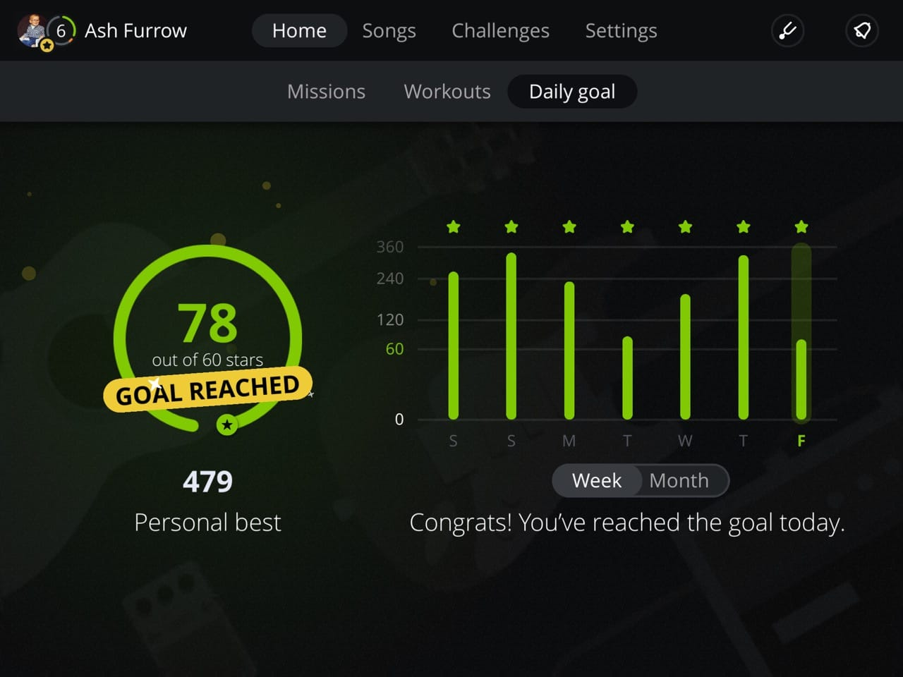

A few weeks ago, I wrote about [improvising on guitar](/blog/improving-improvising/), a follow-up from [when I started learning in December](/blog/learning-guitar/). I've been busy since then, practicing and playing every day. Time for another update.





I've been using [Yousician](http://yousician.com), and it's been a great tool to help develop skills. If you're on Yousician, or you join, please add me as a friend. I find competition for high scores really motivating 😄

Yousician isn't a complete replacement for learning an instrument, though. I've been learning songs on my own, following YouTube courses, and have my first lesson with a local guitar teacher next week.

After discussing with some friends, I started a Slack for musicians to collaborate and learn from each other. If you're interested, [email me](mailto:ash@ashfurrow.com). It's been nice to have a place to chat and encourage each other.

I've been recording myself as well. Mostly for my own sake and to share with the Slack, but I've also sent it to my mom (who is very proud of me).

<SoundCloud trackID="312605091" />

So yeah, pretty excited. Guitar has become a daily activity for me, something I look forward to doing and something that helps me relax. I'd highly recommend it 👍
