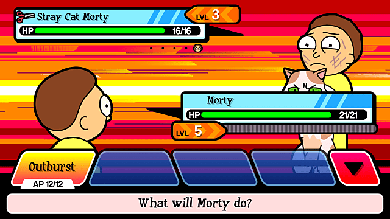

Last year when Pokémon Go came out, cultural critic Jonathan McIntosh did what cultural critics do: he pointed out an uncomfortable truth.

<Tweet tweetID="754147540149219329" />

Pokémon was a huge part of my childhood – augmented by the nominal determinism of being named "Ash" – but I don't deny that it's cruel to capture animals and force them to fight. I mean, come on people. It's a bit obvious, if (as McIntosh points out) surprisingly unpopular.

Of course, the internet being what it is, McIntosh got a bunch of harsh blowback because people are uncomfortable with the idea that something they like could be problematic.

So let's take a detour and talk about my new favourite show: Rick and Morty.

Ricky is a drunk genius who takes his adolescent grandson Morty on adventures through the multiverse. There are actually an infinite amount of Ricks and Mortys, since there are an infinite number of dimensions to exist in. They interact with these alternate versions of themselves and get up to hijinks and in to trouble.

So the show, during a hiatus between seasons, released a game that parodied Pokémon: [Pocket Mortys](https://itunes.apple.com/us/app/rick-and-morty-pocket-mortys/id992640880?mt=8). You play as Rick to collect, train, and fight Mortys. Say again: the game is cockfighting, but with your grandson. And it's super fun.





No one on the Internet seems to have a problem with this uncomfortable truth, even though the game explicitly highlights the same truth that McIntosh did. During fights, Mortys will scream in pain, they'll whimper "this just seems really cruel", and they'll exclaim "I don't want to do this any more!" And it's all part of the fun.

So why does this game get critically reviewed as "hilarious" and "quirky" while McIntosh gets threatened on twitter – even when both point out the same reality? [Pocket Mortys even gets compared directly to Pokémon](http://www.ign.com/articles/2016/01/12/rick-and-morty-pocket-mortys-review):

> In its best moments, Pocket Mortys has a similar feel and tone to its source material.

And no one seems to care that it's pointing out the cruelty. The game is an explicit parody of Pokémon, and readily points out how cruel it is to fight Mortys. By extension, the game highlights how cruel it is to fight Pokémon. Yet there has been no pushback against the creators of Pocket Mortys, while McIntosh gets threatened on twitter for essentially saying the same thing. What's the difference here?

People are uncomfortable when something they like gets criticized as problematic. Well... tough. Your [favs are problematic](https://medium.com/matter/admit-it-your-fave-is-problematic-2dfa692f557b). Your favourite game? Problematic. Your favourite book? Problematic.

Deal. With. It.

I'm problematic, you're problematic. Everyone is. We all have blind spots – that doesn't make us bad people, it just makes us human. What makes us good or bad people is how we respond to uncomfortable realizations. What do you do when it's pointed out that your favourite game or show or author is problematic?

Something I learned from [Feminist Frequency](https://feministfrequency.com) is to be critical of the media I love. Pocket Mortys is a fun game, and the show is funny as hell, but in some ways it's suuuuuuper problematic. I can enjoy both the game and the show while being critical of them. I swear, it might be uncomfortable at first, but after a while you get used to liking something while recognizing its flaws.

This kind of critical thinking is useful beyond just media, I would argue it's necessary to be a well-rounded member of society.
