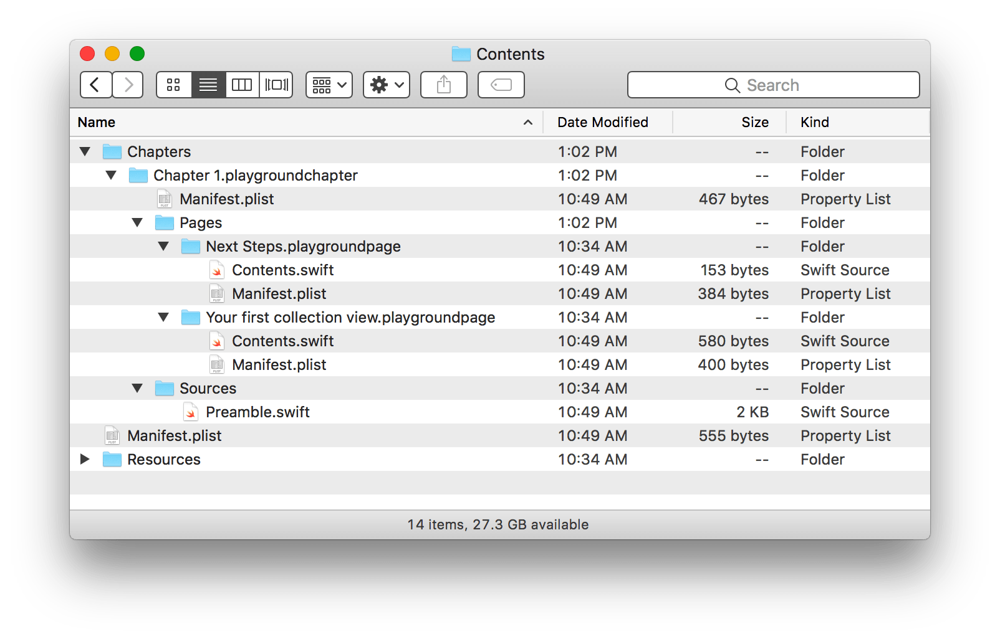
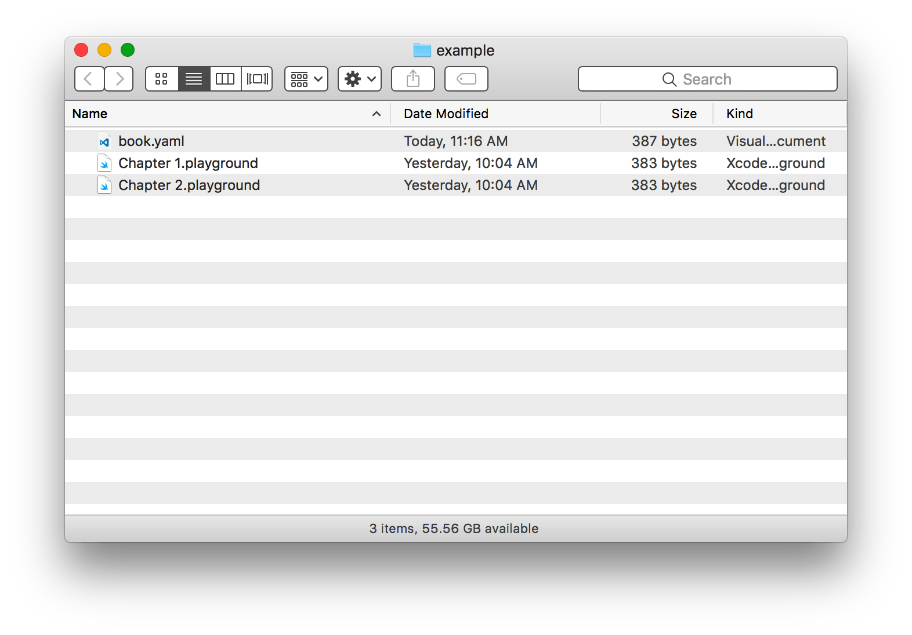
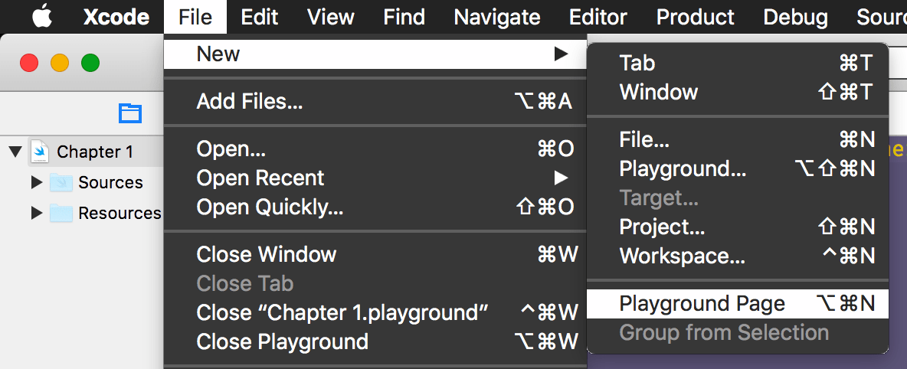

Some time ago I wrote about [Swift Playground Books](/blog/building-swift-playground-books/) and introduced [a tool](https://github.com/playgroundbooks/playgroundbook) to create them from a regular Xcode playground. There's been a lot of work done to the tool by our wonderful contributors, and it's time for an update.

As a quick overview of [Swift Playground Books](https://developer.apple.com/swift/playgrounds/) (for iPad), let's explore what they look like on the file system.



This structure (documented [here](https://developer.apple.com/library/prerelease/content/documentation/Xcode/Conceptual/swift_playgrounds_doc_format/index.html#//apple_ref/doc/uid/TP40017343-CH47-SW4)) must be strictly adhered to or else the playground book won't work on the iPad. Creating this directory structure and the corresponding manifest plists is tedious, which is why I originally created the tool. Now, compared to the original post, things are much easier to accomplish.

The original format had users writing triple-slash `///` comments to delineate playground book pages. Now, chapters are divided into individual Xcode playgrounds.



Individual pages within a chapter are represented by Playground pages within Xcode. Use the File -> New menu to add pages. Make sure that the page names are lexicographically ordered in the way you want them to appear in the book.



There's also some cool things you can do with special comments.

```swift
//#-hidden-code
print("This code gets executed but isn't visible in the book.")
//#-end-hidden-code

func /*#-editable-code*/ <#funcName#> /*#-end-editable-code*/() {
    print("The user will be prompted to edit <#funcName#>")
    print("This yields a compiler warning in Xcode ¯\_(ツ)_/¯")
}
```

Play around and see what you think! For more info, check out [the example repository](https://github.com/playgroundbooks/example). I'm sure there are bugs in the tool, so if you run into problems please [open an issue](https://github.com/ashfurrow/playgroundbook/issues/new).

---

I love open source, and I'm glad I built this tool (even if I never did end up using it myself). Several students have contacted me for assistance when using it to apply for WWDC scholarships, and it makes my heart swell knowing that people are using my software to advance their own careers. I couldn't be happier with the small community that's growing around the tool.
