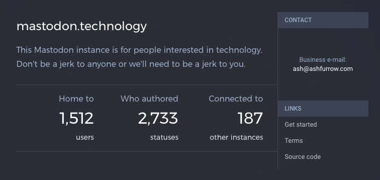
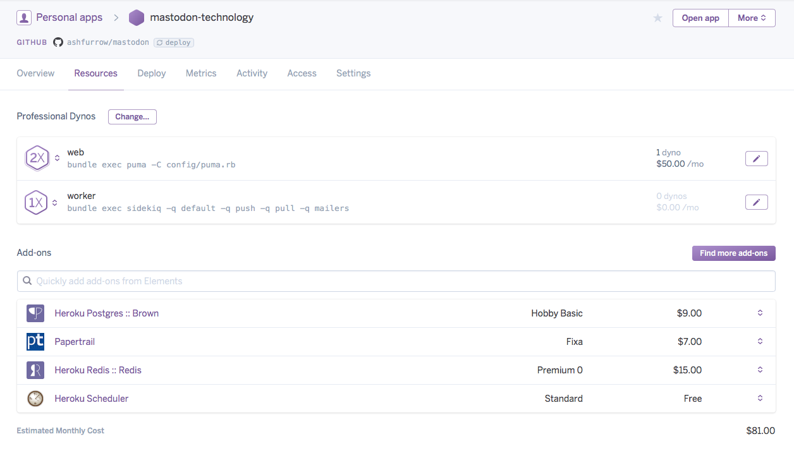
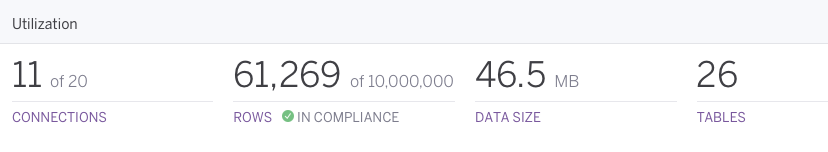
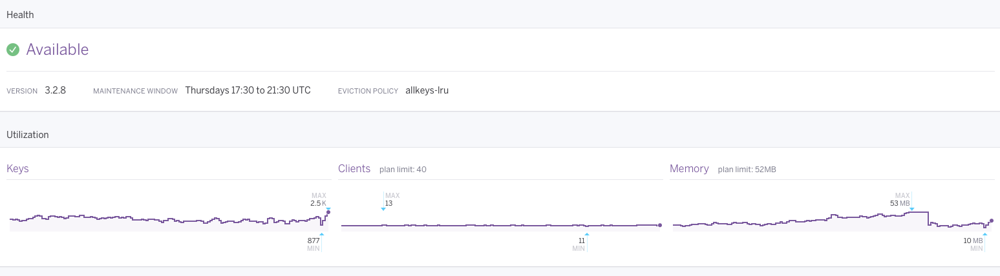
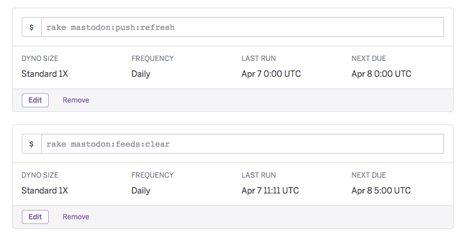
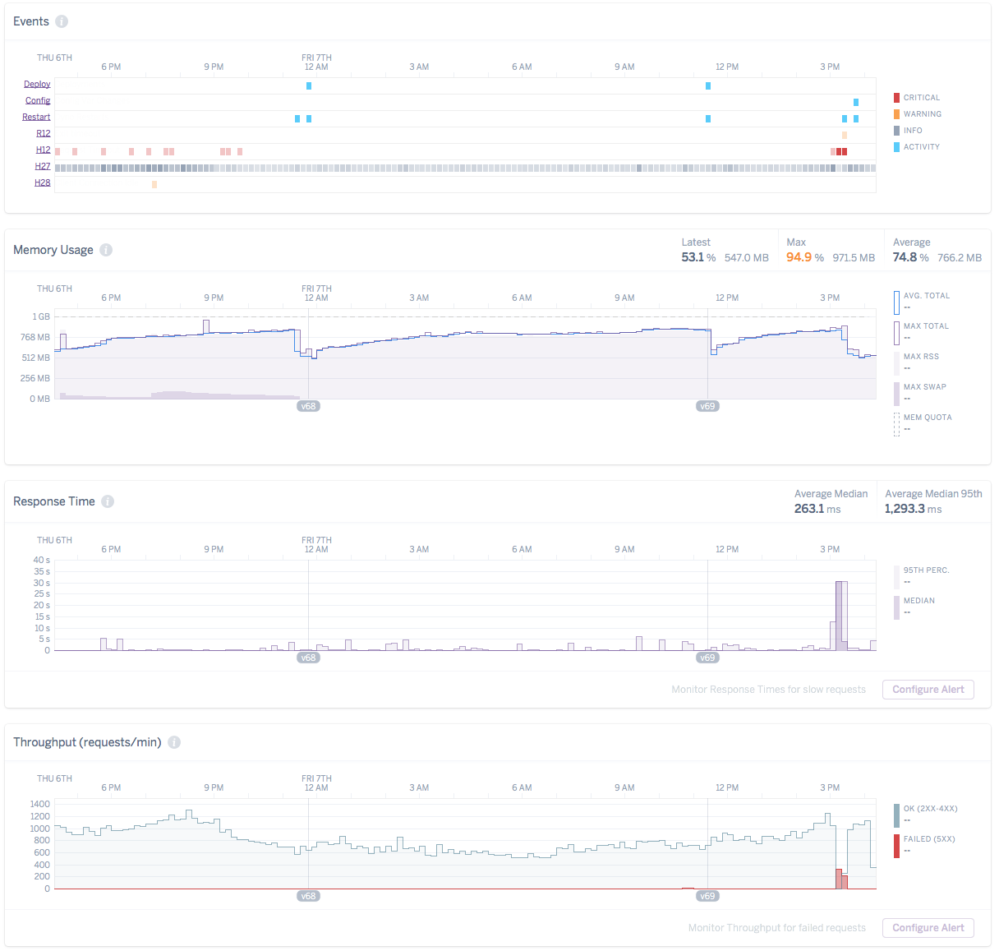

So I've been [running an instance](/blog/mastodon-administration/) of [Mastodon](https://github.com/tootsuite/mastodon) this week. It's be a fun adventure! I'm still not sure where it'll end up but I'm learning a tonne. So let's share some of what I've learned by running Mastodon on [Heroku](http://heroku.com).

If you'd like to help out with some of the hosting costs, please head on over [to my Patreon](https://patreon.com/user?u=3581610).





First, a few things. I _love_ Heroku; it's server administration that's friendly to iOS developers like me who don't know anything about server administration. But! Heroku support for Mastodon is e x p e r i m e n t a l . That's fine, this whole thing is an experiment! Life is an experiment. And like life, there are some issues I've run into.

- [**~~Animated GIF upload doesn't work~~**](https://github.com/tootsuite/mastodon/issues/1007). GIFs are transcoded on the Mastodon server, and that requires ffmpeg to be in your buildpack. But that will put you _just_ over the 300MB slug size on Heroku.
- [**~~Streaming API doesn't work~~**](https://github.com/tootsuite/mastodon/issues/1119). Not sure of the cause yet.

(**Edit**: These are being addressed in more long-term ways, but for now I've gotten them to work. Check out the issues for more details.)

Now to the good stuff: how to get Mastodon set up.





The initial deploy (use the "Deploy to Heroku" button [in the readme](https://github.com/tootsuite/mastodon#deployment-on-heroku-experimental) is going to install two dynos, Redis, and Postgres. You [only need the first Dyno](https://github.com/tootsuite/mastodon/blob/4e41cd9ab8f51120d558b70528b163c98993be53/config/puma.rb#L11-L13), the web one.

I registered a domain ([mastodon.technology](https://mastodon.technology)) with [Hover](https://www.hover.com) and used Heroku's SSL support to serve the Mastodon instance over HTTPS. It's 2017, after all.

On Heroku, your limiting resource is going to be RAM. I'm using one 2x Dyno for the extra RAM, and I've set the `WEB_CONCURRENCY` environmental variable to `1` to avoid scaling issues.

[Papertrail](https://elements.heroku.com/addons/papertrail) is logging service. I tried their free tier but exceeded my daily log limit the second day.





I had to [upgrade my Postgres instance](https://devcenter.heroku.com/articles/upgrading-heroku-postgres-databases) almost immediately. It's not difficult to do, which was nice. Heroku makes a lot of this _super_ easy.





I also needed to upgrade my Redis instance almost immediately, to avoid [500 errors](https://github.com/tootsuite/mastodon/issues/957). Redis was the first scaling problem I hit. It looks like a super-useful service, but is priced really aggressively on Heroku. I understand why – Heroku is a business trying to make money – but it's frustrating that costs double for a few extra megabytes of RAM. Or maybe I just don't understand how Redis works `¯\_(ツ)_/¯`.





I added a [scheduler](https://elements.heroku.com/addons/scheduler) add-on for some of the [cron tasks](https://github.com/tootsuite/mastodon#tasks). I'm still experimenting with the task frequency, but you can see what works for you.

Okay, so that's the Heroku setup. I also used [Mailgun](https://www.mailgun.com) for email sending (the free tier is fine) and [AWS S3](https://aws.amazon.com) for storing media that gets uploaded (dunno costs there yet). Additionally, I'm using free [Cloudflare](https://www.cloudflare.com) as a CDN in front of S3, and to host the S3 bucket on its own domain (static.mastodon.technology) that has a Cloudflare SSL certificate. This is important. Without HTTPS support for your media uploads, you'll be serving mixed content (HTTP assets on an HTTPS page). This causes problems on iOS and some web browsers.

The worst part was just waiting for the DNS changes to propagate. I'm using Cloudflare for DNS, and pointed the domain name servers from Hover to use Cloudflare.

---

Even after all this configuration, I'm still running into performance issues. The site completely fell over this morning and I have no idea why.





It leads me to wonder how long I can keep this up, but like I said, life is an experiment and I'm just rolling with it.

Heroku support is experimental, and like Mastodon, it's continuing to evolve. If you have small needs, I'd say go for it. If you want to be the next big instance, you'll need to invest in a more sophisticated hosting solution. I looked at Digital Ocean for using the Docker image but quickly got in over my head; Heroku is it for me.
