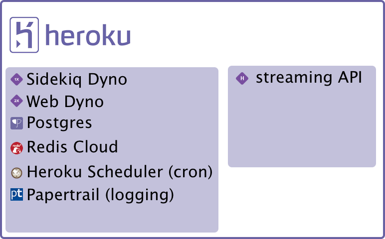
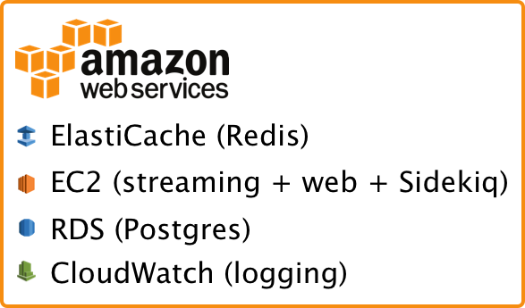

I've been [running Mastodon on Heroku](/blog/running-mastodon-on-heroku/) for about a week now, and it's been a blast! Heroku is really convenient, but it's also expensive. So I'm looking at an alternative hosting plan. Because I'm learning as I go along, I wanted to write a post about my migration plan, to hopefully get feedback from people who've done this kind of thing before.

Let's start with the current infrastructure: two Heroku apps, one for streaming and one for everything else. Estimated costs are ~$150/month. I don't know what to expect from AWS, but from my experience I'm guess that it'll be a lot less than I'm paying now. Additionally, as the community scales up, I'll be able to more easily scale my instance.

I considered Digital Ocean, since it would probably be even cheaper, but I would have to do a lot more to administer Postgres and Redis instances, which seems boring and tedious. I'd rather use RDS and ElastiCache respectively for the convenience.

<Narrow>

</Narrow>

What I'm thinking of is an AWS infrastructure that replaces Heroku Add-Ons for AWS services. I figure if I'm getting into AWS hosting I may as well dive right in, to get the most advantage from fully participating in their ecosystem.

<Narrow>

</Narrow>

(Note that both infrastructures use S3 for static asset hosting, which is not shown.)

So the big question is, how do I go from one to the other? Well here's my plan:

1. **Migrate Postgres from a Heroku Add-On to AWS' RDS service**. This is the highest priority since Heroku's Postgres Add-On is currently the highest cost. I expect some downtime as I put the existing app in maintenance mode, export the database, and import it into RDS. I'll do a dry-run first to make sure things work; maybe I'll set up a fresh Heroku app that points to the new database. The nice thing is, if things go wrong I can just point back to the existing database. Once I verify things are working (maybe give it a few days?) I'll retire the existing database Add-On.
1. **Migrate Redis from a Heroku [Redis Cloud](https://redislabs.com/products/redis-cloud/) Add-On to AWS' ElastiCache service**. This is a lower priority because I expect it'll take some figuring out, and there'll be some downtime. My plan is to set up ElastiCache to replicate the existing store, put the app into maintenance mode, give the new store a chance to catch up, and switch the app over to the new store. Let me know if you've done this before and see any problems with this.
1. **Migrate from Heroku Dynos to AWS EC2**. This is the biggest question mark for me. It's going to require a lot of effort because I've not run a server like this before. Basically I'll get an EC2 running the web server, streaming server, and Sidekiq jobs, make sure it's working, and then switch the DNS to slowly move everyone over to the new server. Once DNS changes have fully propagated, retire the Dynos. If I have to, I'll separate out the web, streaming, and Sidekiq responsibilities into separate instances. Let me know if this is something I should do from the start.
1. **Deal with the little things**. Stuff like setting up cron jobs, making sure logging is working, that kind of stuff.

Aaaaaaand I think that's it. Hopefully minimal downtime.

This is a learning experience for me. It seemed really scary at first but writing it out made things make more sense.

I reckon this will take a solid weekend of work, but I'm happy to do it because a) I really like Mastodon and contributing to a distributed community is rewarding, and b) I'll learn a tonne, which is its own reward.

And again, any advice you have would be welcome. [Toot me](http://mastodon.technology/@ashfurrow) or [send me an email](mailto:ash@ashfurrow.com) if you have any advice, and I'll amend my post.
