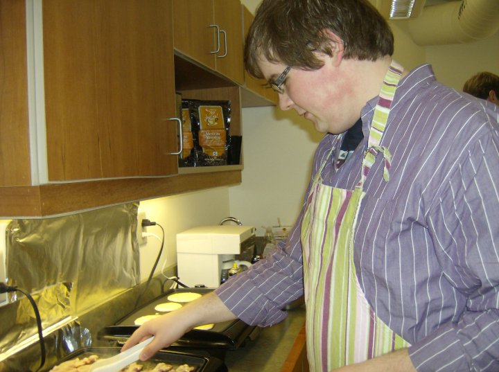

So... update time I guess. I'm kind of writing this for me to help me work through some stuff, and it's probably not that interesting. But I'm putting it on my blog so that others can see that [struggle is normal][struggle] and hopefully realize that they are not alone.

---

This past August had me feeling happier than I've been since roughly 2011, when I graduated university, got married, and moved to Toronto. In university, I had struggled with depression but I had overcome it with talk therapy. I felt great in 2011, and I think I felt that great in August. I even got to enjoy a vacation back home to see my family before things changed suddenly.

I was taking two medications: an SNRI and another "booster" drug that augments the SNRI. It was the _perfect_ combination for me, it worked _so well_. I had even [stopped going to therapy][therapy] because I had worked through what I needed to work through.

Well see the problem is that the booster I was on has an uncommon complication. It's fairly rare, and I was on a very low dose, but I had been told to watch out for certain signs of this complication. This neurological complication. This complication that often is permanent and persists for the rest of one's life.

I stopped taking the booster at the very end of August. I knew what withdrawal from this drug would feel like, I'd been through it a few times. It starts out seeming like it won't be so bad: a few weeks of no change at all, but then a sudden and steep drop in my mood. Drop in my appetite. Drop in hobbies. In motivation to work. Motivation to live.

I spoke with my psychiatrist and the next step we'd settled on was to use a different booster, one that I had used before and had seen _partial_ improvement with. It's a fairly conventional approach and I wanted to pursue this before trying something more radical: a change to my main anti-depressant. From an SNRI to, something else. I'm nervous about this option.



<blockquote class="instagram-media" data-instgrm-captioned data-instgrm-permalink="https://www.instagram.com/p/BbEu3vmA3DM/?utm_source=ig_embed&amp;utm_campaign=loading" data-instgrm-version="13" style=" background:#FFF; border:0; border-radius:3px; box-shadow:0 0 1px 0 rgba(0,0,0,0.5),0 1px 10px 0 rgba(0,0,0,0.15); margin: 1px; max-width:540px; min-width:326px; padding:0; width:99.375%; width:-webkit-calc(100% - 2px); width:calc(100% - 2px);">
 <a href="https://www.instagram.com/p/BbEu3vmA3DM/?utm_source=ig_embed&amp;utm_campaign=loading" style=" background:#FFFFFF; line-height:0; padding:0 0; text-align:center; text-decoration:none; width:100%;" target="_blank"> 
 

 
 

 

 

 
 View this post on Instagram

 

 

 

 

 

 

 

 

 

 
 

 

</a>
<a href="https://www.instagram.com/p/BbEu3vmA3DM/?utm_source=ig_embed&amp;utm_campaign=loading" style=" color:#c9c8cd; font-family:Arial,sans-serif; font-size:14px; font-style:normal; font-weight:normal; line-height:17px; text-decoration:none;" target="_blank">A post shared by Ash Furrow 🏳️‍🌈 (@ashfurrow)</a>

</blockquote>



Artsy changed insurance providers at the end of August and my old therapist was no longer in my health insurance network. And he's more of a psychoanalyst than someone who could help me with coping strategies in the moments when I'm feeling hopeless. What I need is a Cognitive Behavioural Therapist. My psychiatrist had offered to help me find someone specializing in CBT. I was secretly resistant to this idea for, I don't know, really dumb reasons. Rationales that I hadn't shared with my psychiatrist or my wife, Ashley. After talking it through with Ashley, I decided to find a new therapist.

So that's kind of where I am right now.

---

I went back to my psychiatrist for a checkup to see how I was feeling on the alternate booster (these drugs take weeks-to-months to "kick in"). I told her: I'm feeling better, I guess. I can concentrate more easily, I manage to get showered and leave the house every day, which is a big improvement from when I crashed mid-September. But I still felt totally flat, [unable to experience any emotion][flat]. She was getting concerned that the conventional booster wouldn't be effective and started discussing an aggressive change in my primary anti-depressant.

See... psychiatrists all have these little questionnaires that measures changes in different symptoms of depression. Things like mood, appetite, sleeping patterns, interest in activities, and of course, thoughts of suicide. I took the usual questionnaire and my results were only a _slight_ improvement from September. Not promising.

My psychiatrist noticed that one score on one questionnaire had significantly worsened, a really important question. And so I got to have _that_ conversation. You know the one, right?

_"And how often would you say that you think about ending your life?"_

_"That's quite a lot."_

_"Do you have access to any firearms?"_

_"What do you think you would do if you decided to act on these thoughts?"_

I always hate this conversation. I feel so ashamed of myself. I know I shouldn't but I do. I feel like a dog getting its nose rubbed into a mess it's made.

The conversation continues. I answer a question with vague euphemisms. They re-ask the question, reworded so I can't wiggle out of it with an "I don't know" and a hapless shrug.

The thing is, I don't even why I'm afraid of switching medications. It just seems scary. I'm afraid I'll get worse I guess. But I've kind of realized that though it _could_ make things worse in the near-term, my current prescription isn't healthy or sustainable. I have an appointment next week where I'll discuss crossfading between prescriptions and the associated blood work (ugh).

It's kind of weird, but, I'm kind in better spirits now that I've decided to be more aggressive with medication. I guess I was kind of ashamed, but talking through things Ashley and another friend helped me realize that I don't need to feel that way.

Talking helped improve my mood in the short term and I hope or believe I guess that it'll improve things in the long term too.

---

My friend and yours, Orta, had spoken highly of [Blue Apron][blueapron] on several occasions. I was really interested but I hadn't pursued it yet.

See, my appetite is pretty low right now. I have to remind myself to eat and if I forget, my mood drops significant. And my motivation to _do_ things was _verrrrrrry_ limited. So I was eating pretty poorly because it is _far_ easier to microwave another frozen dinner or order food using the internet than it is to:

1. Plan what to eat.
2. Make a list of things I need to buy.
3. Go outside and buy them (or, more likely, order them using the internet).
4. Prepare the food in the tiny kitchen that I share with my roommates.
5. Clean up afterwards.

Which is a real fucking shame because I _love_ to cook. I used to anyways. Here's me in university 2010 cooking for a community breakfast that I'd organized:

Moving to Toronto was like, the peak of my enjoyment of cooking. Actually, it was and remains the most joyous part of my life. I had a _kickass_ kitchen and bought all kinds of doodads to make all kinds of food. I started experimenting with baking, even making goddamn _macarons_.

Moving to Amsterdam put up a lot of barriers to me enjoying cooking. Barriers like a totally different grocery store where everything is in a totally different language and cashiers assume you speak Dutch, and folks interact according to very different customs. Barriers like this weren't by themselves a problem but after moving to Amsterdam I ran out of anti-depressants and struggled to find reliable medical help. I didn't cook anymore, my appetite was gone, I was feeling suicidal.

(Footnote: the time I was feeling the lowest coincided with my first few months with Artsy, and I was really worried that I wasn't performing adequately enough. Artsy colleagues, and Orta in particular, were a reliable source of validation. It got me through some tough times.)

Moving to New York reduced a lot of the barriers to cooking I'd had in Amsterdam, but I wasn't really in the habit anymore. Plus there are _so many_ cool takeout places around the city to try out. Well, to order over the internet. Anyway, the point is I haven't really cooked since Toronto.

Some things I've come to rely upon in New York while I've been depressed in the past few years are, like, _super_ bougie. The part of me that wants to buy off-brand Kraft Dinner to save thirty cents is in utter conflict with the part of me that is _so_ into doing my laundry online.

I felt ashamed of paying extra for convenience. Ashley had explained that, logistically, it makes more sense to pay a little extra for conveniences than to languish without the basics of living. That made sense, and was the kind of justification that I'd used when I felt bad about things.

So, Blue Apron. It was something that I had felt ashamed of even considering. But after Orta helped connect the dots for me that Blue Apron could _remove the barriers to cooking_, I brought it up with Ashley. She's handled everything to get us set up (aside from carrying the heavy box up four flights of stairs).

<blockquote class="instagram-media" data-instgrm-captioned data-instgrm-permalink="https://www.instagram.com/p/BbDyar7BFhp/?utm_source=ig_embed&amp;utm_campaign=loading" data-instgrm-version="13" style=" background:#FFF; border:0; border-radius:3px; box-shadow:0 0 1px 0 rgba(0,0,0,0.5),0 1px 10px 0 rgba(0,0,0,0.15); margin: 1px; max-width:540px; min-width:326px; padding:0; width:99.375%; width:-webkit-calc(100% - 2px); width:calc(100% - 2px);">
 <a href="https://www.instagram.com/p/BbDyar7BFhp/?utm_source=ig_embed&amp;utm_campaign=loading" style=" background:#FFFFFF; line-height:0; padding:0 0; text-align:center; text-decoration:none; width:100%;" target="_blank"> 
 

 
 

 

 

 
 View this post on Instagram

 

 

 

 

 

 

 

 

 

 
 

 

</a>
<a href="https://www.instagram.com/p/BbDyar7BFhp/?utm_source=ig_embed&amp;utm_campaign=loading" style=" color:#c9c8cd; font-family:Arial,sans-serif; font-size:14px; font-style:normal; font-weight:normal; line-height:17px; text-decoration:none;" target="_blank">A post shared by Ashley Furrow (@ashleyfurrow)</a>

</blockquote>

It's been three weeks now and I. Am. Loving. It. Blue Apron has brought some joy back into my life while I struggle through all the shit I'm going through right now. It reminded me that _I like to cook_.

And that hard stuff? The planning and grocery lists and going to store and cleaning the kitchen? Well I'd forgotten, but I like that too. Yesterday, I noticed an _amazing_ grocery store literally on my walk home. It excited me. I went in, planned not one, but two meals! I had a goddamn _conversation_ with the cashier about what I was planning to cook and _I enjoyed it_.

I'm still not completely at ease with my feelings about the modern conveniences of New York and the internet. Maybe parts of me will always be at odds: a struggle between rigid parsimony and practical indulgence. But embracing convenience and starting Blue Apron sparked something with me. It re-ignited a source of joy for me, and is responsible for a much-needed reprieve from the things I'm struggling with right now.

---

I have realized that the most effective solutions to my problems _always_ involve talking it through with someone. It's a mix of [Rubber Duck debugging][duck] but for emotions, and advice from trusted friends. It came down to talking, but I had to be honest and I usually had to start the conversation. That was really hard. Like, _the hardest thing_. But I did it. I worked up the courage for days and finally sprung a conversation about suicidal ideation on my unsuspecting wife while seated in a bustling café. But it worked, and I felt _so_ much better.

If you're struggling with the kinds of problems I'm having, I want you to try talking to someone you trust about how you're feeling. Please. I promise that you _are_ worth the struggle it will be to ask: "can we talk?"

[struggle]: /blog/normalizing-struggle/
[therapy]: /blog/therapys-end/
[flat]: /blog/depression-graphed/
[blueapron]: https://www.blueapron.com
[duck]: https://en.wikipedia.org/wiki/Rubber_duck_debugging

