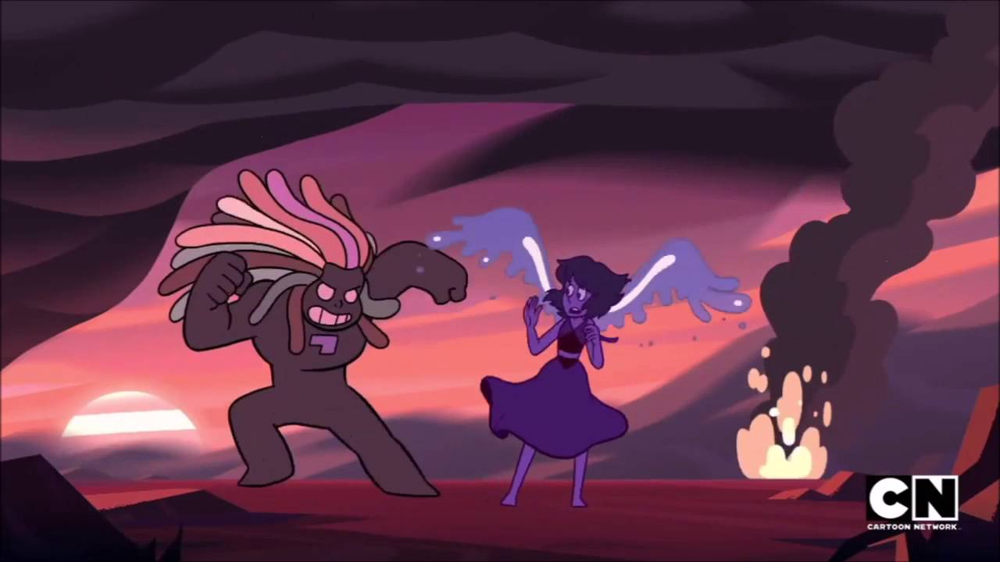
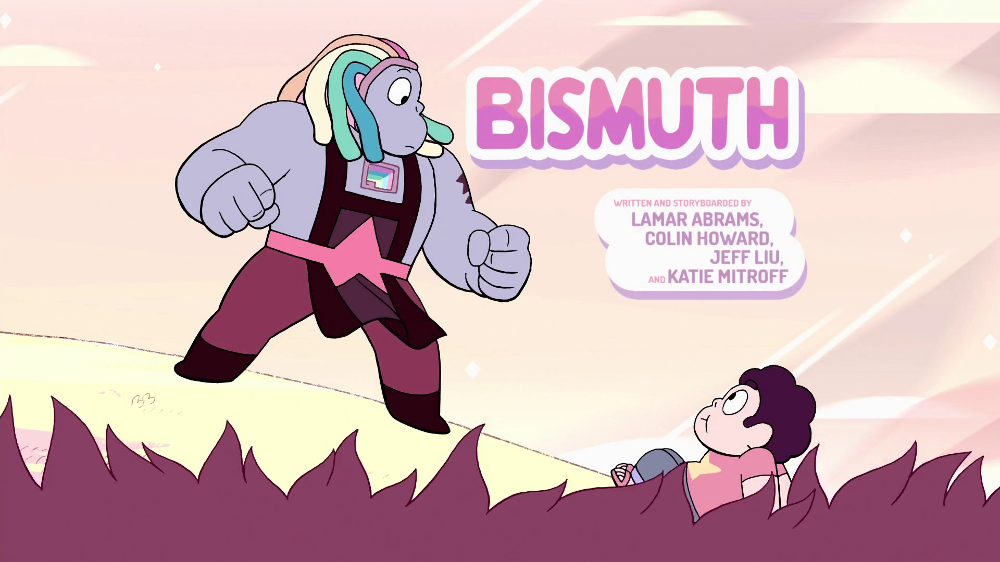
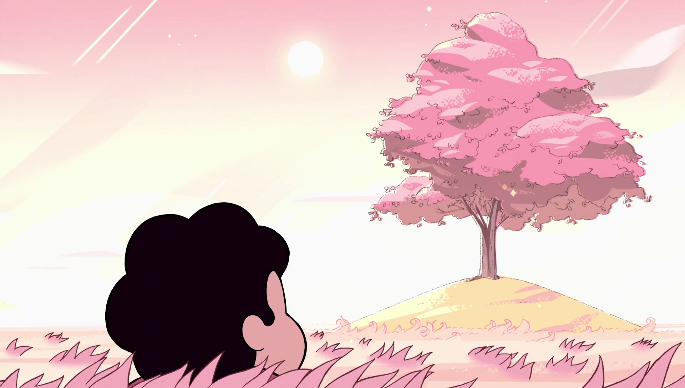
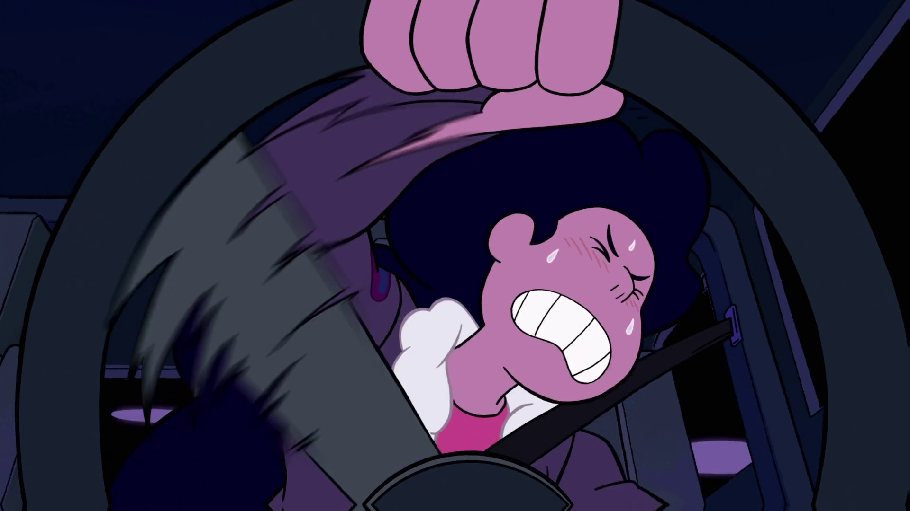
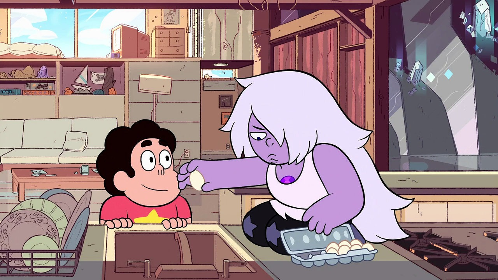
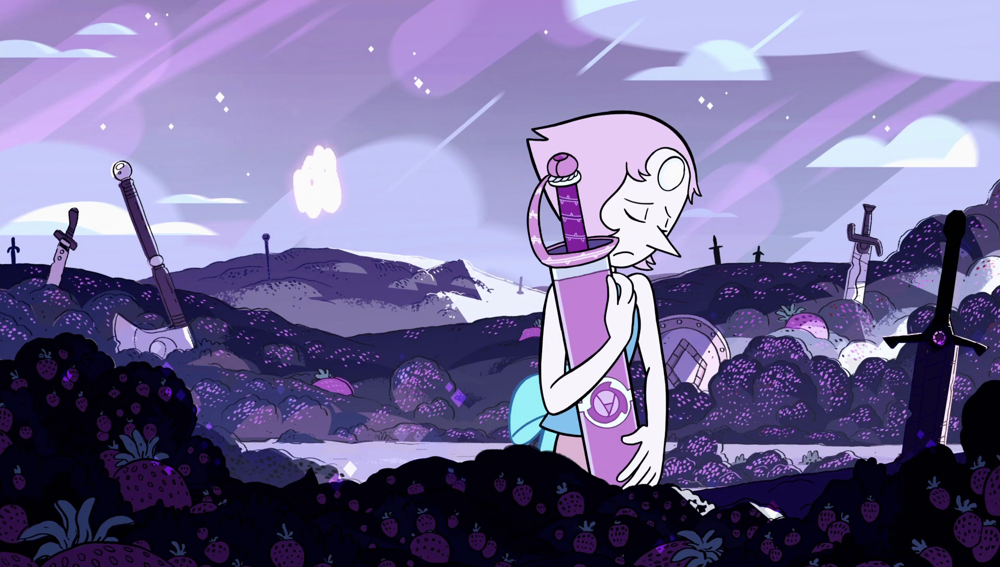

There's a TV show called _Steven Universe_ that I highly recommend, to anyone. To everyone, actually. I'm rewatching it now and I've got some notes on what appeals to me in the show. Maybe it would appeal to you, too.

<Tweet tweetID="925891391737143296" />

Even if you've never watched cartoons or did but didn't enjoy them, I encourage you to set that aside and give _Steven Universe_ a try anyways. It's obviously a cartoon and it's obviously aimed at kids, but the metaphors in the show make it inclusive to folks from all kinds of different backgrounds. Even adults. It's not a _kid's show_ as much as it is a show that is accessible _to_ kids.

_Steven Universe_ is an adventure dramedy that tells stories around a cast of believable characters – with hopes and flaws – centred around the titular Steven's coming-of-age story. The show also tells a long, drawn-out sci-fi about intergalactic beings that colonize planets to mine their raw materials.

So there are a few things that really stand out in the show. Here's a tl;dr list, continue reading for more details.

- Excellent pacing.
- Large stories, told with restraint.
- Consistent and cohesive lore.
- Phenomenal music.
- Believable characters.
- Spectacular Art.
- A non-judgemental narrative style.

Let's go into detail!

## Pacing

_Steven Universe_ is a masterclass in pacing. The story takes place on a kind of slightly-alternate Earth, and it spans back thousands of years to a war. Through telling stories relating to that war, the characters are developed over the course of 11-minute episodes.

There are no filler episodes; each episode contributes to character development in some way, and usually ties in with the broader story. There are often 3–5 episode arcs that tie together, but each episode is a self-contained story. This is a nice balance between the episodic monster-of-the-week style and the Battlestar Galactica style where only a few episodes can be watched in isolation.

## Lore

The lore and world-building in _Steven Universe_ is remarkable in its consistency and cohesion with both the art and the plot. It builds upon itself, setting up a stable foundation upon which to grow the characters and tell their stories.

To give you a taste, here's a rough overview of the world (season one/two spoilers):

Gems are aliens. They are a kind of magic/technology hybrid and exist as small gemstones embedded in their "physical forms" – humanoid bodies. These bodies are "holograms but with mass" and the show has fun with that.

Gems don't age and they don't change. Gems are created and used for specific purposes and there is no escape from their rigid social hierarchy. And that brings us to the war.

The Gem War was began on Earth as a rebellion against Homeworld. Earth was being destroyed to serve the purposes of the Diamonds until Rose Quartz stopped them. Countless gems and humans were destroyed, but the resistance successfully fought off Homeworld's forces (for now). Only a few gems survived the last assault on Earth, and they have been living in isolation for thousands of years.

In the mid-nineties, Rose met Greg (a human). They fell in love and, eventually, decided to have a child. This was unprecedented – gems don't have children, they are grown artificially. Steven was born and the show focuses a lot on his struggle to exist in the space between two races. Not a human, not a gem. Just Steven.

## Music

The show weaves music into its narrative in a real thoughtful way. Both background music as well as music featured in the show: Steven plays a ukulele, and his dad plays a guitar. The show's music had an impact on me: this time last year, I picked up a ukulele and have rediscovered how much I enjoy music.

The voice actors are cast specifically with their singing voices in mind, and Rebecca Sugar (the show's creator) really emphasizes how important the music is by playing a lot of the songs herself.



Oh, and the soundtrack is [available on Spotify](https://open.spotify.com/album/3fNVnjSRQ3oW4PUIKvrThu).

## Characters

Okay so the characters! The adolescent Steven lives with the gems leftover from the war, and is also raised by his father Greg.

Rose and Greg wanted to have a child, but Rose understood this would require a sacrifice. She would have to permanently give up her physical form to give birth. This serves as an analogue to dying during childbirth, except that Rose _knew_ that the beginning of Steven's existence would mark the end of her own.

So fast forward: Steven is living with the gems and spends a lot of time with his father. The two groups don't really get along. Some of the gems blame Greg for Rose being gone, and they struggle with complicated feelings towards their roles in Steven's life.

Each gem has their own distinct origins. Greg has a backstory too. These are all explored in really interesting and thoughtful ways. Side-characters too! You will never see a character only once, they _always_ reappear. Here's a very small (but very representative) example: in Season Two, we explore the origins of a side-character, and that origin story briefly features this gem in a flashback:





Later, in Season Three, we meet the gem again learn more about her relationship to Rose and her role in the war.





I mean, what? I didn't see this coming at all – and these kinds of hints are scattered throughout the show's art.

## Art

The art in the show is spectacular. _Steven Universe_ uses dedicated background artists to help create a cohesive palette of visuals that drive – and are driven by – the plot. It won't do it just to describe, so here are some examples.





The dynamic nature of the show's artwork isn't really represented by still images. The distinctive animation plays a key role. I've mentioned music already, but music+art+animation combine synergistically to convey a really compelling story. Here's one representative example, with some cool glitchy body horror elements!



## Non-judgemental Narratives

What I really dig about the show is how non-judgemental it is. No story ever looks down on a character for their ability, stature, job, lifestyle, whatever.

Take Greg for example. Greg is a burnt-out wannabe rockstar who lives in his van parked beside the carwash (where he works). Rather than depicting Greg as being unable to care for Steven, the relationship between the two is caring and meaningful. The show celebrates how Greg overcomes difficult challenges to support his son. Greg is probably my favourite character.

---

I've presented here a list and explanation of what appeals to me in _Steven Universe_, but I've tried to describe the show only in ways _any_ show could be evaluated. This analysis misses out on discussing ways the show excels as a piece of _culture_. I'm not well-suited to describing the show's meaningfulness to groups of people who are underrepresented in media, but the show's makers make efforts to tell stories that are neglected by most television media. _Steven Universe_ uses metaphors to tell stories that would normally be "over the heads" of children, tackling topics normally reserved for _Degrassi_.

The metaphors, oh the metaphors!

If you're keen to start watching the show, there are a few places you can begin with. The first episode, _Gem Glow_ (S01E01), is a natural place to start; the show finds its footing incredibly quickly. _Space Race_ (S01E28) is a great way to dive in and get a feel for the show without getting caught up in its lore. And if you want a sneak into the where the show's story is gonna go – while avoiding most spoilers! – try _Bismuth_ (S03E20). Have fun!
