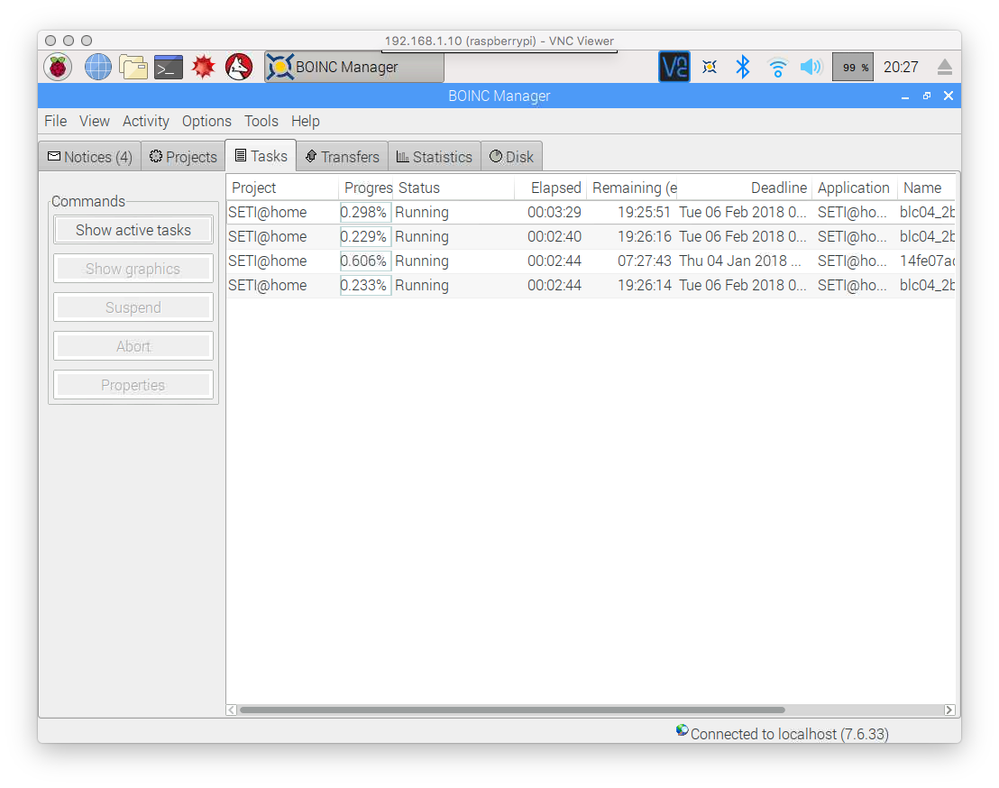
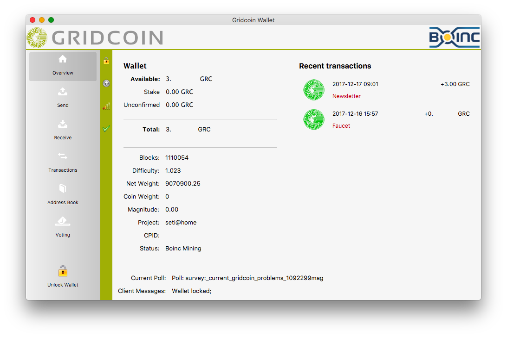
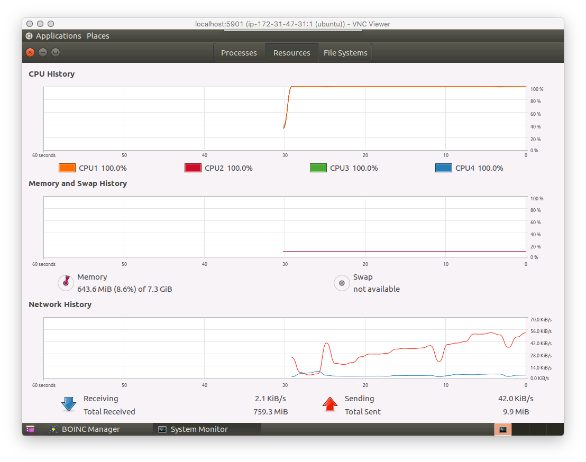

I've known about bitcoin since 2012 when a friend described a kind of digital currency that he purchased by meeting a guy at a subway station and exchanging an envelope of cash for an envelope of a hard drive. The whole concept felt as something not very above-board. So I decided not to learn more about it and just generally ignored it.

A few years passed when I would catch the occasional headline describing the currency's latest record-setting price, but I didn't pay it much attention until I moved in New York. Bitcoin would come up in conversation at Artsy; people were discussing new art projects and new technologies and new startups centred around blockchains. And so, cryptocurrency reasserted itself within my bubble and I took a closer look. That was about 18 months ago.

After reading articles and watching videos – and listening to a great lunchtime presentation from a colleague – I now have a solid grasp on the technical underpinnings of the different technologies involved in bitcoin. I have a less solid understanding of some of the practical nuances, but I've got the technical stuff down. Cryptography, mining, P2P networks for blockchains, that kind of stuff.

So I'm reading headlines about new record-setting bitcoin prices with the perspective of the technological underpinnings. And I still wasn't impressed. I mean, the technology is _amazing_, but I'm not excited about the idea of a bunch of powerful nerds getting rich. Amazing tech, but not something I want to explore.

Then a few months ago, I noticed an uptick in media coverage about bitcoin. Articles like [this one exploring bitcoin's carbon footprint][energy] were being discussed at the office. Bitcoin was being increasingly reported on by people who understood it, leading to more critical coverage and more reporting targeted at a non-engineering audience.

Good! But I still kind of dismissed it. I didn't want to have anything to do with it, and I still don't. Sadly, I may have thrown the proverbial baby out with the bathwater; the blockchain technology that bitcoin is built upon is _super_ interesting. I learnt more about etherium and the distributed-computing infrastructure it's built upon and – yeah I regretted not buying bitcoin when it was under $10 – I threw $150 into etherium. I don't _like_ etherium and I don't _like_ that I'm now involved with cryptocurrencies, yet here we are.

Things changed a few weeks ago when, during follow-up on their episode about citizen science, [PBS Spacetime mentions a cryptocurrency][spacetime] that:

> ... gridcoin, which you mine by devoting computing cycles to BOINC research programs. Seems a bit more useful than bitcoin's useless cryptographic calculations.

[Gridcoin], eh? [BOINC][boinc], huh? Let's check this out.

So I did, and through capitalizing on my newly rediscovered interesting in tinkering on things, I revived my Raspberry Pi and set off. Over the course of the past two weeks, I've been reading about gridcoin and playing with the related technologies. And while I have a good theoretical understanding of cryptocurrency technologies, I didn't have the experience of working with cryptocurrencies in practice. The past few weeks have therefore been a lot of learning new ideas and refining new skills.





Let's back up and define gridcoin. Other cryptocurrencies, like bitcoin, are mined by computers that compete to solve cryptographic hash functions. That computing power is wasted, in a very real sense: solving those hashes isn't useful _except_ to mining more bitcoins. On the other hand, gridcoin is a cryptocurrency mined using calculations that contribute towards scientific research. In fact, gridcoin is really just a layer on top of BOINC, which predates bitcoin and blockchains altogether. This was something I could be interested in!

BOINC is a project run out of Berkley; it administers work to a network of distributed computers owned by ordinary people, who volunteer their spare computing resources to BOINC. This is really important because many projects in science require a lot of computing power. Furthermore, many of these projects lend themselves to being solved using BOINC's distributed batch-processing architecture. You may be familiar with its most famous project [SETI@Home][seti], the search for extraterrestrial life, but there are others. My favourites include [Amicable Numbers][amicable], [Milkyway@Home][milky], and [Asteroids@Home][asteroids].

So gridcoin basically piggy-backs off of the existing credit and team systems built into BOINC. A blockchain is used to keep track of transactions, like other cryptocurrencies, but new coins are staked based off your contributions to BOINC projects. I'm still learning the nuances of the somewhat confusing math, but the general idea is that the more you contribute towards a project's work units (relative to how much others have contributed, and some other factors), the more gridcoins you stake.

Starting wasn't easy. Despite a very active community, I found the documentation to be difficult to follow and sometimes out of date. The guides and wikis I found mostly assumed you already knew what you were doing. Maybe when I have a better grasp of it all, I'll return to update the docs.

So I've installed the BOINC client on my laptop and my pi, and I've been messing around on EC2 to spin up cloud servers to crunch numbers for SETI. It's been fun, to tinker. I eventually settled on just using my laptop because even a c4.xlarge instance (4 virtual CPUs, $0.20/hour) performs worse than my laptop in terms of BOINC stats. I looked into GPU-specific instances, but cloud-based GPU access is still new and in high-demand, so it was too expensive for me (you can add a GPU to an EC2 instance for $0.50/hour, or rent a GPU-optimized instance starting from \$0.90/hour). So yeah, not my thing! That's okay.

One stumbling block I've faced when starting has been that (for reasons that are still beyond me) you need to _have_ gridcoins to stake them. Seems kinda scam-y, but there's a small transaction fee to basically announce yourself on the blockchain. Okay, fine, but also: when and how often you stake gridcoins (get credit for your BOINC work) is determined in part by how many gridcoins you already have. So starting out is tricky, feels weird, and involves a lot of waiting. With a balance of 3 gridcoins (which I acquired by signing up for a newsletter, lol), my estimated time-to-stake was an estimated three thousands days.





Mmm. Mmhmmm.

To build up an initial balance, I tried using a [gridcoin pool][grcpool] on an EC2 instance for a few days but wasn't really impressed. Using a pool is like solo mining except you don't need the upfront investment (and you don't get to keep all your earnings). Maybe I'm impatient – the calculations take longevity of contribution into account, and I only ran this server for like two days.





(Lest my command-line hacker skills be called into question, yes I _did_ install a desktop environment on EC2 but I didn't _have_ to, it was just easier.)

I also don't like the idea of paying per-second for anything. It reminded me I'm literally playing with money, and something about my upbringing makes that uncomfortable for me.

So I moved a bit of my etherium to my gridcoin wallet to prime the process. My time-to-stake estimate is now bouncing between 15–30 days. More reasonable I guess? I'll learn to be patient.

Anyways. Still don't love that I'm doing this but it's fun and I'm enjoying all the tinkering, so. Learning new things has been fun but (as usual) includes its share of frustrations too. And helping to map the galaxy just makes me feel warm and fuzzy.

[energy]: https://motherboard.vice.com/en_us/article/ywbbpm/bitcoin-mining-electricity-consumption-ethereum-energy-climate-change
[spacetime]: https://youtu.be/izqaWyZsEtY?t=784
[gridcoin]: http://www.gridcoin.us
[boinc]: https://boinc.berkeley.edu
[seti]: http://setiathome.berkeley.edu
[amicable]: https://sech.me/boinc/Amicable/
[milky]: https://milkyway.cs.rpi.edu/milkyway/
[asteroids]: http://asteroidsathome.net
[grcpool]: https://grcpool.com
