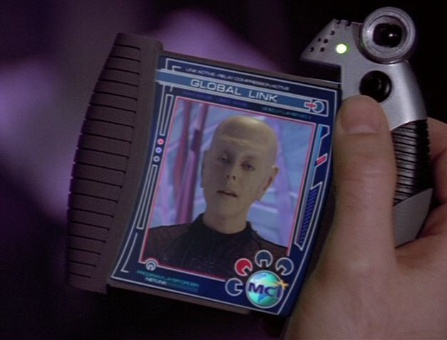
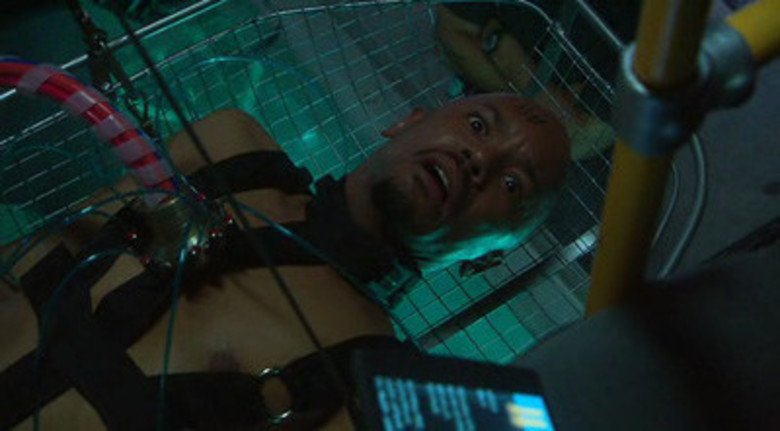

What I love about art, and mass media in particular, is how it is shaped by the time and place it was created. Looking at a movie or TV show from 20 years ago, you can get a glimpse into how the world was back then, and reflect on how things have changed. In my opinion, there is no genre better-suited than science fiction for this lens because sci-fi itself is all about asking "what if?", and the questions a society asks are as revealing as the answers they come up with.

So I was on a roll the other morning, talking about old sci-fi shows I'd watched. I mentioned one that I'd like to discuss today: _Gene Roddenberry's Earth: Final Conflict_.



_Earth: Final Conflict_ hit TV in the late nineties, and I watched it via Canadian TV syndication during my early teenage years. The show tells the story of humanity, set roughly in the 2020's, who are visited by ostensibly peaceful aliens (called "companions", the show is full of poignant euphemisms).

The show has lots of great storylines like:

- How would humans graft alien tech onto our own tech? How would that affect our day-to-day lives?
- Who would resist the companions? Why? How?
- What if a companion, too evolved to normally interact in the corporeal realm, developed a drug addiction?

I won't pretend the show is _good_, but I enjoy how it answers these questions. We're not here to discuss the show, though, but rather what it reveals to us about the time it was created.

Ah, the late nineties. Computers were cool, and obviously important, but the general population didn't understand computers or the internet in the way they do today. So, the show gets some things right (everyone on the show has a "[global][]", which is a video-conferencing device, but it's also on the internet, has a camera, and is basically a contemporary smartphone). But the show also gets some things wrong (like any time they actually _use_ a computer, it's farcical).

I want to draw your attention to S04E05, [_Motherlode_][ep], released October 2000. The plot of the episode, like most episodes of _Earth: Final Conflict_, is not its strong suit. Rather, it's the questions it asks and how it answers them.

See, the companions (officially) arrived on Earth at the end of a brutal world conflict, which nearly ended in a nuclear holocaust. Mediated by the newfound companions, a peace armistice was negotiated to end the Sino-Indian War.

_Motherlode_ asks the question: what if a black ops organization took advantage of everyone being distracted by the arrival of the companions, and worked in secret to massively expand its sphere of influence via the Sino-Indian War Measures Act?

The episode begins with two hooded, chained figures being escorted by armed guards. It's dark. A man in a suit tells them to listen up: by the powers granted by the SI War Measures Act, his company was suspending their civil rights. They are to be detained, indefinitely, in his sensory deprivation prison. Submerged in breathable, body-temperature water, they will be deprived of all sensory stimulation. Forever.

What a fucking _mad_ premise. Like, fuuuuuuuuck. That's dark.

The whole show makes a point of exploring why the SI War Measures Act wasn't repealed with the armistice, what factors are stopping it from being repealed now, and most importantly, the episode makes the following point: the evil of the secret sensory deprivation prison system is something that humans are inflicting on _themselves_. Usually in the show, it's the companions who hurt humanity, but this episode is different. It depicts the (wildly fictional) idea of a society run by a government that doesn't respect its citizens rights, one who is unaccountable to its citizens. There are several instances of psychological torture. It's not an easy episode to watch. And as I said, this episode aired eleven months before the attacks of 9/11.

The question "what if black ops sendep prisons?" is answered by "humanity would torture each other, vindictively and relentlessly", which is a pretty chilling-but-accurate answer. It shocked me how much our perception of the United Stats has changed in just seventeen years. In 2000, the idea that the US intelligence community would be running secret torture prisons without any oversight was a chilling sci-fi "what if", but in 2018 it's... reality?

I mean, I know I know, the US has a much longer history of fucking with people and trampling their rights domestically and abroad, _obviously_. The difference is: everyone I know today accepts this as reality, but in 2000, abuse of a war measures act seemed purely hypothetical. _How we perceive_ the world has shifted so much, so quickly. Maybe that's always been the case, maybe things always move this fast. But re-watching this episode, it disturbed me deeply to be reminded of what the world felt like when I watched as a teenager.

Now, I look at the new _Star Trek Discovery_ and I feel like a really strong 2003-era fascist vibe. Pro-government, mindlessly pro-war and pro-aggression. Humanity at its worst. Art, and specifically mass media, are a reflection of our hopes and fears. What does the media that's being produced today say about us? Nothing good.

[ep]: http://www.imdb.com/title/tt0568689/
[global]: http://earthfinalconflict.wikia.com/wiki/Global
