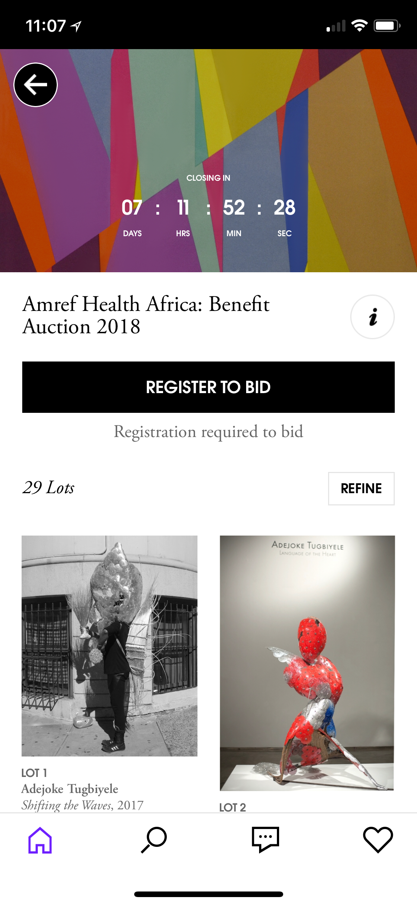
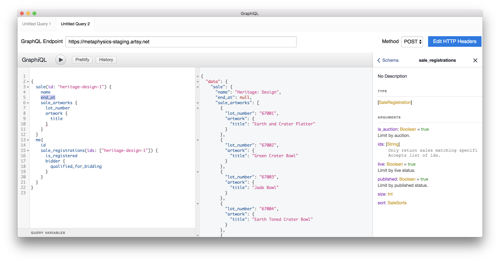

When Swift was released in 2014, I created one of the very first open source Swift libraries: [Moya][]. Moya became a fairly popular iOS project, driven by a motivated and kind community, and by its central goal: use Swift features to provide compile-time assurances to network requests.

What a compelling idea! I would say that using computers (compilers, in this case) to automate the difficult and error-prone parts of network calls is the _spirit_ of Moya.

In a nutshell, Moya has you encapsulate your network calls into an `enum`. Each `enum` case represents an API call, with associated values used as parameters. The compiler will produce an error if you try to use the API call without the required parameters. Since your `enum` has to conform to a specific protocol,the specifics of the network calls (HTTP verb, parameter encoding, path, headers) are centralized in one spot instead of strewn throughout your code.

Of course, you still need to actually _write_ the `enum`s yourself. Boo. We have [long wished for](https://github.com/Moya/Moya/issues/73) a way to automate this, most likely through [Swagger](https://swagger.io). It never came to fruition, though. In a sense, the _practice_ of Moya fell short of its _spirit_.

Okay so a few years went by and then this cool new way to query an API came onto the scene: [GraphQL][]. Let's take a look why GraphQL is so cool.

Typical APIs are built on [REST][], which uses HTTP verbs connected to specific URLs to encode state transfer. Creating a user? That would be a `POST` to the `/api/users` endpoint, for example. REST has its problems, though. In the context of mobile apps, the biggest problem with REST is the number of round trips to the server it can take to render a view. Let's look at an example from the Artsy app.







Okay so let's examine this from an API perspective. The screenshot shows an art auction, a bid registration button, and a list of lots in the auction. So that's three requests so far:

- Fetch the sale model.
- Fetch the logged-in user's registration status.
- Fetch the list of lots in the auction.

As this view became more complex, we have added more network calls. Now, when I'm sitting in my fancy New York City office on fancy 5.8GHz wifi, these requests are all really fast. But if someone is on a less-than-great cellular network, they're going to be waiting a long time for those network requests to return. And on top of that, the responses are going to contain a _lot_ of information that our view just isn't going to render.

So we have a lot of roundtrips and a lot of unnecessary data transfer.

GraphQL solves both of these problems. It provides a way to coalesce many network calls into _one_ single request and also lets the client specify exactly what information it needs back. Let's take a look at what that request could look like for the view above:

```js
{
  sale(id: "some-sale-id") {
    name
    end_at
    /* etc */
    sale_artworks {
      lot_number
      artwork {
        title
        /* etc */
      }
      /* etc */
    }
  }
  me {
    sale_registrations(ids: ["some-sale-id"]) {
      is_registered
      bidder {
        qualified_for_bidding
      }
    }
  }
}
```

Cool! And because the GraphQL server supplies a schema of available fields and queries, we get some really nice tooling on top of this. Here's what it looks like when I hit Artsy's GraphQL server ([which is open source][metaphysics]) with that query in a GraphQL IDE called [GraphiQL][]:







Wow! Autocomplete for our network requests. Errors when a request doesn't adhere to the schema. Inline documentation. Types! This is really great!

So fine, GraphQL is awesome, but what does this have to do with Moya?

Recall that we wanted Moya to automate the work of creating those `enum`s. Because a GraphQL server's schema is accessible programmatically, we can built all kinds of tooling around it. And that leads us to [Relay][].

Relay is what sold me on React Native development. It was that revolutionary of an idea. And Relay shares its spirit with Moya: to automate the difficult and error-prone parts of network calls. Relay asks view components in a React/Native app to provide _fragments_ of data that it needs. Each component on the screen tells Relay what data it needs from the GraphQL schema in order to render itself. Relay coalesces these fragments at runtime into a single GraphQL query, requesting _only_ the data that the component needs, and aggressively caching everything. It is this mobile app developer's dream come true.

I could go on and on about Relay, about how the Relay compiler integrates well with React, about how it can use TypeScript to provide type safety based off the GraphQL schema, about how it abstracts away concepts like pagination and sorting. It's just so exciting! But the truth is, I'm still just getting started with this stuff. I'm thrilled to be in the position where I can work with such cool technologies, and I hope to bring the best ideas back from JavaScript into the native iOS world.

But most of all, I feel so validated in my work on Moya. It was a pretty neat idea, but it's grown into a popular library and vibrant community. Relay has reaffirmed my [belief][] that we programmers share more in common than we have differences. Moya and Relay (and others, like [Apollo][]!) all approach the problem differently, and I want to celebrate what makes each different while acknowledging what makes them the same.

[Moya]: https://github.com/Moya/Moya
[GraphQL]: http://graphql.org
[REST]: https://en.wikipedia.org/wiki/Representational_state_transfer
[metaphysics]: https://github.com/artsy/metaphysics
[GraphiQL]: https://github.com/graphql/graphiql
[Relay]: https://facebook.github.io/relay/
[belief]: /blog/coding-interview-take-home-challenges/
[Apollo]: https://www.apollographql.com
