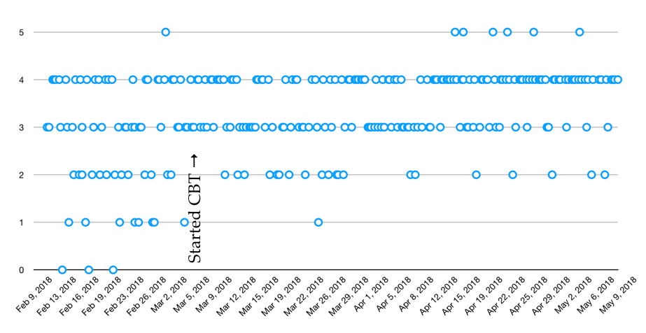

So it's been a few months since I've [last blogged about my mood improvements](/blog/mood-improvements/) and I wanted to check in, because a lot has happened since then.

To catch you up, I have completed my round of cognitive behavioural therapy (CBT) and am feeling great! My mood is consistent throughout the day, and usually hovers around "happy, excited." I even have a graph for you to prove it, which I'm still a bit awestruck by ([plaintext data available](https://gist.github.com/ashfurrow/406dfa25fa8aeba43abea5e52a81f2e8)).





So what does this mean? Well, you can see things got better after starting CBT. The graph doesn't go back very far in time since I started keeping track of my mood shortly before starting CBT. But I was consistently feeling "down, worried", "sad, unhappy", or "miserable, nervous" (that last one indicates suicidal ideation, which you can see from the graph hasn't occurred since February).

Even though mostly I feel "happy, excited", I still dip down. I mean, everyone feels sad or anxious sometimes. The difference now is that I have skills to deal with those feelings. I have learned to separate my thoughts from my reaction _to_ those thoughts, which is a key part of CBT.

I can't begin to tell you how different this feels. Because like, I've _been_ here before. I've felt better, I've [blogged about ending therapy](https://ashfurrow.com/blog/therapys-end/), I've felt good. But it never really lasted. This... feels different. I think, for all the medications I've tried (and all the terrible side effects), all it took was a handful of CBT sessions.

---

My favourite musician, John K Samson, also suffers from depression. He wrote a song about someone with mental illness – well, it's more of a poem set to music. It tells the story of someone who struggles with delusional thinking, which isn't depression, but it influences their mood, too. It's haunting.

<Spotify src="https://open.spotify.com/embed/track/7jI7kdXqAgDpCq6Y6anYqc" />

The nice thing about this song is that it's immediately followed on the record by what Samson calls "a happy ending, of sorts." It's not a resolution – the character still has delusions – but they find happiness.

<Spotify src="https://open.spotify.com/embed/track/3GAoGRa1CilOHMQWb239Bm" />
  
This song really resonated with me. Because the fact is, mental illnesses don't really _have_ resolutions. Like, you can feel better, but it's not like a stomach flu or something that you fully recover from. It sticks with you, and it's going to stick with me, too. But you can live with it, which is what this character in the songs does. And it's what I'm going to do.

All I can say is I'm excited.
