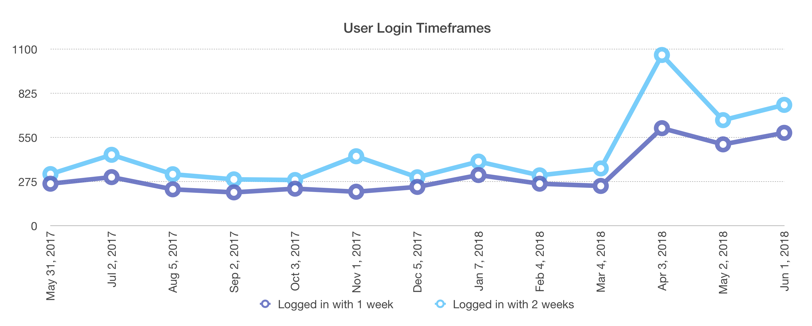

Oh hey, remember [Mastodon](https://joinmastodon.org)? Remember how I [started my own Mastodon instance](/blog/mastodon/)? How's that been going, anyway? Well it's been (over) a year so let's check in, shall we?

Things have been going well on my instance, [mastodon.technology](https://mastodon.technology). I've learned a tonne, I've contributed here and there, and I've gotten to know some of the other instance admins (they rock!). I'm more of a lurker on Mastodon than on Twitter, but it's been nice.

Okay on to the good stuff. Mastodon added the feature of keeping track of user counts over time, but I've been logging in to the Rails console since I started to check how many users have logged in within one- and two-week timeframes. Not a perfect metric, but it's interesting nonetheless. The account metrics are based on [devise](https://github.com/plataformatec/devise) and I collected stats with the following two commands:

```rb
User.where('last_sign_in_at > ?', 1.week.ago).count
User.where('last_sign_in_at > ?', 2.weeks.ago).count
```

All the data is [available in plaintext](https://gist.github.com/ashfurrow/1954350316c180affa879ac3e74caba9), but here's a pretty graph:

<Wide>



</Wide>

So that's cool! Let's contextualize things a bit. The spike in April came in light of the Cambridge Analytica and Facebook controversy. People were angry about Facebook and surveillance capitalism, and they took to Mastodon for an alternative social network. Cool! I was curious to see if that surge of popularity would last, and it _seems_ to have, so far anyway.

The Fediverse was also recently hit by a wave of spam accounts, which _could_ be inflating login counts slightly, but it's hard to say.

All in all, I'm pretty happy with things. Aside from the [occasional problem](https://github.com/tootsuite/mastodon/issues/6734) or [misconfigured database backups](https://gist.github.com/ashfurrow/abd1418399883b2bdfdd9a1f6120f139), running a Mastodon instance hasn't been particularly onerous. This is good, since I have a life and a job and running mastodon.technology can't be like a full-time commitment for me. Having the hosting costs [covered by donations](https://www.patreon.com/ashfurrow) also helps _a lot_, since it removes the financial burden from me. Of course, there are occasional moderation duties, but for the most part users on my instance have adhered to the [Code of Conduct](https://mastodon.technology/about/more). A healthy admin support network helps, too.

It's not all roses. Some instances have been lost in the past year, some intentionally, some accidentally. But we're all figuring this out together and I've learned a lot running this service over the past year. Hopefully I can follow this post up in 2019 with updated stats.
