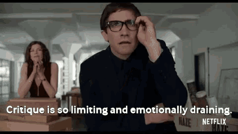

Hey, so the other day I retweeted [this post](https://twitter.com/gjtorikian/status/1091465574998249472) about what it means to be a senior engineer:

<Tweet tweetID="1091465574998249472" />

The tweet does _describe_ a senior engineer, but it isn't a _definition_ of what a senior engineer does (as much as it is a cluster of some behaviours that senior engineers should exhibit). It's not that it's _wrong_, it's just _incomplete_.

I still agree with it and I stand by it 100% – programming _is_ the easy part, being a decent human being _is_ harder. But I also think that it focused too heavily on critique, and critique is not enough.

Critique is so limiting. It's not enough to _just_ denounce toxic culture; a senior engineer's job is to _create_ a nourishing culture instead. It's not enough to _just_ criticize decisions that hurt others; a senior engineer's job is to be involved in the decision-making process and _represent the interests_ of the affected people.

And so on.

This is just a few examples of what a senior engineer can/should be. As I continue to [leverage my impact](https://github.com/artsy/README/blob/973a2b6563e045c69f3568a4c0a256c222cb9ff3/culture/engineering-principles.md#leverage-your-impact) as a senior engineer at Artsy, I'm exploring what it means to even _be_ a "senior" engineer. The tweet was a great reminder for me about the responsibilities of leadership, and it's gotten the wheels of my brain turning to figure out what more I can bring to the role.
