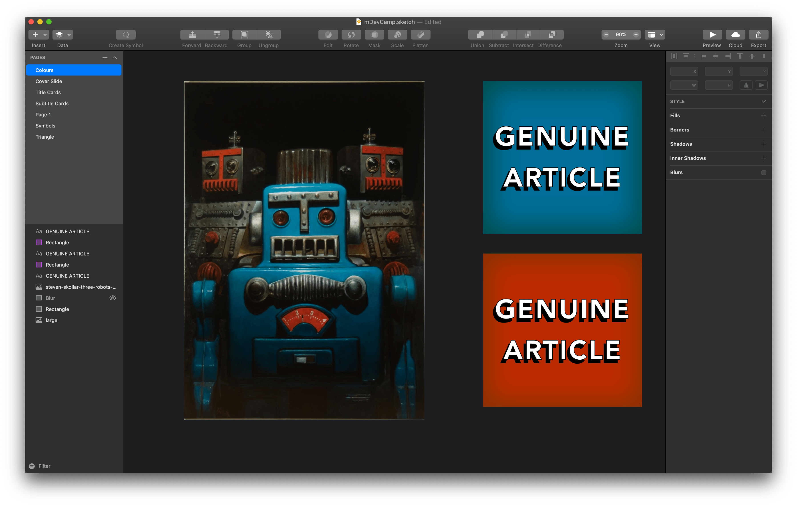
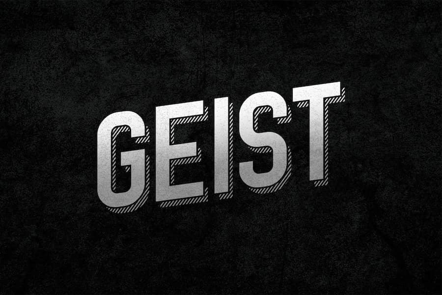
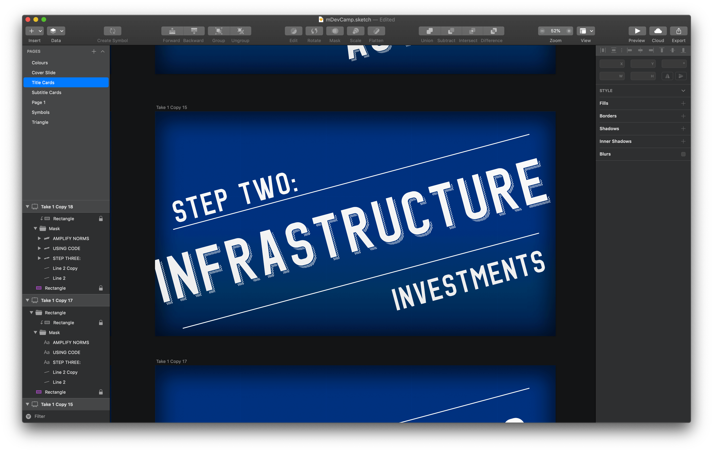
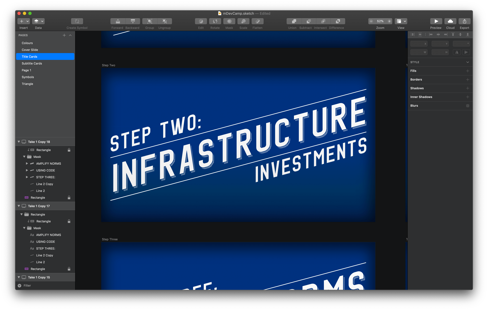
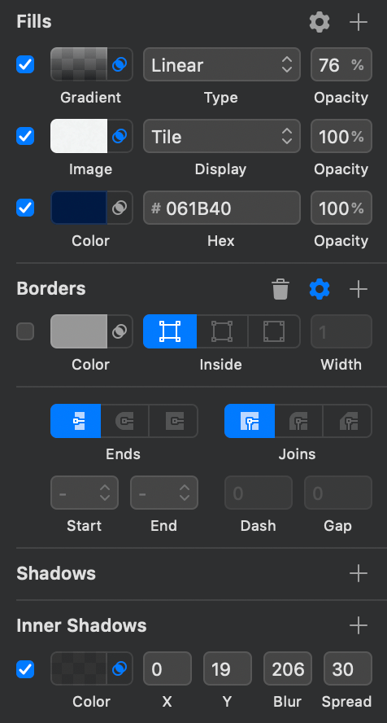
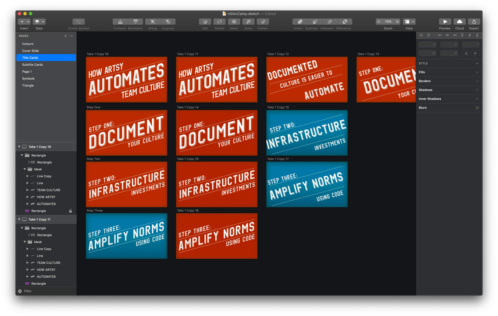
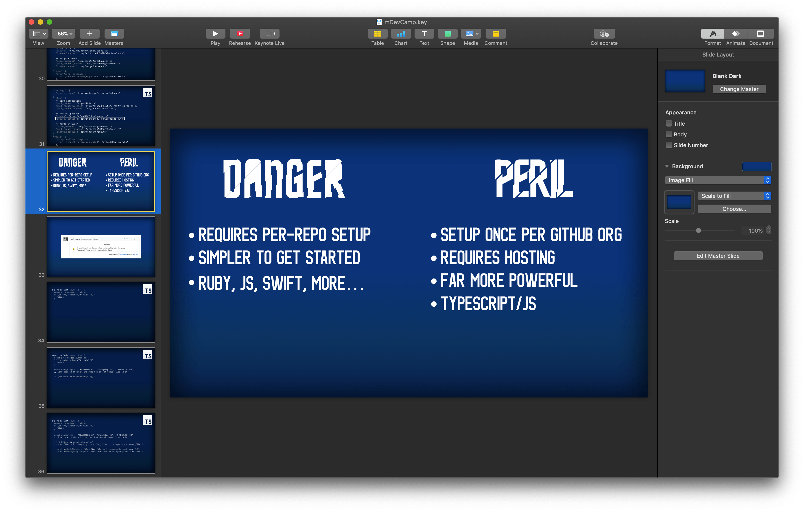
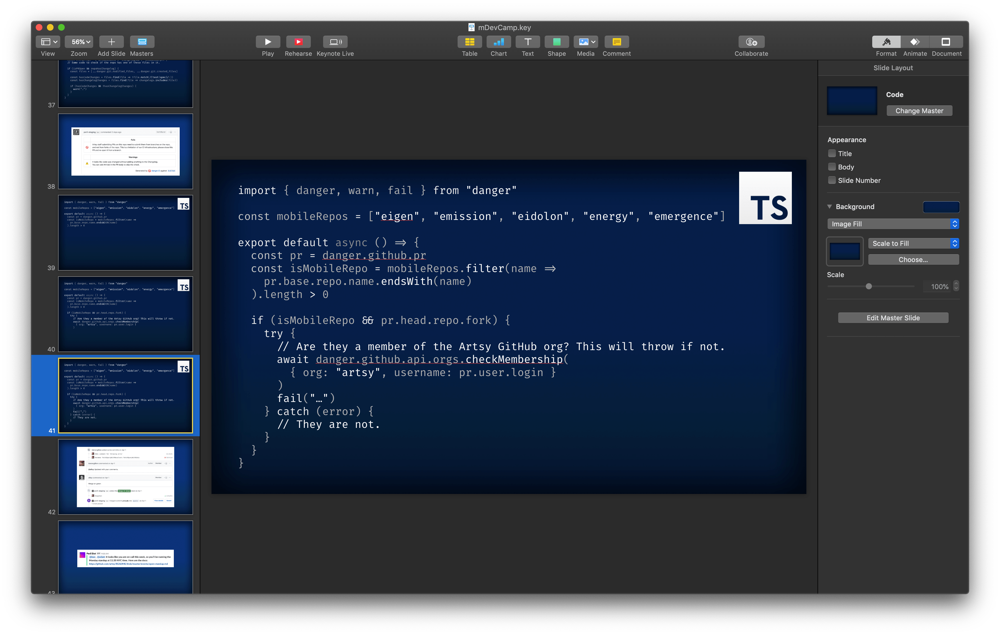
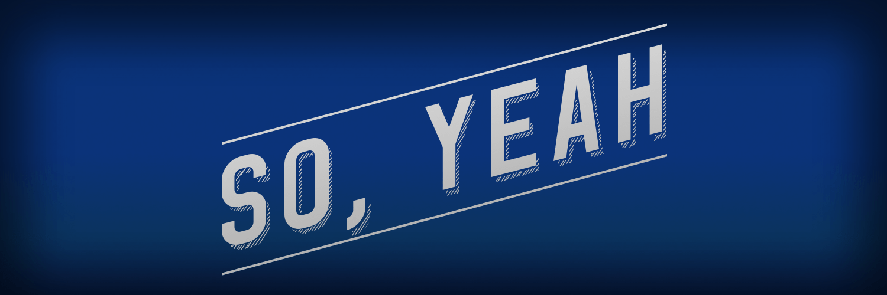

Today I presented a talk at mDevCamp in Prague, titled _How Artsy Automates Team Culture_, and I want to follow-up from [my last post](https://ashfurrow.com/blog/from-proposal-to-applause-how-i-public-speaking/) on the process of creating a conference presentation. That blog post is four years old, but, remarkably, still reflects my overall process. Today I want to focus in on the design aspect of giving a conference talk, using my mDevCamp talk as an example.

So often, when it comes to developers discussing something they've designed, they don't really discuss the nitty-gritty of _how_ they designed it. It just sort of, happens. I want to step through my entire creative process, with a focus on visual design. The [slide deck is available here](https://speakerdeck.com/ashfurrow/how-artsy-automates-team-culture). The talk was recorded and will be uploaded at a later date.



Let's dive in.

Last time I wrote about making conference presentations, I clearly delineated between the design of the talk's _content_ from the visual design of the talk's _slides_, and I still do see those as separate processes. However, I no longer see them as totally independent; the content and presentation _do_ affect one another. It's hard to explain, but let me try to explain my process:

1. Define my talk structure (as described in the [previous post](https://ashfurrow.com/blog/from-proposal-to-applause-how-i-public-speaking/#structure)) in bullet points.
2. Design important slides (the title slide, section title slides, empty slides).
3. Fill in the gaps between all the section title slides.

Only after I finish 3 will I go back and write the presenter notes in Keynote. I don't really _use_ the presenter notes much during my talk, but the process of writing them out on the slides helps me codify my thoughts, pinpointing exactly what needs to be clarified. I also just like having them there in case I lose my place.

So first I define the structure, then the visuals, and then the fine details (revisiting the structure and design as needed to support those details).

To build this presentation, I gave myself extra time: the whole process took six weeks. I created a daily task in OmniFocus to do _at least_ one thing for my presentation, even if it was just browse art to look for visual inspiration. Since my talk is about automation, I started by [searching Artsy for "robots"](https://www.artsy.net/search?term=robots). I felt moved by [this artwork](https://www.artsy.net/artwork/steven-skollar-three-robots) by [Steven Skollar](https://www.artsy.net/artist/steven-skollar) and [this one](https://www.artsy.net/artwork/tim-fishlock-bloody-robots-casually-smacked) by [Tim Fishlock](https://www.artsy.net/artist/tim-fishlock). This is the origin of my talk's retro-futuristic vibe. After all, I want my audience to feel hopeful, so retro-futurism is a perfect fit because in the past, we used to think that the future would be better than the present. [We were hopeful](https://ashfurrow.com/blog/remember-when-sci-fi-was-optimistic/).

I tried recreating the Tim Fishlock style in Sketch, but soon hit a wall.



That's okay, I'm a programmer, I can code around the walls. I ended up [writing this](https://editor.p5js.org/ashfurrow/sketches/auiS1yFQr) to mimic the style. Here's an embed of the live Processing sketch:

<iframe
  src="https://editor.p5js.org/ashfurrow/embed/auiS1yFQr"
  style="max-width: 710px; min-width: 100%; margin: auto; display: block;"
  height="400"
></iframe>

Once I had that defined, I started playing with colours a bit, too. I liked the blue and orange from the Steven Skollar robots and went down that path for a while.





After modifying the code from earlier to save the generated images as PNGs, I started designing a title slide. I wasn't happy with the results. Something about the text effect seemed to feel imposing, totalitarian. Like, it was robotic but it was the _wrong kind_ of robotic.

So, just like with code, I threw the design away and started over.

The exploration wasn't entirely fruitless – I knew I wanted retro-futurism, and thanks to my "failed" experiment, I knew that I wanted my slide to really emphasize hope.

So, again like with code, I googled for someone who'd already solved this problem for me. With no apologies to my designer friends, I typed "retro-futuristic font" into google. Yup. And I'm glad I did that, because within twenty minutes of searching, I found [the perfect font](https://creativemarket.com/MehmetRehaTugcu/248705-Geist-Typeface). And it only cost \$15.





I loved the diagonal lines used as shadow, it reminded me almost of a comic book. And the image that the font creator used to show off the font was _exactly_ what I was looking for: it used a gradient overlay for the text's fill (which I stole for my talk), and it slanted the text upwards (which I also stole). The upward slant made the text feel extra hopeful, but it wasn't easy to replicate that effect, so I originally did a bunch of exploration to see what I could accomplish without the slant:





To achieve this text effect, I wrote out the words I wanted to stylize and converted them to their vector outlines, which made it easier to scale/skew/transform the text. However, this also made it impossible to _edit_ the text. That's fine – because I've already defined my structure, I was able to not have to redo things too often.

This slanted font also influenced the three main points of my talk.

- Step one: **document** your culture
- Step two: **infrastructure** investments
- Step three: **amplify norms** using code

The format of the points became "step x:", then a high-impact word or phrase, and then a few more words to turn the point into an imperative statement. My talk is _telling you what to do_ through its visuals, which is great! I want my audience to do the thing that I'm telling them to do, after all.

(Note: I know that "step two: infrastructure investments" isn't imperative, but it still gets the point across. I just couldn't think of better wording. An generally speaking, if you have a list of things and one of them has to be different, it's better to have it in the middle of the list so the broken parallelism isn't as apparent.)

At first, it was kind of hard going. Each slide had to be designed from scratch, so I started each one with a rough sketch to verify that the proportions worked. I just rotated the text by 15º. Once I was happy with the words on the slide, I duplicated the slide to make a final version.





I kept switching between colours – I couldn't decide which one I liked more. Eventually, once I got things into Keynote, I realized that having more than one colour at all was too much. I needed a single colour, but neither the blue nor the orange I had worked (they needed each other to balance). I decided to go with a deep, rich blue. The kind used in cyanotype photography prints and blueprints. Blueprints actually ended up being the metaphor I used, and I experimented in Sketch with different effects to make the slide backgrounds feel "blueprint-y". I did try a few [subtle patterns](http://subtlepatterns.com) to make the backgrounds look more like paper, but it was way too busy.





For slides _within_ a section, I refrained from using the same variant of the font. The vintage, diagonal shadow is a really potent visual – it pops of the screen – and it's important not to overdo high-impact slides like this. I want my audience to feel like the title and section titles slides are special.

After designing a few slides, I started getting into a rhythm. Most of the slides in the screenshot below were designed over a single weekend.





I started assembling the slides in Keynote. Since I'm telling the story of how Artsy automates its culture, I started trawling through GitHub and Slack for screenshots that I could include in my talk. At all costs, I wanted to avoid having a slide with a bunch of text. (I eventually did have _one_ slide with text: a comparison between Danger and Peril. But I made sure the font was huge and had lots of whitespace).





My talk was going to discuss some code, but I quickly realized that the blue that I'd picked wasn't providing enough contrast with the text. I did a few things to mitigate this. First, I created a new version of my empty slide with a darker blue. By only adjusting the brightness of the colour, and not its hue or saturation, the two different empty slides look very similar to each other. Hopefully, the audience didn't even notice.





Next, I used a bold monospace font for the code. I used [Firacode](https://github.com/tonsky/FiraCode) because it's beautiful and free and it comes in a bold font weight. Finally, after a suggestion from Orta, I found a greyscale colour theme for Visual Studio Code and copied the code for my slides _from_ VSCode, which includes the colour. After some minor tweaks, like making comments more visible, I had code slides that were easy to read and visually interesting – if I only used white, it would be more difficult to read.





Since one of the feature I'm trying to highlight with Danger is how it's implemented in multiple languages, I sought out examples of Dangerfiles in Ruby, TypeScript, and Swift. I designed a little icon for each programming language and put it at the top right of each slide, to help orient the audience.

The last thing I designed for my slides was the upturned triangle that I used at the very beginning of the talk. The core message I wanted to communicate with my talk was "small changes can have a big impact" and I wanted to reinforce that idea with visuals.

It turns out that Sketch doesn't have a "draw an equilateral triangle" option so I had to do some math. I was initially happy with empty triangles, but they needed _something_ to give them more weight. After playing around for longer than I'll admit, I finally got what I wanted. It wasn't easy: I tiled one of Sketch's built-in pinstripe patterns, overlaid it with a white rectangle (the image was initially grey), rotated it to match the triangle sides, and masked it with a copy of the triangle layer.





I still don't understand the difference between "use as mask" and "mask with selected shape", but that's fine. Please don't tell me, actually. While we're discussing frustrations, I also hit a few issues with Sketch that _seemed_ like bugs _to me_ but I'm sure are working as intended for actual designers.





So, yeah. While I'm sure I'm missing some of the finer details, this has been an overview of how I went from searching for visual inspiration to delivering a presentation to a live audience.

If you're an engineer and want to learn how to use Sketch to design things like conference slides, there are two things you'll need to figure out. First: what is Sketch capable of? For this, you can read [Apple's CoreGraphics programming guide](https://developer.apple.com/library/archive/documentation/GraphicsImaging/Conceptual/drawingwithquartz2d/Introduction/Introduction.html). As amazing as Sketch is, sometimes it feels like I'm using a (really amazing!) UI for the Core Graphics framework. Second: how do you use visual effects to achieve a goal? That one's a lot harder, and I'm still figuring it out. Like most creative skills, it takes a lot of practice.

Designing conference slides is always fun, but it's also always bittersweet: once I finish, I won't get to explore the designs anymore. See, there's this saying in the design community: "you never finish a design, you just stop working on it", but for conference slides, that's not really true. The conference is over. I might _never_ open this Sketch file again. And that always makes me feel kind of sad – I have to say goodbye to all the ideas I've been playing with. But I learned a lot along the way! And it'll always be there if I want to return and take some ideas in a new direction.
