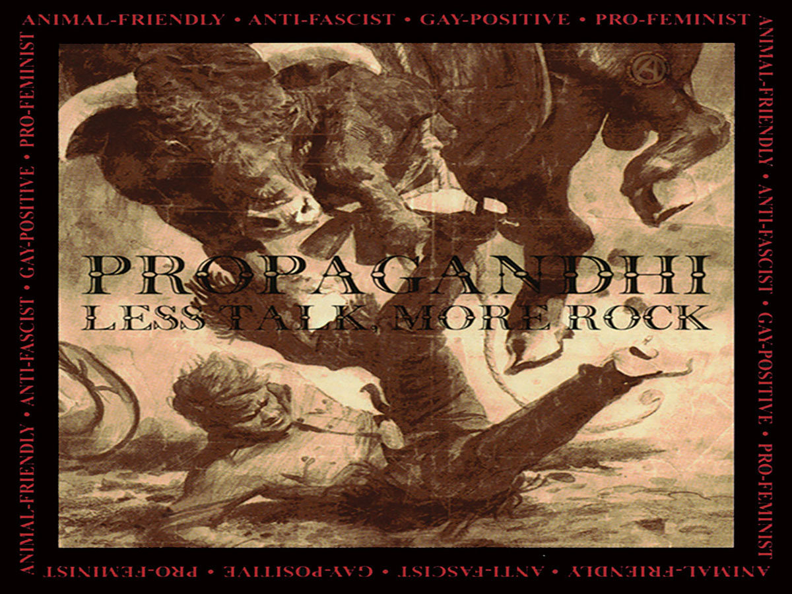

(Note: This is a pretty personal post. A classic "I wrote this for me, not for you" kind of post. Feel free to skip.)

Last year I realized that I'm also capable of being attracted to men. And I realized that I've been hiding from that fact for a long time. And I don't want to hide anymore. So I'm coming out as bisexual. I'm still in a happy, committed marriage; coming out isn't about changing my relationship with people around me, it's about changing my relationship to myself.

And I already feel _so_ much happier.

See, there's this part of myself that I've been _terrified_ of. I've _hated_ this part of myself and have tried to wall it off. To isolate and bury it. That kind of walling-off hurts: it's a constant mental tax. Without getting into specifics, these walls were formed in high school, and the walls aren't exactly... precise, you know? I've been denying a huge part of me – my sexuality – because _part_ of that sexuality is something I despised.

Coming out – to my wife, to my parents, and now to you – is a way for me accept myself for who I am. I've felt overwhelming relief as I tell the people close to me, like a weight is lifted from my shoulders. No more pressure to "act straight" – I can just be myself.

It's Pride month, and I _wish_ that I could say that I'm proud of my sexuality, but I'm still working on that. For now, it's just a huge relief to not hate myself anymore. I'll work on being proud later.

So what happened? Why now? Well, last year I went through a regimen of [Cognitive Behavioural Therapy to treat my depression](https://ashfurrow.com/blog/all-i-can-say-is-im-excited/). This gave me skills to detect when I'm hating myself irrationally; after the depression faded, those skills were still kind of running in the background. Just on the lookout for anything I hated about myself. And they found something: my sexuality. Those same skills helped me navigate through coming to terms with myself.

Of course, it also helps a lot to have a loving, understanding partner. Thank you, Ashley, for being my wife, a partner who is just as excited to find out more about who I am as _I_ am.

This has been a long process for me, and throughout it, I've found some pieces of art that have really helped me figure out who I am, and to accept myself. The _Ash Furrow Bisexual Oeuvre_, if you will.

---

A friend and colleague at Artsy, who is also a huge fan of John K Samson, recommended an album from JKS' punk rock days: Propaghandi's _Less Talk, More Rock_ ([Spotify](https://open.spotify.com/album/2CQTQJtCn5wfQ8MeHNjy9Y?autoplay=true&v=L)). It's an angry album, described by its creators as "the kind of album you write in your early twenties." On its cover, you'll see the words "animal-friendly, anti-fascist, gay-positive, pro-feminist" circling the border.





Thank you, Erik, for recommending this album. It changed my life.

---

[hbomberguy](https://www.youtube.com/user/hbomberguy) is a video games YouTuber who covers left-wing politics, too. He's very funny, and despite not being much of a gamer, I found myself captivated by his essays about [video games that I will never, ever play](https://www.youtube.com/watch?v=AC3OuLU5XCw). He's just such a good video essayist, and one of his videos in particular really spoke to me.

<YouTube videoID="l8u8wZ0WvxI" />

This is an essay discussing HP Lovecraft, his stories, his racism, his homophobia... and how queer adaptations can appropriate his writing.

> This is the kind of story HP Lovecraft could have been writing all along, and just maybe, it's the kind of story he _should_ have been writing.

He also discusses coming to terms with his own bisexuality through art, and the video essay spoke to me in a way that I didn't expect it to – or even want it to. Thank you, hbomberguy.

---

[ContraPoints](https://www.youtube.com/user/ContraPoints/) is a trans YouTuber who discusses left-wing politics, and who has been living her transition online. Someone confronting, then accepting, a part of themselves like that _in public_... it's an inspiring, naked kind of bravery. Thank you, Natalie Wynn.

---

[Big Mouth](https://www.netflix.com/title/80117038) is a cartoon from Netflix about puberty. It's the horniest, most awful show. It makes me embarrassed to ever have been a teenager. Ick.

There's this character, Jay. He spends two seasons being the show's [adorkable misogynist](https://www.youtube.com/watch?v=X3-hOigoxHs) and homophobe. I didn't really like the character, truth be told. But something happens at the end of the second season: he realizes that he's bisexual. And instead of turning his homophobia inward, like I did, he quickly learns to accept and love himself. (He's still working on that misogyny, though.)

As stupid as a show about literal "hormone monsters" sounds, I had never seen a character go through this realization before. It made me feel a little more normal, which I really needed.

---

So how long could I go before talking about Mastodon? Well gosh.

[Mastodon](https://joinmastodon.org) is an open source, federated social network. Don't worry about the techno-jargon, the point is this: I've been involved with the Mastodon community [for over two years](https://ashfurrow.com/blog/mastodon/), and Mastodon is a place of radical acceptance. Seeing people live as themselves and _be accepted_ as themselves by people who care about them has been transformational for me. People just... being themselves. What a concept, folks. Thank you, Mastodon.

<Toot src="https://radical.town/@RobinHood/101943188965153472/embed" />

---

Solidarity forever 🏳️‍🌈
