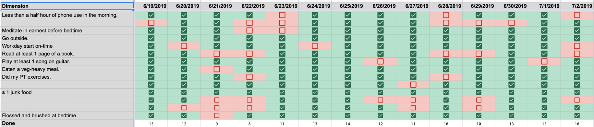

I need to preface this post with a disclaimer: what works in a business context will not necessarily work in a personal context. I'm always sceptical when I hear of people applying productivity tips or office interpersonal schemes to their personal lives, _especially_ as engineers. Engineers solve problems. When engineers deal with interpersonal _situations_, they tend to approach them as interpersonal _problems_. Problems that need solutions.

And not everything in life is a problem that needs to be solved. Some things just are.

Okay, now on to the post.

Have you ever tried to measure something difficult? Something that defies measurement, even? The old saying goes that "what cannot be measured cannot be managed", and if you're trying to manage something like (for example) your mood, then measuring it becomes important. [In the past](https://ashfurrow.com/blog/all-i-can-say-is-im-excited/), I've been able to get away with rough approximations. These were super-useful at the time. But nowadays, my approach to mood management is more about supporting habits and routines that support a healthy mood (rather than managing my mood itself, which has been really stable, thanks for asking).

It was about 6 months ago that I came across _[Metrics for the unmeasurable](https://lethain.com/metrics-for-the-unmeasurable/)_, a blog post that describes **synthetic metrics**. These can be placeholders for actual metrics that are too difficult or too expensive to measure directly. The post describes how to use synthetic metrics to "measure" really amorphous things like "is our company secure?" I encourage you to read it.

A synthetic metric is a way to combine smaller, easier-to-measure natural metrics to give an approximation of a hard-to-measure value.

Like my mood. I knew that there are things that affect my mood, like whether I'd meditated that day or not. So I gathered a collection of these metrics in the form of yes/no questions into a spreadsheet. This yielded a single number that encapsulates _a lot_ of what goes into my day-to-day life. (Synthetic metrics, as defined in _Metrics for the unmeasurable_, are a bit more complex. I've found that simplifying them has worked best _for me_, and you should always find out what works _for you_.)

Every morning, I have a reminder to fill in the metrics for the day before. The metrics are a combination of:

- Things that I do everyday already, that if I'm _not_ doing, indicate a problem. Example: are my teeth brushed at bedtime?
- Things that I need to do to maintain my mood, that I can skip occasionally, but if I skip many days in a row, indicate a problem. Example: have I meditated today?
- Things that I aspire to, that I _want_ to make a part of my daily routine. Example: have I read a book today?

I have chosen to frame most of these metrics in terms of _absolute minimums_. My metric for reading a book every day is "read at least 1 page from a book", for example. My idea was that I should keep the bar low so that I can motivate myself. For example: if it's nearing the end of the evening, and I realize that I haven't read a book yet, I'm far more likely to pick it up if I know that just reading a single page is enough to tick that box for the day. And, of course, once I read one page, it's a lot easier to read another. And another. And oh my look at the time, I've stayed up past my bedtime reading again.

So you can see that these metrics not only reflect my day-to-day life, but also help guide my life. I think this is true of most metrics: a corollary to "what cannot be measured cannot be measured" could be "what gets measured cannot help but become managed." At least, in my experience.

Here's a snapshot of how my metrics have looked for the past few weeks. I've omitted a few because they're personal, as well as a section below where I make notes that help contextualize the metrics (example: did I get some bad news that day?).





My metrics have become more and more filled-in over time – I've just gotten better at hitting them. Since starting in January, I've continuously adjusted the metrics, too. When I decided I wanted to improve my diet, I added a metric of "≤ 1 junk food" and, when I was finished taking my anti-depressants, I removed the "took my medication on time" metric. This flexibility has been really helpful.

I've thought about correlating my average [mood measurements](https://github.com/KrauseFx/mood) with the spreadsheet, but I don't think that would be that useful. I actually originally had a complex (omg spreadsheets are hard!) formula to give me a "grade" for each day, but I never paid attention to it. Like, at all. The picture was enough. So what's going on?

Well, to relate things back to business again, let's think about sprint planning. On my team at Artsy, our _primary_ goal when estimating the complexity of tickets is _not_ to accurately plan a sprint based on capacity, but rather because the conversation around estimation is itself useful for uncovering hidden complexity. I'll say that again: we estimate our tickets, but not so we can plan a "full" sprint, but because the estimation process itself helps share knowledge and build team cohesion.

Something similar happens with my daily personal synthetic metrics. It's not really that useful to track if I'm brushing my teeth or reading a book every day, but _asking myself the questions_ prompts useful self-reflection. And, retrospectively, I can look back and see patterns.

"Oh, on days where I don't go outside, I tend not to do my physiotherapy exercises."

"Oh, on days where I spend more than a half hour on my phone before leaving the house, I tend to arrive to work late." (Late in this context is "later than I want", because Artsy has flexible working hours.)

"Oh, looks like I meditate consistently throughout the week, but often have difficulty keeping up the habit on weekends."

These are all really useful observations and, while they may be obvious, they are only obvious once you _actually observe_ them. Having this record has helped me reflect on how my life has been going and where I want it to go next.

Should you start keeping daily personal synthetic metrics? I don't know. The value of the synthetic metrics is really reflection and retrospection, which I _definitely_ recommend you do. Just make sure to do it in a way that works for you.
