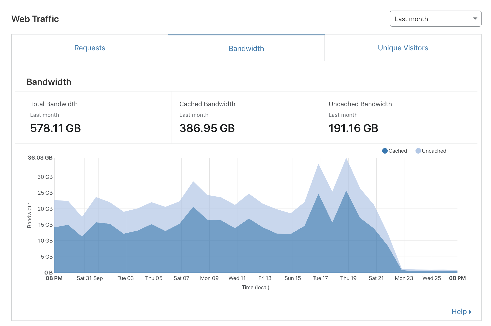
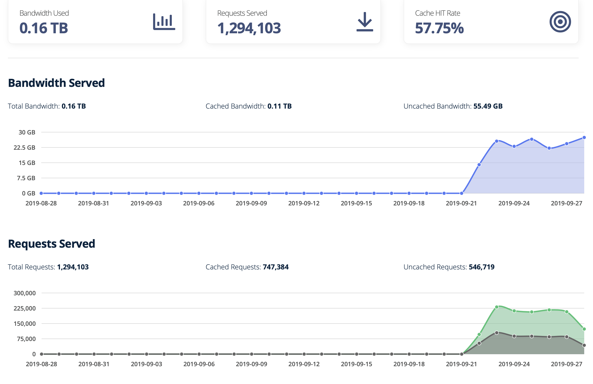
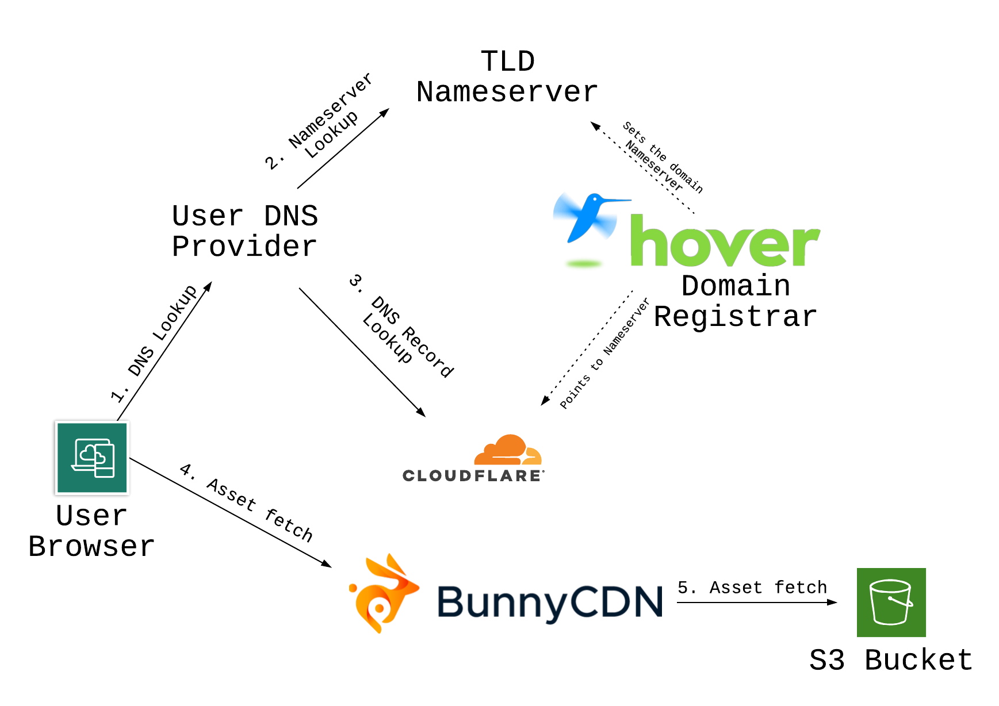
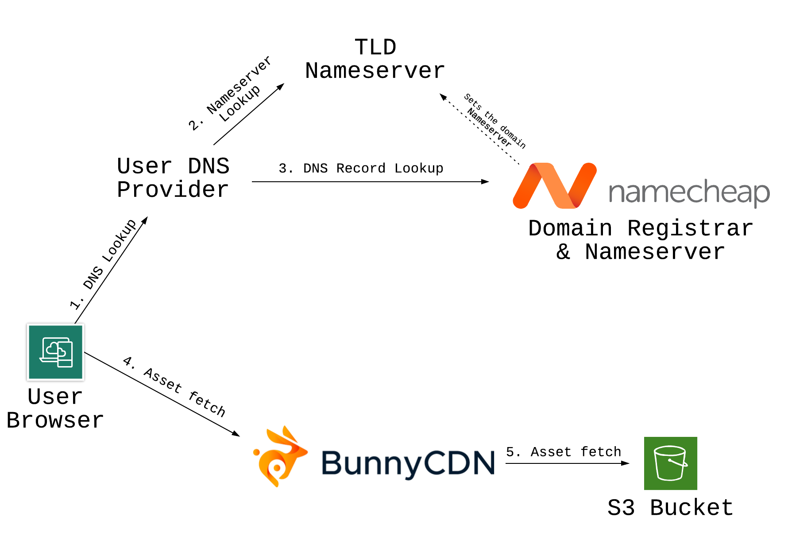

Running a [Mastodon](https://joinmastodon.org) instance requires at least one thing: a server somewhere to run the code and store media uploads. Since media upload storage is a common burden for servers, many solutions exist for upload storage. Mastodon can optionally be configured to upload media somewhere else. I use an AWS S3 "bucket" for `mastodon.technology`, but there's a catch: you'll pay for the bandwidth used when users download uploads from that bucket, so you want to minimize how often it's downloaded from.

This is one benefit of a Content Delivery Network, or CDN. A CDN sits in front of the bucket, caching the assets as its fetches them. It caches these on "edges" of its network, which are located in datacentres around the world. That means that, once _one_ user in Australia has downloaded an upload, the CDN might keep a cached version on its Australian edge, so subsequent Australian users will get the cached version instead. This saves bandwidth back to the S3 bucket. And since the CDN edge is physically way closer to the user than the S3 bucket (which sits all the way across the Pacific Ocean), the user can download the asset faster. It's a win-win.

But CDNs can get expensive, too. Since they are designed to mitigate costs for such a niche thing (upload storage bandwidth), they usual target enterprise customers. That means that they're expensive. Or rather, they have been. [Cloudflare](https://www.cloudflare.com) became really popular because it offers free CDN services, and you only pay for the "pro" features if you need them. This is pretty cool, and it's why I've used Cloudflare for a few years.

However, I don't really like Cloudflare. I don't like how they [protect hate forums, where mass shootings are planned](https://www.vice.com/en_us/article/j5yxxg/cloudflare-is-protecting-a-site-linked-to-a-neo-nazi-terror-group); I don't like how they have grown to the point where a [huge portion of the internet's total traffic flows through their infrastructure](https://w3techs.com/technologies/details/cn-cloudflare/all/all); I don't like how [un-seriously they treat their responsibilities](https://arstechnica.com/tech-policy/2017/08/cloudflare-ceo-the-people-behind-the-daily-stormer-are-assholes/). So, I wanted to move off.

A local Mastodon user, [IzzyOnDroid](https://mastodon.technology/@IzzyOnDroid) reached out to me to ask about this. Migrating away from Cloudflare hadn't been high on my priority list, but IzzyOnDroid were really helpful, researching alternatives and asking the fediverse for suggestions. They did the hard work for me – getting enough context to make a decision – and brought back some options. I chose [BunnyCDN](https://bunnycdn.com).

<Toot src="https://mastodon.technology/@IzzyOnDroid/102764663475108726/embed" />

Why BunnyCDN? Well, I really liked it's upfront cost structure. BunnyCDN takes Cloudflare's approach of having two tiers of customers, but _both_ tiers are paid. Enterprise customers can still buy bandwidth per-petabyte, but smaller customers like me don't have to commit to prohibitively expensive plans. And they're very upfront about the costs (bandwidth in North American data centres costs less than Asia & Ocean, for example). Based on our bandwidth flowing through Cloudflare (500GB/month), I estimated that if all my bandwidth went only through the most expensive datacentres, it would cost about \$30/month. Realistically, far less than that, since most traffic comes through cheaper datacentres.

So let's do it!

But how???

Okay so here's the thing: Cloudflare isn't just the CDN provider for the instance, it is also the domain's nameserver. That means that it holds all the DNS records that point `mastodon.technology` to the various IP addresses used for HTTP requests, email, and even [public DKIM keys for mail server verification](https://www.namecheap.com/support/knowledgebase/article.aspx/317/2237/how-do-i-add-txtspfdkimdmarc-records-for-my-domain). These DNS settings are really, really important. If they get messed up, everything about the instance can break.

So I split up the migration from Cloudflare to BunnyCDN into two phases: first migrate the CDN provider, and then migrate the DNS provider. Getting this right is really important, and I **mostly did okay**, but hopefully you can learn from my experiences.

Okay let's go.

## Migrating CDN Providers

Migrating to a new CDN provider turned out to be the easier part of this. Cloudflare had been pointing `static.mastodon.technology` to my S3 bucket, caching assets on its edges as they're requested.

Here's what the infrastructure looked like before adding BunnyCDN. It includes a lot of detail around DNS lookups that will become relevant in the next section.






I could have changed the `static` subdomain to point to BunnyCDN, but that's risky. If something went wrong, I would have to wait for DNS propagation to fix it. I'd prefer to be able to rollback any changes quickly.

So I set up a new subdomain, `cdn.mastodon.technology`, to point to BunnyCDN. I waited for the new subdomain's DNS records to propagate, and then started the switch. [Mastodon uses an environment variable](https://github.com/tootsuite/mastodon/blob/3582fa5c1755a7b92443d4cd8bcd71723d325891/.env.production.sample#L90) called `CDN_HOST` to point to your CDN domain, so all I had to do to switch to BunnyCDN was update this environment variable and reboot the server. Well, mostly.

I forgot that I'd also configured nginx to set [Content-Security Policy HTTP response headers](https://en.wikipedia.org/wiki/Content_Security_Policy), allow-listing asset downloads from our CDN host. I forgot to update the nginx settings to add the new domain, so media embeds were momentarily broken. I rolled back the environment variable change, update nginx's configuration, and re-deployed the change. Everything after that went smoothly, and I watched BunnyCDN's stats as traffic started rolling in.

One thing that I really like about BunnyCDN is that I'm paying them. Weird, right? But it kind of sucked to be a free-tired Cloudflare customer. A lot of features, like realtime metrics, aren't available for free customers. By paying BunnyCDN, I'm getting a full-featured CDN provider. BunnyCDN might not provide as comprehensive a tool as Cloudflare, but it has everything I need _and_ I can access all its features.

Here's what Cloudflare's bandwidth stats looked like after about a week:







And here's what BunnyCDN looked like:







I noticed that Cloudflare was still serving a number of requests, even after switching the instance to point to the new subdomain. About 6000 requests and nearly 1GB of total traffic per day. This is probably remote instances, displaying federated toots from `mastodon.technology` that were made before I changed the environment variable. I hadn't considered this – I can reboot _my_ instance server with a new environment variable, but I can't control anyone else in the fediverse. This decentralization is both a feature of the fediverse, and a huge constraint.

I definitely wanted to keep remote users able to access media uploads, so once I was sure BunnyCDN was stable, I also updated the existing `static.mastodon.technology` DNS record to also point to BunnyCDN. All HTTP traffic was now routed around Cloudflare, we just had the DNS nameserves to deal with next.

BunnyCDN is good CDN, cute CDN, 12/10.

## Migrating Nameserver Providers

Domain management is not something I enjoy. It's something I tolerate. While I learned a lot about the fundamentals of the internet in university, I am often learning about the practical nature of systems administration as I go.

The `mastodon.technology` domain had always been registered with [Hover](https://www.hover.com), which is where I managed all my domains. Hover was pointing to Cloudflare as the domain's nameserver, so my next step was to use a different nameserver. Most domain registrars _also_ offer free DNS management services – that is, if you register a domain with Hover, you can also use Hover as a nameserver. Hover was pointing to Cloudflare as a nameserver, and _I thought_ that my next step was to point it back to Hover. Unfortunately, [Hover doesn't support CAA DNS records](https://www.thesslstore.com/knowledgebase/caa-records/how-to-add-a-caa-record-on-hover/), which are important for renewing the instance's [letsencrypt](https://ashfurrow.com/blog/migrating-from-cloudflare/) SSL certificates.

Hmm. So I couldn't use Hover as a nameserver after all.

My choices here were either to use a different nameserver (maybe [FreeDNS](https://freedns.afraid.org)) or to migrate the domain registration itself from Hover to a new registrar that had better DNS services, which is what I did. I moved over [a different domain I manage](https://peerlab.community) to [Namecheap](https://www.namecheap.com), to get a sense of the process and prepare myself for migrating `mastodon.technology`. I picked Namecheap because it supported all the DNS record types I needed and seemed to have good support. I would end up regretting this choice. Read on for details.

Here is roughly what happens when a user requests an upload (after introducing BunnyCDN into the infrastructure). First there's a DNS lookup that takes up steps 1, 2, and 3; then, there is the asset download itself in steps 4 and 5.







Originally, I made this diagram to clarify at each step what gets cached and what doesn't, but it turns out that... it all gets cached. All of it. Every solid line in this diagram, and even one of the dashed lines, represents a cache.

Caching is infamously one of the two most difficult problems in computer science. When you change DNS settings for a domain, you are interacting with a worldwide cache. It's difficult to plan that interaction when you aren't intimately familiar with each layer of the cache, so I took notes and planned. I did some research, and I asked for help when I needed it.

The domain transfer went smoothly. Hover was pointing to Cloudflare as a namesever, and Namecheap copied that setting during the transfer. I read [Namecheap's documentation](https://www.namecheap.com/support/knowledgebase/article.aspx/582/51/how-do-i-transfer-a-domain-to-namecheap-with-minimal-downtime) and I thought I was prepared. But I ran into a problem.

Other domain registrars / DNS providers I've used have all let me edit the DNS records for its nameserver _even when I'm pointing to a different nameserver_. This lets me get the DNS records set up on the new nameserver _first_, and _then_ update the nameserver with the TLD. This makes sure that the DNS settings are complete and correct at the moment that the TLD nameserver settings are updated. However, Namecheap's user interface doesn't let you do this. Namecheap makes you first update your nameserver settings _first_, before letting you set any DNS records.

My solution was to be ready to set the DNS records quickly.

Unfortunately, I wasn't quick enough.







I used [an online `dig` tool](https://www.digwebinterface.com/) to track the nameserver and DNS record propagations, and watched in mild horror as incomplete records spread through the internet. I entered the A and AAAA records (the ones used by browsers) first, and they propagated really quickly. The problem was with the MX records, used for email. Without the MX records, I started seeing the follow error in my Maingun logs:



```
Failed: mastodon@mastodon.technology → USER@EXAMPLE.COM 'You were mentioned by USER@mastodon.social' Server response: 550 Requested action not taken: mailbox unavailable invalid DNS MX or A/AAAA resource record
```



It seems like larger email providers, like Gmail, picked up the MX record change quickly. Smaller email servers, who probably have longer cached TTL's for DNS lookups, took longer to recover. The frustrating thing is that email servers are really particular, and I think this change will hurt the spam score for outbound emails from the instance.

<Toot src="https://mastodon.technology/@announcements/102875960419073268/embed" />

I'm really disappointed in Namecheap for introducing this limitation, that other domain registrars / DNS providers don't force on you. As far as I can tell, there's no way to mitigate this problem with using Namecheap. I've contacted Namecheap support to let them know about the problem, and they've passed the feedback on to their product team. For now, I would probably recommend using a different domain registrar, but I'm sticking with them because things are working now, and migrating away would be even more work. No thanks.

## Aftermath

Based on the first week of traffic, I'm expecting a cost of about $12/month. I'm really grateful for the [patrons](https://www.patreon.com/ashfurrow) for covering the hosting costs. Based on the estimated cost of $12/month for ~500GB of traffic, there's enough wiggle-room that the existing Patreon support should cover the costs of the transition. It's really cool that the patrons' support gives me both the freedom to run the instance as ethically as I can, but also to learn more about systems administration. Thank you.

And thank you again to [IzzyOnDroid](https://mastodon.technology/@IzzyOnDroid) for the bump to do this, and for the help researching options. I couldn't have done it without you (well, I could have, but I probably wouldn't have). You rock.

I'm going to wait for a while to make sure Cloudflare isn't still being used as a nameserver by some dinky email server out there, and then I'll delete my account. This has been a project I've been thinking of for months, and I'm really glad to be out of the woods.

<script src="https://mastodon.technology/embed.js" async="async"></script>
