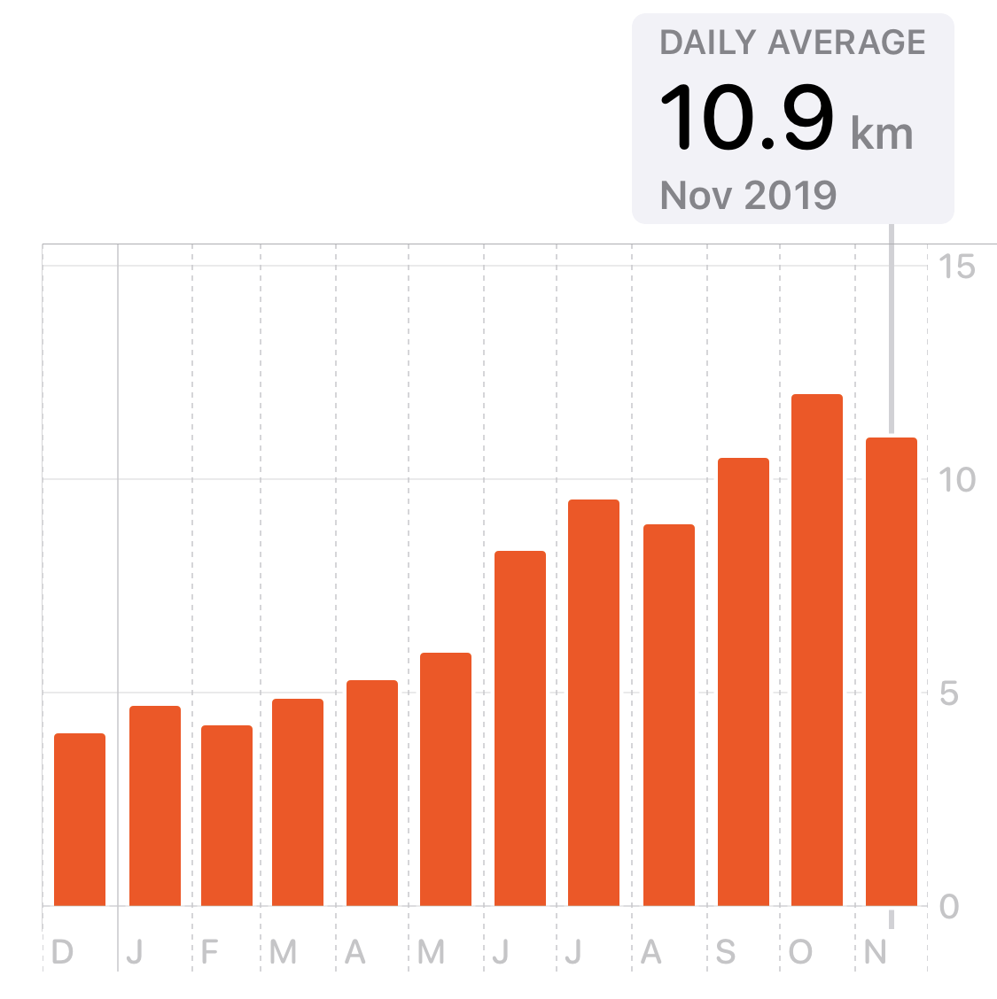

Three months ago, I wrote _[Learning to Walk](/blog/learning-to-walk/)_, a blog post that went into detail about my recent physical therapy experiences. I said at the time "I understand exercise now" and alluded to some weight loss I'd had. This post is going to explore my experiences with both exercise and weight loss in more detail. It's yet another personal blog post, written for me more than for you, but this is _my_ blog, so 🤷‍♂️

I'll also note that this blog post comes with a strong content warning for weight, exercise, medical trauma, body image issues, and mental health problems. Okay. Deep breath. Let's do this.

---

I've been gaining weight for my entire adult life. Slowly, but surely. At the beginning of the season, I would always hate getting my summer clothes out of storage because inevitably some would no longer fit. And the same with winter. Year after year. It sucked, and I wanted to stop it, but didn't really know how (and, for most of my twenties, depression would get in the way of _anything_ I tried to do).

My weight is actually quite linked to my depression, since my body's appearance is one of the easiest things for my depressed mind to latch on to to justify its depression. This intersects with [outdated medical approaches to weight](https://highline.huffingtonpost.com/articles/en/everything-you-know-about-obesity-is-wrong) that I've experienced first-hand. 

While living in Amsterdam in 2014, at the absolute bottom of my depressive episode, I was going to an expat medical clinic to get help through psychiatric medication. I'd gotten a prescription and it'd had a positive effect, so I returned to get the prescription refilled. The doctor I saw, who was different than the last one, refused to refill it. She believed that my depression was caused by my weight. In a heavy Dutch accent, she told me "the body and the mind, they are not so separate, yeah?" Yeah. Obviously. Duh. But hey: when a suicidal patient comes to you to refill a prescription that your colleague wrote, that the patient describes as helpful for them... to refuse, and then to tell them that they don't need medicine and they just need to lose weight to feel better. It's medical malpractice, in my opinion. It destroyed me.

So needless to say that I am reluctant to go to doctors. I don't trust them and I have good reasons not to.

Flash forward to 2019. [I am in control of my depression](/blog/all-i-can-say-is-im-excited/). I have been learning how to exercise from my physical therapist. And [as mentioned here](/blog/metrics-for-the-unmeasurable-mood/), I made some modest improvements to my diet. But it wasn't for months, when someone literally told me that I'd lost weight, that I even acknowledged weight loss as a possibility.

Even now, months later, I avoid thinking about it. As desperately as I want to lose weight and improve my appearance, and as hard as I've been working on diet and exercise, it's difficult to think about for me. It's too dangerous an idea, and I'm still reluctant to get my hopes up. I force myself to only think about my diet and exercise individually, and never in the broader context of my health or appearance.

It's been challenging.

I don't know how much I weighed at the beginning of the year, or when my weight even loss started. The last time I had a physical exam was 2017, and I know how much I weighed then. Since that exam, my weight had increased, but my current delta is a 65 pound weight loss. Since I bought a scale in June, when I started being more proactive about exercise outside of a strict physical therapy context, I've lost 40 pounds.

<Narrow>

</Narrow>

I wish I could be more excited, but it's difficult. There have been periods where I'm really happy about my progress, but even getting excited makes me anxious.

This fall, when I got my winter clothes out of storage, none of them fit. Like, none at all. _That_ was an amazing feeling, if fleeting. I had to buy new clothes and felt excited about being shopping for smaller sizes, but also anxious because I was still shopping for large sizes. I felt guilty spending money on new clothes because they might not fit for very long... and then felt guilty for feeling hopeful... and finally recognizing _this is when I need those CBT skills_ and it was all okay! Phew.

<Narrow>

</Narrow>

So we've covered my history with weight and its relationship to my mental health. It both reflects my mental health and is reflected _by_ my mental health. It's a sad topic that I'm still working through, but what about the happier stuff? If I've been focused on diet and exercise to the exclusion of weight or size, how have _those_ been going?

They've been going _fantastic_, thanks so much for asking.

---

I'll start with diet because that turned out to be the boring one. I mentioned in _[Metrics for the Unmeasurable Mood](/blog/metrics-for-the-unmeasurable-mood/)_ blog post that I started tracking my eating habits. As one of my coworkers phrases it, the first step to improving something is to track it. And as I said in the _Metrics_ post: "what gets measured cannot help but become managed." So that's how it happened.

I started tracking if I'd had less-than-or-equal-to one "junk food" a day. I didn't define it strictly, but trusted that I would develop a working definition over time. And I did. I also started tracking if I'd had a "veg-heavy meal" that day (with a similarly missing definition). And eventually, started tracking if I had snacked later than 8:30pm. By tracking these behaviours, I managed to think about them. Thinking about these topics is difficult, because they all relate to weight loss, but by keeping the focus on the habits themselves, I compartmentalized the negative feelings so that I could work through them.

I needed some help to support these habits. I looked in our cupboards and fridge for the foods that I was eating, and came up with some substitutions. I've always had a sweet tooth, so grapes became a common snack. Lots of hummus, lots of carrots.

My wife, Ashley, does most of the grocery shopping. I told her the foods I was trying to avoid, and asked her to stop buying them altogether. If I _really_ wanted a KitKat, I could walk 2 minutes to the corner bodega and buy _one_ to eat. We'd been stocking these kinds of foods and then one day, thanks to Ashley, we just _stopped_.

It was difficult. I was still using food as a coping mechanism, so I had to become even more diligent with my mental health skills. My usual lunch had always been sushi, and I started buying smaller portions. Eventually, my usual lunch starting coming from a salad bar. My usual breakfast changed from a bagel to oatmeal. I got _really_ good at making overnight oats, but my current favourite breakfast is Swiss-style muesli. Here's a healthy dinner Ashley and I made together:

<Narrow addBottom>

<blockquote class="instagram-media" data-instgrm-captioned data-instgrm-permalink="https://www.instagram.com/p/BxGUiTOliuU/?utm_source=ig_embed&amp;utm_campaign=loading" data-instgrm-version="13" style=" background:#FFF; border:0; border-radius:3px; box-shadow:0 0 1px 0 rgba(0,0,0,0.5),0 1px 10px 0 rgba(0,0,0,0.15); margin: 1px; max-width:540px; min-width:326px; padding:0; width:99.375%; width:-webkit-calc(100% - 2px); width:calc(100% - 2px);">
 <a href="https://www.instagram.com/p/BxGUiTOliuU/?utm_source=ig_embed&amp;utm_campaign=loading" style=" background:#FFFFFF; line-height:0; padding:0 0; text-align:center; text-decoration:none; width:100%;" target="_blank"> 
 

 
 

 

 

 
 View this post on Instagram

 

 

 

 

 

 

 

 

 

 
 

 

</a>
<a href="https://www.instagram.com/p/BxGUiTOliuU/?utm_source=ig_embed&amp;utm_campaign=loading" style=" color:#c9c8cd; font-family:Arial,sans-serif; font-size:14px; font-style:normal; font-weight:normal; line-height:17px; text-decoration:none;" target="_blank">A post shared by Ash Furrow 🏳️‍🌈 (@ashfurrow)</a>

</blockquote> 

</Narrow>

Dealing with my depression was a necessary first step before dealing with my diet. My mood both reflected and created my diet deficiencies: I used food as a coping mechanism for my depression, which contributed to my weight gain, which gave my depression "rational" justification. It was a cycle, and Cognitive Behavioural Therapy was the only thing that managed to break it for me.

Years ago, I'd read _[Health at Every Size](https://amzn.to/37vOioS)_, and I leaned heavily (_heavily_? get it?) on lessons I'd read from that book. Lessons like mindful eating and paying attention to how my body felt before and after eating. I learned what it was like to crave carbs specifically, or what it felt like when I'd not eaten any vegetables lately. 

My goal was never to lose weight, it was only ever to form sustainable, life-long habits around paying attention to what I eat. The better eating habits followed naturally, and the even though the weight loss followed after that, I never focused on the weight loss itself. The past nine months have been a daily learning exercise in awareness, and I've learned so much.

---

Alright, so blah blah blah food. But this blog post isn't about food, it's titled _Learning to Run_, so where's the running?

As I mentioned in _[Learning to Walk](/blog/learning-to-walk/)_, I have been walking 2.5km to work every day since 2015. Well, most days. When I lived closer to a subway stop, I'd take it in a lot when I was feeling depressed. _Really_ bad days saw me working from home. Artsy's flexible working arrangements, where I could work when and from where I wanted, were hurting me. I mean, they were supporting me, but they were also hurting me. As recently as _this year_ there were days that I just stayed inside _the whole day_. (One of the daily metrics I measure is "did I go outside today?" and it's worked wonderfully.)

Something I learned, while learning to exercise for physical therapy, is how affected my mood is by my activity. I noticed that on work days that started with a hard morning, if I _pushed through that difficulty_ and walked to work, I would _consistently feel better_. I realized that, just like with depression, my mood is both a reflection of and creation of my physical activity levels. This pushing through difficulty became another skill in my CBT toolbox.

I was learning to walk with a new gait. A new foot strike. A new hip angle. Everything. And every day I walked to work, I learned a little more. Actually, this is a good point to mention that I read a book _about_ learning this summer – probably the most important book I've read for a few years: _[Making it Stick: The Science of Successful Learning](https://amzn.to/2QHb1IB)_. I started reading the book because I wanted to get better at learning in a professional context, but I found myself using the techniques from the book in my experiences learning to walk.

To zoom in on one lesson I learned from _Making it Stick_, it's the idea of [_interleaved practice_](https://academicaffairs.arizona.edu/l2l-strategy-interleaving). Say you're a baseball player and you'r going to practice hitting 15 fast balls, 15 curve balls, 15 sliders, then your best bet is to practice them all mixed up, randomly selecting from those three pitches. By interleaving your practice of each pitch, you are strengthening your understanding of _the differences between_ those pitches.

Overall, you'll be a better baseball player. Paradoxically, you will _feel worse_ when you practice. That's because, if you practiced the three pitches in distinct groups of 15, then you would _feel_ like you were practicing effectively, even though you were really worse. This is _desirable difficulty_ and it's really important for learning.

We actually have data on this. Separate grade-schoolers into two groups: one will practice throwing bean bags into a target three feet away, and the other will practice with targets both two and four feet away. Get them to practice for months, and then evaluate how well they can hit targets that are three feet away. The second group (who has never practiced at three feet away) will _consistently_ outperform the group who has been _only_ practicing at this distance.

And so. I was learning to walk. And to help, I wanted to start learning to run.

I asked my physical therapist and he was clear: I wasn't ready. My posture was already putting strain on my knees, and running would lead to injury. He gave me some kind advice: "you don't run to get fit, you get fit to run." So getting fit became my goal. I trained and researched for months. I got the 👍 from my PT, and only had one obstacle left: my self-consciousness.

New York is amazing. I love it here, it has so many people. So many... not fat people. And I had always felt bad about even taking up space. A gym isn't exactly somewhere that I felt comfortable at – it took a lot of support from my PT to work up the courage to sign up, but I did it because I wanted to run. Now I was ready, but felt self-conscious about being seen to run outside. _In public_. To be honest, it still gives me chills sometimes!

In August, as I wrote _Learning to Walk_, I already had a plan. I was about to fly home to Canada. _Rural_ Canada, _deep_ in the country. I would start learning to run in the privacy of the middle of nowhere.

I'd done lots of research, I had advice from my physical therapist. And, crucially, I had some high-strength bug repellant. I spent two weeks in August learning how far I could push myself, how far I _should_ push myself, how to ramp up a pace. The Apple Watch was _very_ helpful, helping my learn more about my heart rate responded to exercise. I learned to say to myself: "when the clock says X, even if I'm still tired, I'm going to run for 30 seconds. And then, I'll walk for a minute." 

Learning this skill (to stick to a planned cadence of running-and-walking) was crucial to master first. Once I had this down, I worked on decreasing the amount of time between running, and then increasing the amount of time spent _while_ running. I learned to tack new skills onto this one, like using the transition between walking and running as a cue to think about my form and check in on my body.

Running form itself was difficult to get right. I _needed_ to get it right, to prevent injuries. But do _you_ know how to run? Like, _really_ know? How your foot should hit the ground? How it should _sound_ as it hits the ground? Could you describe how every muscle in your ankle works together to form a specific arch in your foot? What about up a hill? Against a slant? Around a corner? (_Untitled Goose Game_ taught me to slow down to turn corners faster, and I actually tried it while running – it works!). I felt like I was playing [QWOP](http://www.foddy.net/Athletics.html), but I was getting better quickly..

I learned a lot about running, but in line with _interleaved practice_, I learned a lot about walking, too. I learned _so_ much – I even learned how to fend off an aggressive dog who was angry I'd ran past its owners property. (Holy moly, that was scary).

I was in the middle of the country. A car would pass every ten minutes, but that was largely it. The scenery was beautiful and even though I'd grown up on these roads, I was appreciating my home from a whole new perspective. I left my phone at home, so I don't have pictures from my runs themselves, but here's the view:

<Wide>

</Wide>

Returning to New York was hard because I was still self-conscious while running. But I was a little more confident. I began running along the East River near my apartment.  Here's _that_ view:

<Narrow addBottom>

<<blockquote class="instagram-media" data-instgrm-captioned data-instgrm-permalink="https://www.instagram.com/p/B5FmVXiHyNR/?utm_source=ig_embed&amp;utm_campaign=loading" data-instgrm-version="13" style=" background:#FFF; border:0; border-radius:3px; box-shadow:0 0 1px 0 rgba(0,0,0,0.5),0 1px 10px 0 rgba(0,0,0,0.15); margin: 1px; max-width:540px; min-width:326px; padding:0; width:99.375%; width:-webkit-calc(100% - 2px); width:calc(100% - 2px);">
 <a href="https://www.instagram.com/p/B5FmVXiHyNR/?utm_source=ig_embed&amp;utm_campaign=loading" style=" background:#FFFFFF; line-height:0; padding:0 0; text-align:center; text-decoration:none; width:100%;" target="_blank"> 
 

 
 

 

 

 
 View this post on Instagram

 

 

 

 

 

 

 

 

 

 
 

 

</a>
<a href="https://www.instagram.com/p/B5FmVXiHyNR/?utm_source=ig_embed&amp;utm_campaign=loading" style=" color:#c9c8cd; font-family:Arial,sans-serif; font-size:14px; font-style:normal; font-weight:normal; line-height:17px; text-decoration:none;" target="_blank">A post shared by Ash Furrow 🏳️‍🌈 (@ashfurrow)</a>

</blockquote> 

</Narrow>

[I hooked up my running activity](https://slava.playplay.io) to Artsy's #distance Slack channel. That first 💪 reaction meant a lot to me.

<Narrow>

</Narrow>

The motivation I got from my colleagues felt _amazing_, but I also learned the joy of _giving_ my colleagues motivation.

--- 

I've mentioned the Apple Watch a few times, and it's worth bringing up. The watch has connected me to colleagues for my runs. It's connected with a colleague so we can congratulate each other's achievements: after my first run, Eloy congratulated me. He didn't know this had been a goal of mine, but he was still excited for me.

The watch has also helped me track my progress. I don't do calorie counting, but it does hook up to my scale to track weight, and also tracks a bunch of health data: resting heart rate, average walking pace, oxygen absorption (somehow ???). Tracking these trends over time has become really exciting for me.

<Tweet tweetID="1189269261811929094" />

My self-consciousness is kicking in right about now, so please indulge me as I push through this difficulty. When I got my scale in June, I set a goal. This week, I hit that goal and had to set a new one. That new goal is to get under 30 on the BMI scale. I rightfully hate the BMI scale – like other types of medicalization of being fat, it is misused against vulnerable people. Nevertheless, my goal is to no longer be medically categorized as obese. I'm not far. It really kind of sucks to have "just be overweight" as a goal, but I've learned to simultaneously appreciate how far I've come while recognizing how far I still want to go.

I try to push past my self-consciousness. When I coworker congratulates me on a run, _I acknowledge the compliment_. When I'm feeling great after a workout, _I take a selfie_. When someone asks me how I've been, _I tell them I'm feeling amazing_. These are all difficult to do, but I'm pushing through that difficulty.

<Narrow>

</Narrow>

So anyway, my weight is down. My respiration health is trending well. My walking pace is up. My daily active calories spent are _way_ up. My resting heart rate has nearly crossed below 60bpms, which feels _ridiculous_. Between walking and running, I travel over 10km per day.

<Narrow>

</Narrow>

On top of all that data, I just feel physically so much better. I've had a really stressful few weeks at work, and I've actually relied on running as a way to help cope. Running has replaced food as my go-to coping mechanism. I'm pretty fucking proud of that.

---

I'm fortunate to have a physical therapist, let alone one as amazing as this. I'm fortunate to have access to the technology to help me. I'm fortunate to have access to the mental healthcare I needed to get started. All that said, it's been a lot of hard work, and I'm proud of that.

I'm learning to run. It's difficult, but just like learning a new programming skill, that difficulty is what has made it fun for me.
