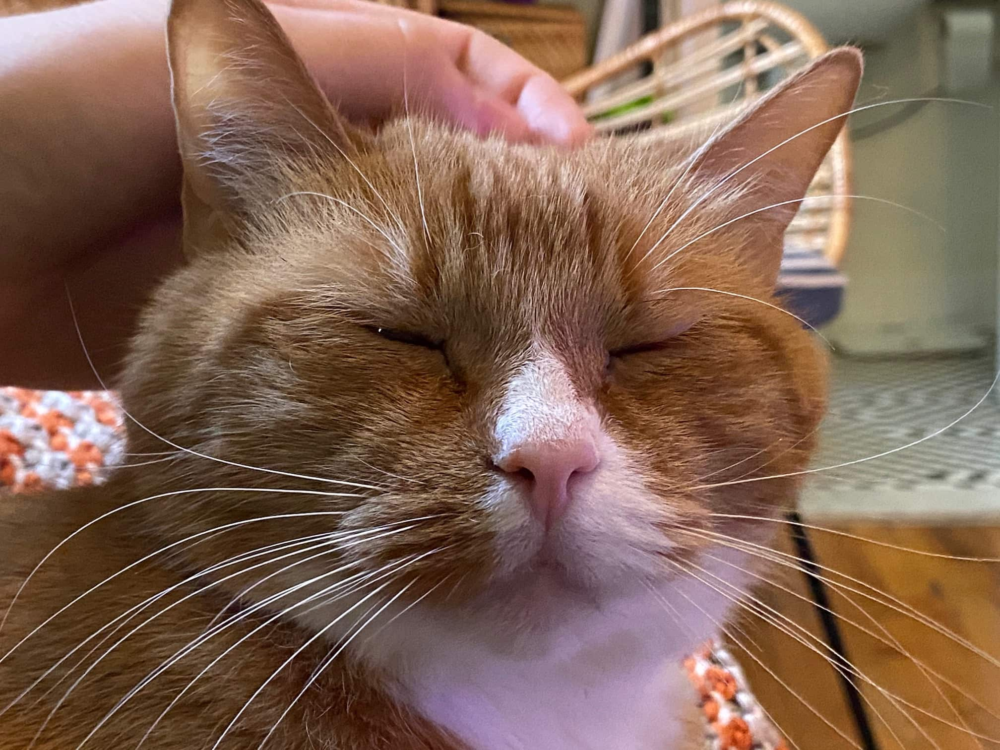

Content warning for a medical discussion.

Ten days ago, my cat started acting weird. He stopped eating and sleeping, he only wanted to be alone, and he was very irritable. He was clearly in pain, so we took him to the vet. I hoped for the best but emotionally, I prepared for the worst.

Turns out it was his teeth. He had to have four of them removed, which sucked, but he's feeling much better now. I'm really grateful for the veterinarian's office workers, who not only relieved Dave of his pain but also called him a "very good patient" in his paperwork.

And now Dave is back to his old self. Better that before, even. I wonder how long he had been in mild or moderate pain before things got really bad and he stopped eating. How long was he suffering, and unable to communicate it?

It's hard not to see myself in Dave. Like I said in my last post, [there is something wrong with my body](/blog/pausing/) and it's causing me significant pain. And when I think about it, that pain has been around a long time. Creeping up over the years, and I never really realized it.

Dave couldn't tell me that he was in pain – if he could have, I would have done something sooner. But me? I don't have any excuse. I knew there was something wrong with my body but I waited until it became a serious problem to go to the doctor (in February). And then my surgery got pushed back due to the COVID pandemic. And then things got worse when I injured myself in April. I haven't slept a solid night in five weeks.

So while the veterinarian was helpful in clearing my conscience – that Dave's tooth pain wasn't my fault – I have no excuses for not taking care of _myself_ sooner. For waiting until the problem was serious, and then having to wait even longer due to a cancelled surgery. The uncertainty has been almost as bad as the pain.

Things are tough right now.

But I got some good news last week. My surgery has been rescheduled. Things are still up in the air (isn't everything right now?) so I'm not breathing a sigh of relief until I literally wake up from the procedure. But if all goes well, I'll be able to return to strength training and running safely in July.

Things are still tough. There's a certain search for certainty – that I know I'll _really_ never find – but I feel it more acutely now than ever. But I really needed some good news, and I got it. So we'll see how things go over the next few weeks.
