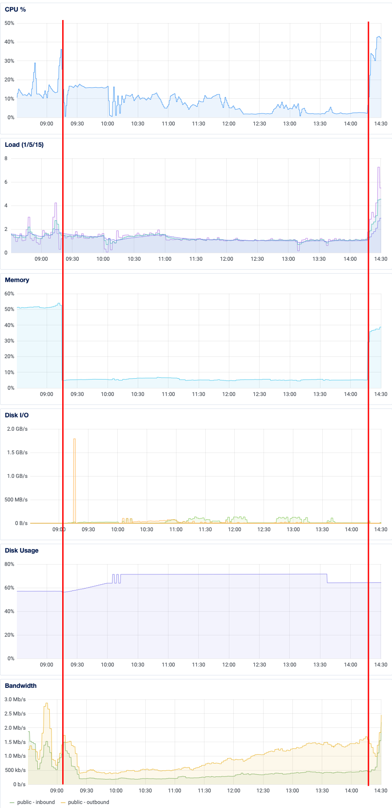
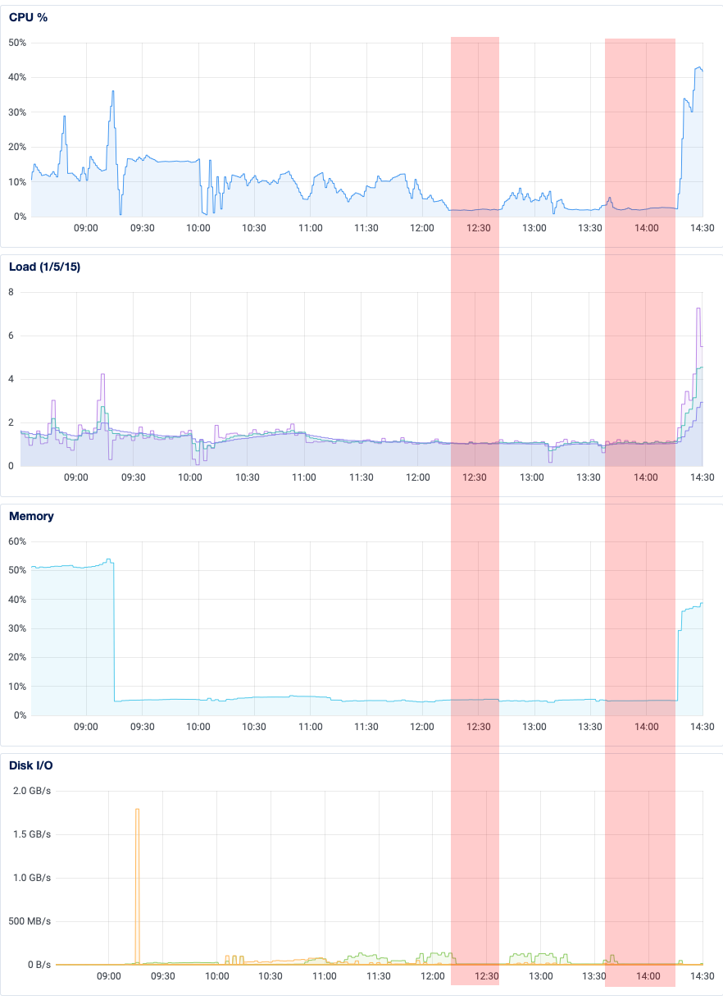
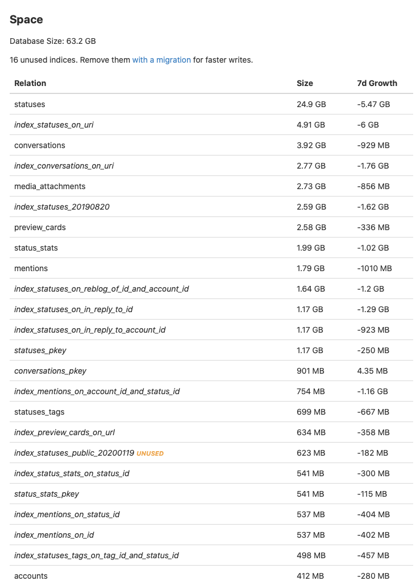

For several months, the Mastodon instance I administer has been experiencing intermittent problems with unresponsiveness and timeouts. They are hard to pin down because when something breaks, I naturally want to fix it (via server restarts). However, this robs me of the opportunity to track down the root cause of the problem. Over time, my co-admin and I have collected enough logs during these periods of downtime that we narrowed the problem down to our database. Which, yikes!

So let's dive in a bit, into server logs and databases and, oh my! Docker containers too!

Quick refresher on [`mastodon.technology`](https://mastodon.technology)'s tech stack. It runs [a slightly-modified version of the Mastodon source code](https://github.com/ashfurrow/mastodon), hosted within Docker images. Mastodon is a Rails app that uses Redis, Sidekiq, and Postgres, along with a streaming server written in Node.js. Each of these services are run in their own Docker containers (`web`, `redis`, `sidekiq`, `db`, and `streaming`, respectively). Mastodon doesn't really want you to be using Docker anymore, and frankly, I want to migrate away from it as soon as possible. But I've learned that you should only make one big change to your infrastructure at a time, and we had to make a pretty huge change today.

Alright so we're experiencing intermittent problems. Every few weeks, HTTP requests to the instance would begin timing out. We have had to change our nginx configuration as the instance has scaled up, but we eventually ruled that out as the cause of this problem. There are a lot of different logs to sift through, and many only stay around as long as the server is running, so it's tricky. I eventually caught [PGHero](https://github.com/ankane/pghero) during one of these periods of unresponsiveness and it showed several long-running queries. I read the SQL queries and they really shouldn't have been taking as long as they were – upwards of 45 minutes! One of them was an account deletion query, for example.

So we checked the Postgres logs and to my horror, we found this:

```
...
db_1         | ERROR:  could not open file "base/20283/23550": No such file or directory
db_1         | CONTEXT:  automatic vacuum of table "d8e743tn2b3pfv.public.accounts"
...
```

These were happening pretty steadily, and as time went on, at an increasing rate. I looked at the filesystem for `base/20283/23550` and confirmed that "yep, that does not exist", but that didn't really help me fix the problem. So I searched the internet and all I found was [one Stack Overflow question](https://stackoverflow.com/questions/39211130/postgresql-could-not-open-file-base-xxxx-xxxxx-no-such-file-or-directory) with someone desperately asking for help with a similar error. The only answer was "restore from a backup – you _do_ have backups, don't you??"

Like I said earlier. Yikes.

But that's okay! I do have backups! What I needed next was a plan.

It seemed from the Stack Overflow answer that the database itself was corrupted. I'm not a database administrator, but I know my way around SQL well enough. I figured if the database was corrupted, but still working, then we should dump its contents and re-create it from scratch.

I tried this out on the staging Mastodon instance (pssh, _yeah_ I have a staging environment) and it worked! But staging is a far cry from production. I'm going to go over the individual steps in more detail below, but the important thing was that I had the experience of trying this out twice on staging at my back. I was pretty confident that the export-then-import solution would work.

Once I knew what to do, the next step was to schedule a maintenance window. I don't like the instance to go offline for more than a few minutes, and I suspected that my plan would take all day. I announced the window a week in advance to make sure users could plan around it.

<Toot src="https://mastodon.technology/@announcements/105421340427386358/embed" />

So alright alright, we have a plan and we have a schedule. Nothing left to it but to do it.

## Recreating the Mastodon Database

[The Mastodon docs](https://docs.joinmastodon.org/admin/migrating/) already have a great guide on migrating to a new machine, which I used as the basis for my plan. Like I said earlier, I'm still using Docker so I had to modify some commands.

Big picture, my plan was the following:

- Turn off everything but Postgres.
- Back up the database.
- Point Docker to use a new directory for Postgres, and restart.
- Restore from the backup.

Things went mostly smoothly. Let's dive into some more detail.

### Preamble

First, I disabled some regular `cron` jobs like automatic database backups. I wanted my work to be the only thing the server was doing at the time.

```sh
sudo crontab -e
```

Next, I created a new volume in Digital Ocean's admin panel and mounted it. Everything looked good in the terminal.

Next up, tmux. Nothing is worse than the uncertainty of "is the command taking a while or has my ssh session timed out?" So I used tmux (and the [tmux cheat sheet](https://tmuxcheatsheet.com)) to execute long-running commands in a stable shell.

### Turn Off Everything But Postgres

This is important. When we create a backup of the database, it's like a snapshot. I want _all_ the data to be in that backup so that when I restore it, all the data still exists. That means no one can edit or add anything while I'm running the backup/restore tasks. This sucks, but it's also straightforward. I don't operate at Facebook scale so I can afford to just take the instance down for a day.

Taking down the web server means local users can't access Mastodon, but it also means that federated content won't be processed either. That's okay – when a remote server tries to send us content and it fails because we're offline, it will re-enqueue that task with exponential backoff. The fediverse was built so that instances could go offline but data would still be federated _eventually_, which is really cool. We'll see later how this looks in our network bandwidth graphs.

```sh
docker-compose down # Turn off everything
docker-compose up -d db # Turn Postgres back on
```

### Backing Up the Database

Next we need to dump the contents of the database into a backup. See, Postgres stores more than just the contents of all the database tables. It also stores indexes and other metadata to make querying the database really efficient. But all this metadata can be recreated, derived from the data itself (in the form of, say, a backup).

Backups in Postgres are done using the [`pg_dump` command](https://www.postgresql.org/docs/9.6/app-pgdump.html). This will generate an archive that can be used to re-create the database. One format `pg_dump` can export to is plaintext SQL statements, which will re-create your database for you. However, I used it with the `-Fc` option, which exports the backup in Postgres' "custom" file format. This is a bespoke compressed archive that Postgres knows how to deal with natively, and efficiently. We'll see later how the plaintext dump will come in handy, too.

```sh
# Dump the backup into the root of the Docker container's filesystem
docker exec -t mastodon_db_1 pg_dump -Fc -U postgres -f '/export.dump'
# Now copy it into the host machines filesystem
docker cp mastodon_db_1:/export.dump /home/ash/export.dump
```

The `export.dump` file was about 12GB, down from a 96GB database.

### Pointing Docker to a New Directory

I mentioned that I use a Digital Ocean volume to store the Postgres database. This is nice because volumes can be scaled independently from virtual machines, and can even be detached and attached to different droplets easily. Neat!

So I created the new volume at the `/mnt/volume_nyc1_new_postgres` mount point. I created a new directory for Postgres and gave it the same file permissions as the old one.

```
sudo mkdir /mnt/volume_nyc1_new_postgres/postgres
sudo chown BLAH_BLAH /mnt/volume_nyc1_new_postgres/postgres
sudo chmod -R BLAH_BLAH /mnt/volume_nyc1_new_postgres/postgres
```

Now that the new directory structure exists, we can point Docker to it. Here's the diff of my `docker-compose.yml` file:

```diff
     volumes:
-      - /mnt/volume_nyc1_01/postgres:/var/lib/postgresql/data
+      - /mnt/volume_nyc1_new_postgres/postgres:/var/lib/postgresql/data
     shm_size: 256mb
```

Basically, Docker treats the container's `/var/lib/postgresql/data` as a special directory that _really_ exists in the host machine's `/mnt/volume_nyc1_01/postgres` directory. We're just updating it to the new mount point. Complain as I might about Docker, this is really cool. If something goes wrong with the restore, all I need to do is revert this change and restart the containers. Docker made doing this restore non-destructively really easy.

Let's restart the Docker container.

```sh
docker compose down
docker-compose up -d db
```

### Restoring from the backup

Okay, now let's copy the backup into the Postgres container and then use it with [the `pg_restore` command](https://www.postgresql.org/docs/9.6/app-pgrestore.html).

```sh
# Copy the backup into the Docker container
docker cp /home/ash/export.dump mastodon_db_1:/export.dump
# Create an empty database
docker exec -t mastodon_db_1 createdb -U postgres -T template0
# Now perform the restore
docker exec -t mastodon_db_1 pg_restore -U postgres -n public --no-owner -d postgres --verbose /export.dump
```

(Notice the `--verbose` option, which will give you steady feedback on how things are going.)

I really wish I had known about the `-j` option, which you can use to take advantage of multiple CPU cores. The restore itself took _hours_, but I could have saved time by reading the docs a little more carefully. Lesson learned!

Generally, the restore went well. Postgres went through phases: restoring primary keys, restoring data, creating indexes, and restoring foreign keys. It was with one of the foreign keys that I actually had a problem with, though...

It had been about a half hour since the restore had started with the `fk_rails_256483a9ab` constraint (the name is deterministically generated by Rails). CPU usage, memory usage, and Disk I/O were all flat, so it _seemed_ like this operation had stalled. Through some well-placed `psql` commands, I was able to abort that task specifically while letting the remainder of the `pg_restore` proceed. Stopping the task turned out to be a mistake, though, as the restore _was_ actually working even though resource utilization was flat. Huh!

Alright so `pg_restore` worked, except for where I intervened. Whoops. The error message in the console looked like this:

```
pg_restore: [archiver (db)] Error while PROCESSING TOC:
pg_restore: [archiver (db)] Error from TOC entry 2970; 2606 46934 FK CONSTRAINT statuses fk_rails_256483a9ab postgres
pg_restore: [archiver (db)] could not execute query: ERROR:  canceling statement due to user request
CONTEXT:  SQL statement "SELECT fk."reblog_of_id" FROM ONLY "public"."statuses" fk LEFT OUTER JOIN ONLY "public"."statuses" pk ON ( pk."id" OPERATOR(pg_catalog.=) fk."reblog_of_id") WHERE pk."id" IS NULL AND (fk."reblog_of_id" IS NOT NULL)"
    Command was: ALTER TABLE ONLY public.statuses
    ADD CONSTRAINT fk_rails_256483a9ab FOREIGN KEY (reblog_of_id) REFERENCES public.statuse...
```

Yeah, it really does cut off with `...` at the end, which sucks because _I still need that foreign key_. I started faffing with the Mastodon source code to figure out some equivalent SQL commands to do this manually, but then it hit me: since I'm looking for a SQL command to generate this foreign key, which is derived from the contents themselves, why not use my staging instance to help me out? I could generate a plaintext SQL backup and find the SQL query necessary to add the foreign key!

I hopped over to the staging server and re-ran `pg_dump` with a few different options. I omitted the `-f` option so that the output would go to the terminal rather that a file. I also changed to using the plaintext output format with `-Fp`, so that I could `grep` for what I needed:

```sh
docker exec -t mastodon_db_1 pg_dump -Fp -U postgres | grep -B 2 fk_rails_256483a9ab
ALTER TABLE ONLY public.statuses
    ADD CONSTRAINT fk_rails_256483a9ab FOREIGN KEY (reblog_of_id) REFERENCES public.statuses(id) ON DELETE CASCADE;
```

Perfect! I can run that SQL query in `psql` to recreate the foreign key. When I did that, I saw the same weird resource utilization as before. Disk I/O was low, but present. Same with CPU, load average, and RAM usage. I don't know what kind of long-running task that Postgres was doing that wasn't bound by either CPU or memory or I/O, but after about 40 minutes the query completed. If anyone knows what was up here, please let me know.

Okay next came the big moment! Let's see if it all worked...

```sh
docker-compose up -d
# Don't forget to re-enable backups!
```

And it did! We suffered horrible performance for a while while the fediverse caught up with sending us things, but after a few hours we were back.

## Graphs

Here is a graph of the CPU utilization, load average, memory usage, disk I/O, disk usage, and inbound/outbound network traffic during the maintenance window. I have marked the beginning and end of the maintenance with red lines. Note that these graphs are from Digital Ocean's control panel – I was using more sophisticated, realtime tools to monitor the system as I worked.



As I mentioned earlier, I wish I had used `-j` on the `pg_restore` command. To think most of the vCPU cores were just sitting there idle, for hours... oh well! I'll know for next time.

One thing I find really neat about this graph is how the inbound network bandwidth creeps up and up over time. See, when other instances sent us updates while we were offline, they got back a 502 response code. This caused them to retry, which would also fail. So they wait a bit before retrying, and failing. So then they wait a little _longer_ before retrying _again_, and failing _again_. And so on.

The consequence of this "exponential backoff" strategy was an increasing amount of inbound traffic as the day went on. Makes sense: there is a backlog of federated updates we're accruing. Notice too that both the CPU utilization and load averages spiked when the instance came back up – they were way higher than they had been before being taken offline. All that traffic caused a massive traffic jam internally, with 10-minute latencies for Sidekiq jobs. It actually broke local media uploads while the Sidekiq queues were being cleared, which took several hours.

Okay so one other thing: let's revisit the big mistake I made, of terminating the `pg_restore` task for that foreign key. To my credit, I knew better than to ctrl-C the whole `pg_restore`, and instead only killed the task that _appeared_ to be stalled. I've highlighted below the regions where I saw the initial apparent stall, and when I tried again manually. You can see that compared with other parts of the `pg_restore` process, CPU utilization, load average, memory usage, and disk I/O appear negligable.



I'm still pondering why adding a foreign key would take so long on an otherwise idle database. But then again, the table it's altering _is_ among the largest in the database. I just don't get why all the resources appeared to be sitting idle.

## Conclusion

Overall, I'm very happy with how today went. I didn't really need to do much except check in now and then. In fact, the process benefited from some "benign neglect" and I only did harm by intervening.

On disk, the old database was 96GB large. The new one is 63GB. Turns out that database vacuuming is important.



I hope that this fixes our intermittent downtime problems and, hopefully, even improves performance. I have to thank my co-admin [Brian](https://mastodon.technology/@bclindner) for his moral support during all this, for being my rubber duck while I sorted this out.

Over the years, administering a Mastodon instance has led me to solve some pretty big problems. I'm not really a systems administrator – I'm more of an application developer. That means that I have a lot more skills to learn to administer an instance effectively, but it also gives me a unique perspective from which to look at these sysadmin problems. Looking back at all I've learned since 2017, I'm pretty amazed! So: I'm officially burying my sysadmin impostor syndrome. And I feel compelled to express gratitude for this chance to learn. To the community on `mastodon.technology`, thank you for patience and trust.
