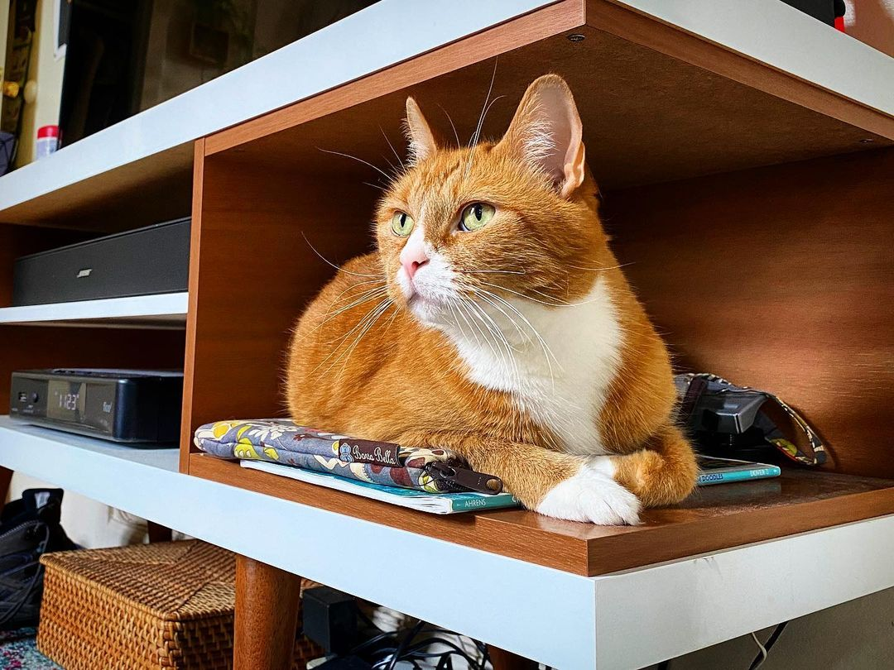
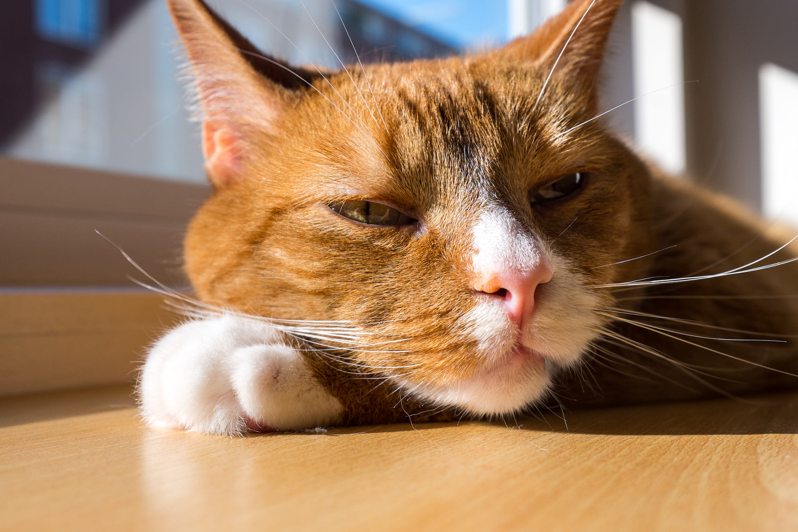

In 2007, I was 19 and had just moved in with my girlfriend Ashley (we're now married). I had wanted to get a cat because, having been raised with dogs and cats, I missed the presence of a fluffy companion. Ashley agreed. We found an orange cat someone was giving away online and we made arrangements to meet and see if we got along with the cat.

Before that happened, I got a phone call from my dad. I still remember where I was, walking up Regent Street because I didn't own a car yet. He told me two important things. First, he told me that taking responsibility for another life was a large commitment. Second, he told me to decide whether or not I was ready to own a cat _before_ meeting this one in particular, because I would fall in love with it.

Dad was right, about both points. We met Dave and we did fall in love with him. And he was a massive responsibility.

<Wide>

</Wide>

Dave was beautiful. The softest fur I'd ever felt. He was playful, but gentle. Adventurous, but easily frightened. Willful, but clingy. He was perfect.

We pampered him. We spoiled him. Dave never spent a single night hungry or cold (except that one time he jumped out our apartment window and we didn't find him until the next day).

About a year and a half later, we adopted another cat. Dave and Bandita quickly became frenemies, and they've been our constant companions ever since. We graduated university and moved to Toronto, and the cats came with us. We moved to Amsterdam and New York, and the cats came with us, too.

When 500px was burning me out so badly that I was contemplating ending my life, and my wife was a thousand kilometres away on a work placement, Dave and Bandita were there at the end of every long day to comfort me. They kept me going, and maybe even saved my life.

Every time I started a new job and had anxiety about fitting in, Dave and Bandita were there. Whenever the stress of a big city got to me, they were there. And when I just wanted to focus on work, they were there too, desperate for my attention.

When I still worked in an office, Dave would wait by the door for me to come home, every day. He was the first thing I'd see when I got home.

<Wide>

</Wide>

Around when the pandemic started, Dave began having health problems. We took good care of him and nursed him back to health. When we moved home to Fredericton a year ago, he started having trouble breathing. We took care of him, and he seemed to bounce back. But his problems were recurrent, and the last few months became difficult.

We were giving Dave a puffer two or three times a day for asthma attacks. I don't know if you've ever given a cat a puffer, but they do not like it. At all. It pained me to hold him still to administer his medicine.

Dave lost twenty percent of his body weight in a few months, and his breathing became laborious. He stopped fighting me when I would give him his puffer – he just didn't have it in him anymore. He was suffering.

This past week, the vet did more X-rays. The news wasn't good. Dave was down to just one functioning lung. Our only hope was a long drive to another city to do a CT scan that would require Dave to be put under anaesthesia. The vet wasn't confident he would come back up. I wasn't confident he would even survive the drive.

My dad was right about how much work it was to take responsibility for another life. The ultimate responsibility of a pet owner is saying goodbye.

Dave was put to sleep yesterday. The last thing he saw was the two of us, crying, and comforting him. I stroked his face, just the way I knew he liked it, as I made the sound that I'd found for him. We gave him the best life we could, and in return we'd had fourteen years with the perfect cat. A constant companion. A friend. A member of our family. He was a lucky cat, but we were luckier for having him.

<Wide>

</Wide>

We'll miss you, Dave. I'm glad your suffering is over. You'll always be loved.
